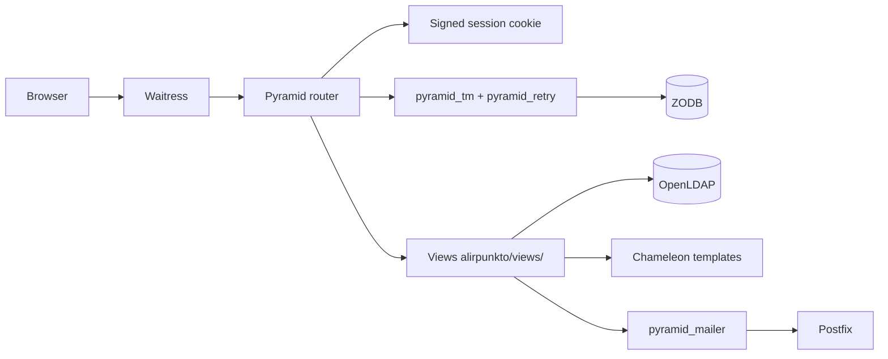

# Runtime architecture

> Status: current documentation.

## Request-processing chain

Configuration is centralised in `alirpunkto/__init__.py`:

- `pyramid_chameleon` for TAL/METAL rendering;
- `pyramid_tm` and `pyramid_retry` (3 attempts, `development.ini`): each
  request is one transaction; e-mails handed to `pyramid_mailer` only leave
  at *commit* time;
- `pyramid_zodbconn` provides the request's ZODB connection;
- the session factory is `SignedCookieSessionFactory` (signed cookie,
  `httponly`, `secure`, `SameSite=Lax`);
- `config.set_default_csrf_options(require_csrf=True)` enforces CSRF
  protection on every view;
- a `BeforeRender` subscriber (`add_renderer_globals`) injects the template
  globals.

## Routes

Routes are declared in `alirpunkto/__init__.py`; `alirpunkto/routes.py`
only serves the static view (`/static`).

| Route | Path | View |
|---|---|---|
| `home` | `/` | `views/home.py` |
| `login` / `logout` | `/login`, `/logout` | `views/login.py`, `views/logout.py` |
| `register` | `/register` | `views/register.py` (candidature) |
| `forgot_password` | `/forgot_password` | `views/forgot_password.py` |
| `modify_member` | `/modify_member` | `views/modify_member.py` |
| `get_email` / `check_new_email` | `/get_email`, `/check_new_email` | e-mail address change |
| `elections` / `vote` | `/elections`, `/vote` | verifiers' vote |
| `manage_provider` | `/manage_provider` | provider management |
| `sso_login` + Keycloak redirect | `/sso_login`, `/<KEYCLOAK_REDIRECT_PATH>` | `views/sso_login.py` |

## Templates

Pages inherit from `templates/layout.pt` (shared METAL structure); each view
has its template (`login.pt`, `register.pt`, `home.pt`, …). Rich forms use
Deform (`templates/deform/`).

## Known limits

- Routes are declared inline in `__init__.py`; `routes.py` is nearly empty,
  so the announced separation never materialised.
