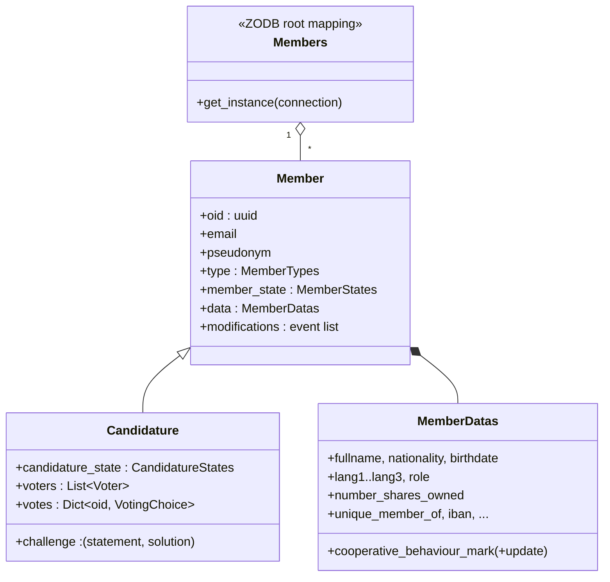

# Domain model

> Status: current documentation.
> Modules: `alirpunkto/models/member.py`, `alirpunkto/models/candidature.py`,
> `alirpunkto/models/users.py`.

## Member

`Member` (persistent) carries the application identity: `oid` (a UUID,
identical to the LDAP `uid`), `email`, `pseudonym`, `type` (`MemberTypes`),
`member_state` (`MemberStates`) and a `MemberDatas` block for the profile.
Every modification goes through the property *setters*, which journal a
`MemberDataEvent` (timestamp, function, old and new value, seed) into
`modifications`: the object keeps its own history.

Related enumerations (`models/member.py`):

- `MemberTypes`: `ADMINISTRATOR`, `ORDINARY`, `COOPERATOR`, `PROVIDER`;
- `MemberStates`: `CREATED`, `DRAFT`, `REGISTRED`,
  `DATA_MODIFICATION_REQUESTED`, `DATA_MODIFIED`, `EXCLUDED`, `DELETED`;
- `MemberRoles` (governance roles, distinct from the types): `NONE`,
  `ORDINARY`, `COOPERATOR`, `BOARD`, `MEDIATION_ARBITRATION_COUNCIL` —
  effective governance is carried by the LDAP groups;
- `EmailSendStatus`: `IN_PREPARATION`, `SENT`, `ERROR`, used by each
  member's `email_send_status_history`.

## Candidature

`Candidature` inherits from `Member` and adds the review of the
application file:

- `challenge`: the anti-robot arithmetic challenge and its solution;
- `candidature_state`: the state machine
  `DRAFT → EMAIL_VALIDATION → CONFIRMED_HUMAN → UNIQUE_DATA → PENDING →
  APPROVED | REFUSED`;
- `voters` and `votes`: the randomly drawn verifiers and their choice
  (`VotingChoice`: `YES`, `NO`, `ABSTAIN`).

**Tallying**: once every verifier has voted, rejection requires a **strict
majority of NO** — a tie approves, including the 0-0 of an all-abstain
ballot (rule adopted from PR #232; abstention makes a tie reachable even
with three voters).

The full flow is described in
[../functional_specifications/candidature.md](../functional_specifications/candidature.md).

## Members

`Members` is the ZODB root mapping (`root['members']`, keyed by `oid`).
`Members.get_instance(connection)` always rebinds the instance to the
current request's ZODB connection (see
[03_zodb_persistence](03_zodb_persistence.md)).

## User (session)

`models/users.py` defines `User`, a **lightweight, non-persistent** object
(name, e-mail, oid, active flag, type) serialised as JSON into the session
after login. Do not confuse it with `Member`: it is a mere reflection for
the user interface.
