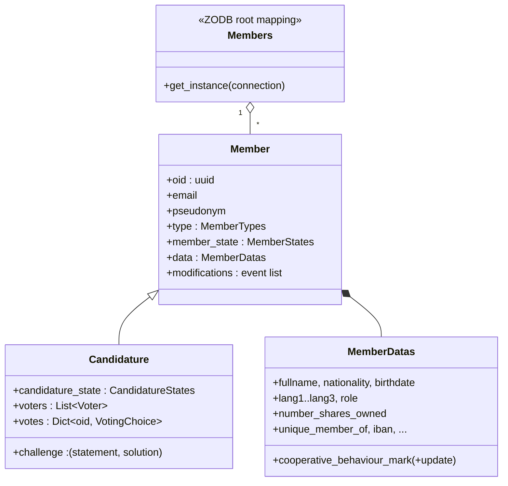

# Domain model

> Status: current documentation.
> Modules: `alirpunkto/models/member.py`, `alirpunkto/models/candidature.py`,
> `alirpunkto/models/users.py`.

## Member

`Member` (persistent) carries the application identity: `oid` (a UUID,
identical to the LDAP `uid`), `email`, `pseudonym`, `type` (`MemberTypes`),
`member_state` (`MemberStates`) and a `MemberDatas` block for the profile.
Every modification goes through the property *setters*, which journal a
`MemberDataEvent` (timestamp, function, old and new value, seed) into
`modifications`: the object keeps its own history.

Related enumerations (`models/member.py`):

- `MemberTypes`: `ADMINISTRATOR`, `ORDINARY`, `COOPERATOR`, `PROVIDER`;
- `MemberStates`: `CREATED`, `DRAFT`, `REGISTRED`,
  `DATA_MODIFICATION_REQUESTED`, `DATA_MODIFIED`, `EXCLUDED`, `DELETED`;
- `MemberRoles` (governance roles, distinct from the types): `NONE`,
  `ORDINARY`, `COOPERATOR`, `BOARD`, `MEDIATION_ARBITRATION_COUNCIL` —
  effective governance is carried by the LDAP groups;
- `EmailSendStatus`: `IN_PREPARATION`, `SENT`, `ERROR`, used by each
  member's `email_send_status_history`.

## Candidature

`Candidature` inherits from `Member` and adds the review of the
application file:

- `challenge`: the anti-robot arithmetic challenge and its solution;
- `candidature_state`: the state machine
  `DRAFT → EMAIL_VALIDATION → CONFIRMED_HUMAN → UNIQUE_DATA → PENDING →
  APPROVED | REFUSED`;
- `voters` and `votes`: the randomly drawn verifiers and their choice
  (`VotingChoice`: `YES`, `NO`, `ABSTAIN`).

**Tallying**: once every verifier has voted, rejection requires a **strict
majority of NO** — a tie approves, including the 0-0 of an all-abstain
ballot (rule adopted from PR #232; abstention makes a tie reachable even
with three voters).

The full flow is described in
[../functional_specifications/candidature.md](../functional_specifications/candidature.md).

## Members

`Members` is the ZODB root mapping (`root['members']`, keyed by `oid`).
`Members.get_instance(connection)` always rebinds the instance to the
current request's ZODB connection (see
[03_zodb_persistence](03_zodb_persistence.md)).

## User (session)

`models/users.py` defines `User`, a **lightweight, non-persistent** object
(name, e-mail, oid, active flag, type) serialised as JSON into the session
after login. Do not confuse it with `Member`: it is a mere reflection for
the user interface.

## Resignation and Quarantine (2026-07-30)

The historical "Démissionner" scenario is implemented
(`views/unsubscribe.py`). Two states join `MemberStates`:
**`PENDING_UNSUBSCRIPTION`** (the request is placed, the confirmation
e-mail is out, the previous state is remembered in
`previous_member_state`) and **`UNSUBSCRIBED`** (the link was followed;
`departure_date` and `departure_reason` are set). An unconfirmed request
**expires lazily** after `UNSUBSCRIBE_LINK_VALIDITY_DAYS` (7 days) — there
is no scheduler: staleness is checked on the profile page and when the
link is clicked, and the previous state is restored.

Upon confirmation the LDAP entry is **deactivated but kept**
(`isActive=False`): the pseudonym and the identity stay reserved during
the **Quarantine** — `QUARANTINE_PERIOD_DAYS`, a Quantitative Parameter of
§3.4 of the statutes, **180 days** by default (#54) — and
`data.date_erasure_all_data` records the erasure due date. The deferred
purge (see [09_periodic_tasks](09_periodic_tasks.md)) then erases
everything **except the pseudonym, the departure date and the reason**,
moving the member to `DELETED`.

## Upgrade candidature (#7)

An Ordinary Member can become a Cooperator
(`views/upgrade_to_cooperator.py`): a form reduced to the four identity
fields (cloned from `RegisterForm`) opens a `COOPERATOR` `Candidature`
carrying **`existing_member_oid`**, pseudonym and e-mail copied from the
member — never asked again — pre-set to **`UNIQUE_DATA`** so the existing
flow (verifiers, vote) takes over. On approval, `register_user_to_ldap`
branches into an **in-place update** of the LDAP entry (type, identity
attributes) keeping `uid`, `cn`, `mail` and `userPassword` untouched. A
running upgrade candidature is **resumed**, never duplicated.

## Profile visibility (2026-08-01)

Three regimes now govern the `modify_member` view. **A member only ever
sees their own profile** (#201): the member list is neither fetched nor
exposed for them, any crafted `oid` (POST field, stale session) resolves
to their own at a single point, and a plain GET lands straight on their
page. **The administrator views without modifying** (#149): a read-only
card of the ticket's eight fields — pseudonym, profile text, avatar,
user number, translated role, Cooperative Behaviour Mark with its date,
departure — built before any side effect; a crafted `modify` POST ends
on the card, never in a write, and nothing sensitive (e-mail, IBAN,
civil identity) reaches the context. **One's own profile follows the
matrix of issue #55**: everyone views and edits their presentation,
avatar, e-mail and languages; a Cooperator or assimilated additionally
edits the IBAN and views — never edits — identity, nationality, CBM,
shares, contribution and role; pseudonym and user number are read-only
for all; the groups one belongs to show, translated, above the form; the
erasure date (#54) is visible to no one. The `Owner` matrix being keyed
by state only, a per-type post-processing
(`_restrict_owner_permissions_by_type`) strips the ten Cooperator-only
fields to `NONE` for everyone else, and the `PENDING_UNSUBSCRIPTION`
entry guarantees a resigning member still opens their profile — the
cancel button lives there. The view finally carries the specification
frame (#123): "Your profile" title, introduction, translated Submit and
Cancel buttons, cancellation being a Post/Redirect/Get handled before
any LDAP work.
