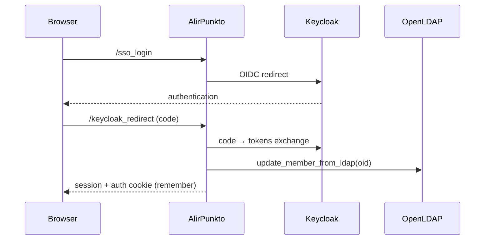

# Authentication

> Status: current documentation.
> Modules: `alirpunkto/views/login.py`, `alirpunkto/views/sso_login.py`,
> `alirpunkto/views/home.py`, `alirpunkto/utils.py` (`store_sso_tokens`,
> `logout`), `alirpunkto/views/logout.py`.

## Two entry paths

1. **Local form** (`/login`): the pseudonym is resolved to an `oid`
   (`get_oid_from_pseudonym`), then `check_password` attempts an LDAP
   *bind* — slapd verifies `{SSHA}` passwords natively. On success the view
   synchronises the member (`update_member_from_ldap`) and also requests a
   Keycloak token (`get_keycloak_token`) to align the SSO session.
2. **Keycloak SSO** (`/sso_login` plus the `/keycloak_redirect` route):
   OIDC flow; the token is verified (signature, audience, expiry through
   `jwt`), the `oid` extracted from it, the member synchronised from LDAP,
   then the session is opened.

## Session content

The session is a **signed cookie** (`SignedCookieSessionFactory`,
`httponly`, `secure`, `SameSite=Lax`) limited to 4093 bytes. It only holds
the strict minimum: `logged_in`, `user` (a lightweight `User` object as
JSON), `created_at`, and — through `utils.store_sso_tokens` — the Keycloak
**refresh token** and its expiry. The *access token* is deliberately
**not** stored: nothing ever reads it back and its group claims overflowed
the cookie (incident of 2026-07-08, locked by
`tests/test_session_cookie_budget.py`). Pyramid identification uses
`remember(request, pseudonym)` (a separate *auth tkt* cookie).

## Refresh and logout

`home_view` keeps the SSO session alive while the refresh token's expiry
has not passed (`refresh_keycloak_token`, then `store_sso_tokens`) and logs
out cleanly otherwise. `utils.logout` purges the session (user, tokens);
`/logout` closes it on the interface side.

## Known limits

- The refresh token lives in a signed but **unencrypted** cookie: readable
  by its bearer (harmless) but exposed if the cookie is stolen. The sound
  target is a server-side session (see
  [architecture_decisions](architecture_decisions.md)).

## Deactivated accounts (2026-07-30)

`sso_login` refuses a member whose `data.is_active` is false (a resigned
or deactivated account): the guard sits after the resynchronisation from
LDAP and before the session `User` is built. The LDAP entry, kept through
the Quarantine, therefore reopens no access.

## External-audit hardenings (2026-08-01)

**The post-login redirect is bound to the site.** The login view
honoured `session['redirect_url']` blindly; `safe_local_redirect` now
only accepts a same-site target — an absolute URL whose authority is
exactly the request's host (the legitimate case of views storing
`current_route_url()`), or a local `/…` path (never `//…`); exotic
schemes, backslashes and `user@host` tricks fall back to home, and the
session key is purged either way.

**Login attempts are limited before any LDAP work**: two sliding
windows (10 per address over 5 minutes; 5 per username over 15 minutes
across addresses), cleared on success, a uniform translated answer, and
a password-free log line. The state lives in process memory — the
choice is documented in `login_throttle.py` and matches the deployment
(a single Waitress process); for the address window to see real client
IPs behind Apache, Waitress now trusts the proxy (`trusted_proxy` in
`production.ini`).

**Architecture decision**: Keycloak will not become the single
authentication entry point. The test server is not connected to
Keycloak and hosts only AlirPunkto; direct LDAP authentication is an
assumed path, the Keycloak integration remaining the acquisition of an
SSO token after the local authentication.
