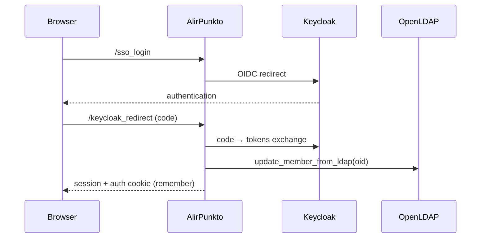

# Authentication

> Status: current documentation.
> Modules: `alirpunkto/views/login.py`, `alirpunkto/views/sso_login.py`,
> `alirpunkto/views/home.py`, `alirpunkto/utils.py` (`store_sso_tokens`,
> `logout`), `alirpunkto/views/logout.py`.

## Two entry paths

1. **Local form** (`/login`): the pseudonym is resolved to an `oid`
   (`get_oid_from_pseudonym`), then `check_password` attempts an LDAP
   *bind* — slapd verifies `{SSHA}` passwords natively. On success the view
   synchronises the member (`update_member_from_ldap`) and also requests a
   Keycloak token (`get_keycloak_token`) to align the SSO session.
2. **Keycloak SSO** (`/sso_login` plus the `/keycloak_redirect` route):
   OIDC flow; the token is verified (signature, audience, expiry through
   `jwt`), the `oid` extracted from it, the member synchronised from LDAP,
   then the session is opened.

## Session content

The session is a **signed cookie** (`SignedCookieSessionFactory`,
`httponly`, `secure`, `SameSite=Lax`) limited to 4093 bytes. It only holds
the strict minimum: `logged_in`, `user` (a lightweight `User` object as
JSON), `created_at`, and — through `utils.store_sso_tokens` — the Keycloak
**refresh token** and its expiry. The *access token* is deliberately
**not** stored: nothing ever reads it back and its group claims overflowed
the cookie (incident of 2026-07-08, locked by
`tests/test_session_cookie_budget.py`). Pyramid identification uses
`remember(request, pseudonym)` (a separate *auth tkt* cookie).

## Refresh and logout

`home_view` keeps the SSO session alive while the refresh token's expiry
has not passed (`refresh_keycloak_token`, then `store_sso_tokens`) and logs
out cleanly otherwise. `utils.logout` purges the session (user, tokens);
`/logout` closes it on the interface side.

## Known limits

- The refresh token lives in a signed but **unencrypted** cookie: readable
  by its bearer (harmless) but exposed if the cookie is stolen. The sound
  target is a server-side session (see
  [architecture_decisions](architecture_decisions.md)).
