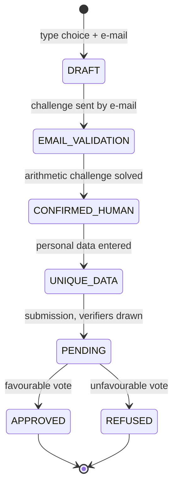

# Candidature

> Status: current functional specification (replaces the historical
> scenario kept, in French, in
> `../../fr/specifications_historiques/Scénarios/Candidature.md`).
> Modules: `alirpunkto/views/register.py`, `alirpunkto/models/candidature.py`,
> `alirpunkto/views/vote.py`, `alirpunkto/views/elections.py`.

## Actors

The **applicant**; the **verifiers** (members drawn at random); the site.

## State machine

## Flow

1. **DRAFT** — the applicant chooses their type (ordinary member or
   cooperator) and enters their e-mail address; uniqueness of the address
   among non-refused candidatures is checked.
2. **EMAIL_VALIDATION** — the site generates an **arithmetic challenge**
   (`generate_math_challenges`) and sends it by e-mail
   (`send_validation_email`): receiving it proves the address, solving it
   proves humanity.
3. **CONFIRMED_HUMAN** — challenge solved; the applicant sets their
   pseudonym and password (strength and uniqueness rules:
   `is_valid_password`, `is_valid_unique_pseudonym`).
4. **UNIQUE_DATA** — personal data entry; the required fields depend on
   the type (a cooperator provides the full civil identity, sensitive data
   reserved to the verifiers).
5. **PENDING** — the candidature is submitted; `random_voters` draws the
   verifiers (their number set by the `number_of_voters` setting), each
   invited by e-mail to review the file.
6. **Vote** (`/elections`, `/vote`) — each verifier votes yes, no or
   abstain (`VotingChoice`), before the verification deadline. Once all
   have voted, rejection requires a **strict** majority of no: a tie
   approves (PR #232). Depending on the tally, the `vote` view moves
   the candidature to **APPROVED** or **REFUSED**.
7. **APPROVED** — the LDAP account is created (`register_user_to_ldap`,
   `{SSHA}`-hashed password), the cleartext password is purged from the
   ZODB, the applicant becomes a member and is notified
   (`send_candidature_state_change_email`).

At every state change, the applicant (and, during the vote, the verifiers)
receive a localised e-mail.

## Known limits

- No automatic expiry: a pending candidature stays pending until a human
  acts (see
  [../architecture/09_periodic_tasks.md](../architecture/09_periodic_tasks.md)).

## Ordinary → Cooperator upgrade (#7)

From the home page, a logged-in Ordinary Member sees the "Become a
Cooperator" button. They enter only the four identity fields (given
names, family names, date of birth, nationality) — the pseudonym and the
e-mail are taken from their account, never asked again nor editable. The
candidature enters the verification process directly: verifiers drawn,
convocations, vote. Identity uniqueness is checked as for any Cooperator
application, resigned members in Quarantine included (#54). On approval
the existing account becomes Cooperator (identifier, pseudonym, e-mail
and password unchanged); on refusal the member stays Ordinary. A running
upgrade is resumed, never duplicated.

## Minimum age of Cooperators (#80)

Cooperator status is reserved to persons **of age** (18th birthday
reached, civil calendar — leap years included). The "Date of birth"
field explains it below the input, and the rule is checked on
submission **at both doors**: Cooperator registration and the upgrade.
An underage candidate is refused with the ticket's message, inviting
them to register as an Ordinary Member of the Community and to upgrade
as soon as they come of age — the Ordinary form asks no date of birth
at all: the minors' path stays open. The majority bound is recomputed
**at every request**.
