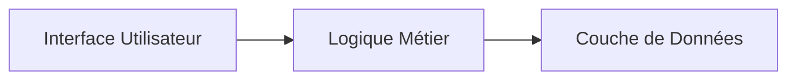
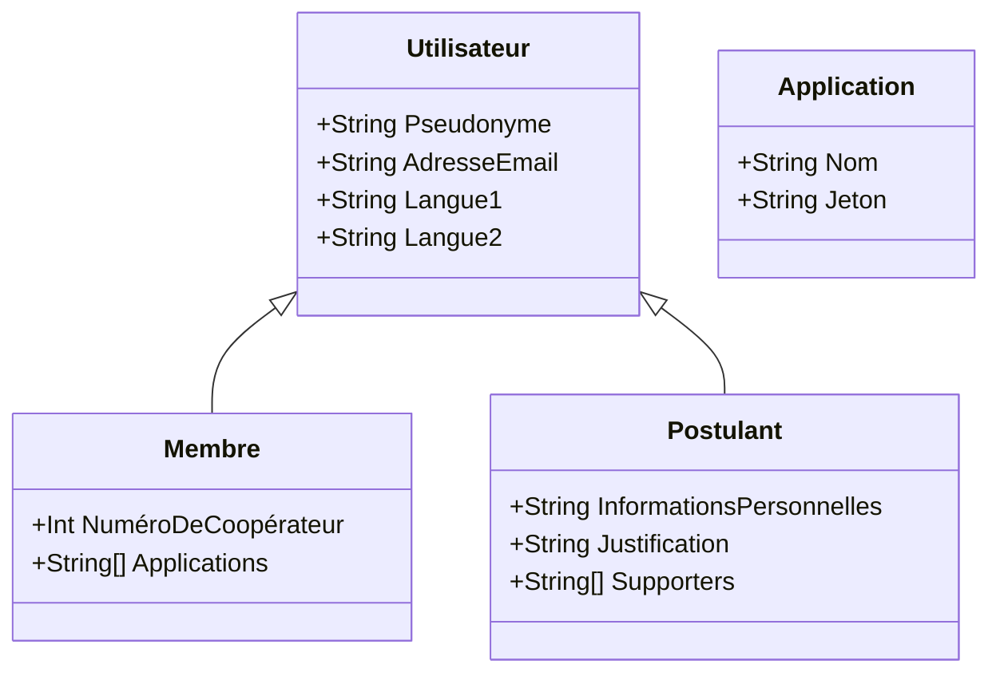
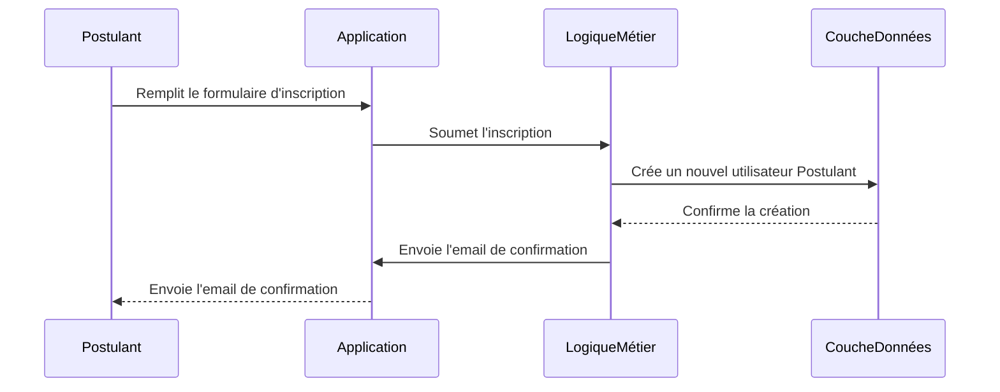
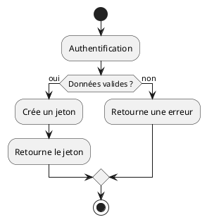
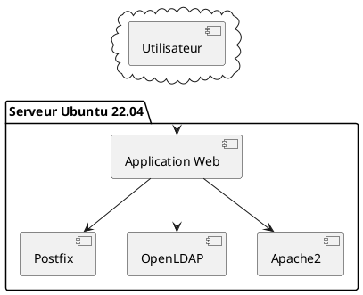
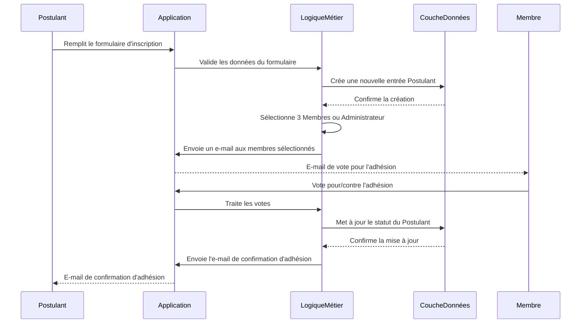
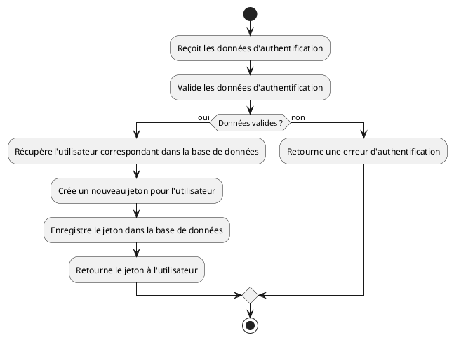
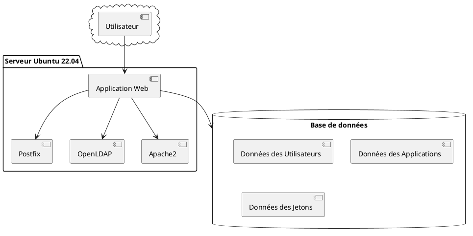

# Objectif
Tout d'abord, nous commencerons par définir l'architecture globale du système. Nous opterons pour une architecture modulaire en couches qui sera composée principalement de trois parties : l'interface utilisateur, la logique métier et la couche de données. 

La couche d'interface utilisateur sera responsable de l'affichage des informations aux utilisateurs et de la collecte des entrées des utilisateurs. Elle sera construite en utilisant Bootstrap 5 pour un design réactif et Pyramid avec TAL/METAL pour la gestion des templates côté serveur. Les formulaires seront conçus pour recueillir toutes les informations nécessaires des utilisateurs comme spécifié dans le prompt.

La logique métier sera développée en utilisant le langage de programmation Python et le framework Pyramid. Elle sera responsable de la gestion des processus métier tels que la validation des données entrées par les utilisateurs, la gestion des votes pour l'acceptation des nouveaux membres, la création des jetons d'authentification pour les utilisateurs authentifiés et l'envoi des mails par le serveur Postfix.

La couche de données sera principalement composée d'un serveur OpenLDAP où seront stockées toutes les informations des utilisateurs. Cette couche sera également responsable de la création des numéros de coopérateurs uniques pour chaque utilisateur et de la communication avec les autres logiciels qui ont besoin de ces informations.

Concernant le processus d'inscription, nous créerons un algorithme qui sélectionne trois membres au hasard parmi les membres de l'OpenLDAP ou l'administrateur s'il n'y a pas assez de membres. Un email sera envoyé aux membres sélectionnés les invitant à se connecter à l'application et à voter pour ou contre l'adhésion du postulant. Si la majorité vote pour, le postulant sera accepté comme membre.

En ce qui concerne les maquettes des écrans, nous utiliserons PlantUML Salt pour créer une maquette fonctionnelle ("wireframe")  pour décrire l'interface utilisateur de l'application. Ces maquettes comprendront des écrans pour le formulaire d'inscription, la page de vote des membres, le tableau de bord de l'utilisateur et les écrans de gestion du profil.

Enfin, en ce qui concerne l'authentification, nous implémenterons un mécanisme de jeton basé sur des normes ouvertes telles que JWT ou OAuth. Cela permettra à nos utilisateurs de s'authentifier sur diverses applications open source de manière sécurisée. 

Dans l'ensemble, nous nous assurerons que le système soit conçu et développé de manière à respecter les normes de sécurité les plus strictes et à garantir la confidentialité et l'intégrité des données des utilisateurs. Nous mettrons également en place des mécanismes pour surveiller et maintenir la performance du système afin de garantir une expérience utilisateur de qualité.

# Détails
Voici un aperçu de l'architecture générale du système :



**Diagramme de classes :**

Commençons par un simple diagramme de classes pour visualiser la structure de nos objets. 



**Diagramme de séquences :**

Prenons un exemple de processus d'inscription d'un nouveau membre.



**Diagramme d'activités (PlantUML) :**

Examinons le processus d'authentification.



**Diagramme de déploiement (PlantUML) :**

Enfin, voici un diagramme de déploiement simple de notre application.



Ces diagrammes donnent une vue d'ensemble de l'architecture et de la conception de l'application. Lorsque nous commencerons le développement, nous pourrons entrer plus en détail dans chaque partie de l'application et peut-être créer d'autres diagrammes pour aider à visualiser le fonctionnement interne de chaque composant.

**Diagramme de séquences détaillé :**

Prenons un exemple plus détaillé de la séquence d'actions pour le processus d'adhésion d'un nouveau membre.



**Diagramme d'activités détaillé (PlantUML) :**

Regardons le processus de création de jeton pour l'authentification.



**Diagramme de déploiement détaillé (PlantUML) :**

Ajoutons plus de détails au diagramme de déploiement.



Dans ce diagramme de déploiement, la base de données est représentée comme un composant distinct, ce qui montre que l'Application Web interagit avec elle pour stocker et récupérer des données. Cela inclut les informations des utilisateurs, les données des applications pour lesquelles les utilisateurs peuvent se connecter, et les jetons créés pour l'authentification.

# Squelette de l'implémentation
D'accord, nous allons écrire une ébauche de code Python pour donner une idée de la façon dont l'architecture pourrait être mise en œuvre. Notons que ceci est une version simplifiée et nécessitera des modifications supplémentaires pour une application complète.

Commencer par les modèles de données :

```python
from pyramid.security import Allow, Everyone

class User:
    def __init__(self, username, email, lang1, lang2):
        self.username = username
        self.email = email
        self.lang1 = lang1
        self.lang2 = lang2

class Member(User):
    def __init__(self, username, email, lang1, lang2, member_num):
        super().__init__(username, email, lang1, lang2)
        self.member_num = member_num

class Applicant(User):
    def __init__(self, username, email, lang1, lang2, personal_info):
        super().__init__(username, email, lang1, lang2)
        self.personal_info = personal_info
        self.supporters = []
```

Ensuite, pour le processus d'inscription :

```python
from pyramid.view import view_config

@view_config(route_name='register', renderer='json')
def register(request):
    username = request.params.get('username')
    email = request.params.get('email')
    lang1 = request.params.get('lang1')
    lang2 = request.params.get('lang2')
    personal_info = request.params.get('personal_info')

    new_applicant = Applicant(username, email, lang1, lang2, personal_info)
    # save new_applicant to database

    # email members or admin for voting
    email_members_for_voting(new_applicant)
    
    return {'status': 'success'}
```

Enfin, pour le processus d'authentification :

```python
from pyramid.httpexceptions import HTTPForbidden
from pyramid.security import remember
from pyramid.view import view_config

@view_config(route_name='login', renderer='json')
def login(request):
    username = request.params.get('username')
    password = request.params.get('password')

    user = authenticate(username, password)  # implemented elsewhere
    if user is None:
        raise HTTPForbidden()

    headers = remember(request, user.id)

    return HTTPFound(location=request.route_url('home'), headers=headers)
```

Pour simplifier, ce code ne tient pas compte de l'interaction avec une base de données ni de l'envoi d'e-mails. Nous devrons implémenter ces fonctionnalités en utilisant une bibliothèque adaptée, par exemple SQLAlchemy pour les bases de données et smtplib pour l'envoi d'e-mails. De plus, nous devrons configurer la sécurité de l'application à l'aide de la configuration ACL de Pyramid.

Si l'on ajoute OpenLDAP
Voici un exemple de connexion à un serveur LDAP à l'aide de la bibliothèque python-ldap. Pour récupérer les informations d'authentification à partir du fichier de configuration `buildout.cfg`, nous pouvons utiliser le module configparser.

Notons que python-ldap n'est pas installé par défaut, nous pouvons l'installer via pip :

```bash
pip install python-ldap
```

Ensuite, voici comment nous pouvons mettre en œuvre la connexion dans notre code :

```python
import ldap
import configparser

def get_ldap_config():
    config = configparser.ConfigParser()
    config.read('buildout.cfg')
    return config['ldap']

def connect_to_ldap():
    ldap_config = get_ldap_config()
    con = ldap.initialize(ldap_config['uri'])
    
    try:
        con.protocol_version = ldap.VERSION3
        con.simple_bind_s(ldap_config['root_dn'], ldap_config['root_password'])
    except ldap.INVALID_CREDENTIALS:
        print("Your username or password is incorrect.")
        return None
    except ldap.SERVER_DOWN:
        print("Unable to contact the LDAP server.")
        return None

    return con

def search(con, search_dn, filter):
    try:
        result = con.search_s(search_dn, ldap.SCOPE_SUBTREE, filter)
        return result
    except ldap.LDAPError as e:
        print(e)
        return None
```

Dans cet exemple, le fichier `buildout.cfg` doit contenir la section suivante :

```cfg
[ldap]
uri = ldap://localhost:389
root_dn = cn=admin,dc=my-domain,dc=com
root_password = password
```

Et `search_dn` serait quelque chose comme `ou=users,dc=my-domain,dc=com`.

Remplaçons `uri`, `root_dn`, et `root_password` par nos valeurs réelles. Pour `search_dn`, remplaçons-le par l'endroit où nous stockons les utilisateurs dans votre LDAP. Le filtre serait généralement une chaîne utilisée pour filtrer les résultats de recherche LDAP.

Voici des exemples de templates Chameleon (langage de template de Pyramid) pour l'authentification, la création de compte et le vote.

**1. Authentification : login.pt**

```html
<html>
<head>
    <title>Authentification</title>
</head>
<body>
    <form action="${request.route_url('login')}" method="POST">
        <label for="username">Nom d'utilisateur :</label>
        <input type="text" id="username" name="username" required><br>

        <label for="password">Mot de passe :</label>
        <input type="password" id="password" name="password" required><br>

        <input type="submit" value="Se connecter">
    </form>
</body>
</html>
```

**2. Création de compte : register.pt**

```html
<html>
<head>
    <title>Inscription</title>
</head>
<body>
    <form action="${request.route_url('register')}" method="POST">
        <!-- Note: Replace the fields below with your actual user fields -->
        <label for="username">Nom d'utilisateur :</label>
        <input type="text" id="username" name="username" required><br>

        <label for="email">Adresse de courriel :</label>
        <input type="email" id="email" name="email" required><br>

        <!-- more fields... -->

        <input type="submit" value="S'inscrire">
    </form>
</body>
</html>
```

**3. Vote : vote.pt**

```html
<html>
<head>
    <title>Vote</title>
</head>
<body>
    <h2>Voter pour l'adhésion de ${applicant.username}</h2>

    <form action="${request.route_url('vote', applicant_id=applicant.id)}" method="POST">
        <input type="radio" id="oui" name="vote" value="oui">
        <label for="oui">Oui</label><br>
        
        <input type="radio" id="non" name="vote" value="non">
        <label for="non">Non</label><br>

        <input type="submit" value="Voter">
    </form>
</body>
</html>
```

Notons que ces templates sont très basiques et n'incluent pas d'erreurs de gestion ou de validations.

Pour les intégrer à Pyramid, nous pouvons utiliser la fonction `render_template` de Pyramid :

```python
from pyramid.view import view_config

@view_config(route_name='login', renderer='templates/login.pt')
def login(request):
    # your login logic here...
```

Faire de même pour les vues 'register' et 'vote'. Notons que ces templates supposent que nous avons les informations utilisateur et d'application dans votre requête.
