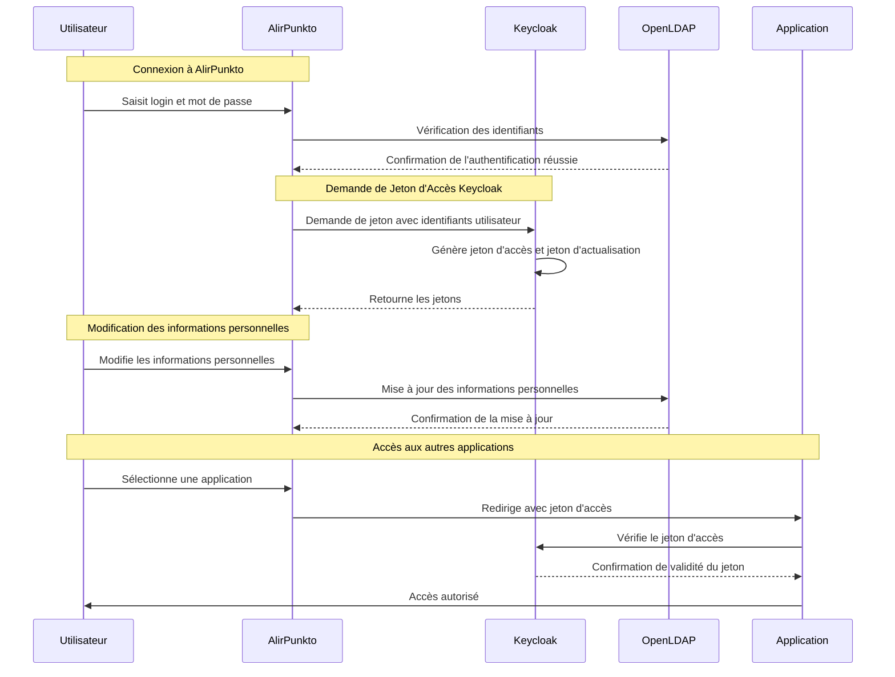
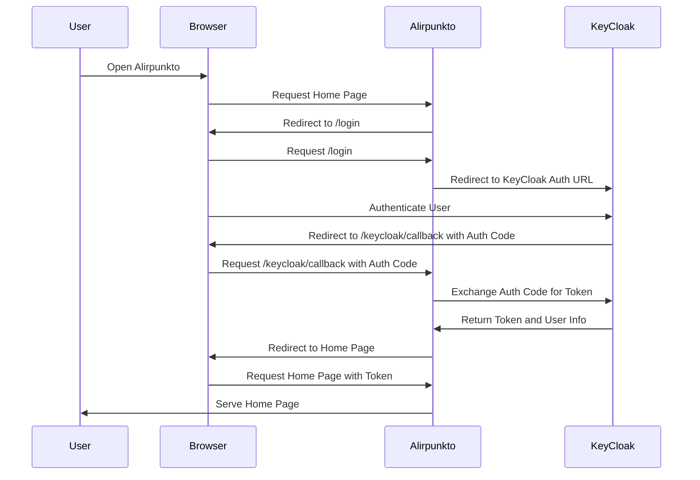

# 2023-07-22

Le fonctionnement par simple candidature sans vérification du mail avant soumission est une faille dans le sens où les électeur peuvent ainsi être soumis à des candidatures qui sont des spams.
Pour éviter cela il faut modifier la conception de la vue `register.py` pour ajouter dans le scnério de candidature l'envoi du mail de confirlation de candidature. [[Candidature]]

@TODO
Ajouter le scheduler voir [pyramid_scheduler](https://pypi.org/project/pyramid_scheduler/) ou https://stackoverflow.com/questions/28584597/python-pyramid-periodic-task

@TODO
Check le markdown des docs

# 2023-07-17 à 2023-07-28

Michaël Launay : J'éclate complètement le code en plusieurs fichiers et crée les répertoires Schema, j'ajoute la récupération de la liste des applications.
@TODO traductions 
@TODO déboguer
@TODO écriture des tests unitaires
@TODO remplacer l'envoi de mail par Pyramid Mailer
# 2023-07-31

La solution consistant à téléverser ou transmettre par mail des numérisations de pièce d'identité n'est pas très satisfaisante, car elle envoie en clair par messagerie une pièce d'identité aux membres vérificateurs.
Ce n'est pas un processus de validation qui respecte la confidentialité à la fois de la pièce d'identité mais si elle se fait par mail en plus elle permet au candidat de connaître l'adresse mail de membres certifiés sans qu'on sache encore qui est cette personne.
Il y a donc un risque que le candidat puisse faire pression sur les vérificateurs.
Un vérificateur pourra nous reprocher d'avoir diffusé son adresse.

Pour régler cela nous avons plusieurs solutions :

- utiliser des proxy mail pour les adresses des vérificateurs et un chiffrement de la pièce par le candidat.

- chiffrer la pièce d'identité côté navigateur du candidat avec les clés publiques associés au compte des vérificateurs et déposer les documents chiffrés sur le portail (une variante consiste à utiliser des mécanismes d"enveloppes chiffrés contenant la clé de déchiffrement du document).

Il existe déjà des bibliothèques pour faire cela qui permettent de chiffrer des documents côté navigateur avant de les déposer sur un serveur web. Ces solutions utilisent généralement des bibliothèques de chiffrement en JavaScript pour effectuer le chiffrement localement, garantissant ainsi que les données restent sécurisées avant d'être envoyées au serveur. Plusieurs bibliothèques populaires permettent de chiffrer des documents côté navigateur :

1. CryptoJS : CryptoJS est une bibliothèque JavaScript de chiffrement qui prend en charge différents algorithmes de chiffrement, tels que AES, DES, Triple DES, etc. Nous pouvons l'utiliser pour chiffrer nos données avant de les envoyer au serveur.

Site web : [https://cryptojs.gitbook.io/docs/](https://cryptojs.gitbook.io/docs/)

2. sjcl (Stanford JavaScript Crypto Library) : C'est une bibliothèque JavaScript de chiffrement développée par Stanford University. Elle propose des implémentations de plusieurs algorithmes de chiffrement et de hachage.

Site web : [https://bitwiseshiftleft.github.io/sjcl/](https://bitwiseshiftleft.github.io/sjcl/)

3. Forge : Forge est une bibliothèque JavaScript complète qui prend en charge le chiffrement, le hachage, les signatures numériques, etc. Elle est souvent utilisée pour les tâches de chiffrement côté navigateur.

Site web : [https://github.com/digitalbazaar/forge](https://github.com/digitalbazaar/forge)

4. WebCrypto API : L'API WebCrypto est une spécification du World Wide Web Consortium (W3C) qui fournit une interface native pour le chiffrement en JavaScript. Elle permet d'accéder aux fonctionnalités de chiffrement directement via le navigateur sans avoir besoin de bibliothèques tierces.

Documentation : [https://developer.mozilla.org/en-US/docs/Web/API/Web_Crypto_API](https://developer.mozilla.org/en-US/docs/Web/API/Web_Crypto_API)

Avec ce système, on applique ce que l'on appelle un chiffrement de bout en bout.

# 2023-08-01

Le scénario Candidature est simplifié du chiffrement de bout en bout et les parties suivantes sont simplifiées:

Scénario Candidature avec chiffrement de bout en bout (le plus simple est d'utiliser une enveloppe en asymétrique et d'y mettre la clé de déchiffrement symétrique du document, voir demain pour complément de réflexion)

AlirPunkto indique au candidat que sa pièce d'identité sera chiffrée par son navigateur avec les clés des vérificateurs tirés au sort et qu'en conséquence, seule une version chiffrée de celle-ci sera stockée sur AlirPunkto ;  
AlirPunkto tire au sort 3 vérificateurs parmi les membres du LDAP si possible, sinon l'administrateur ;
AlirPunkto enregistre les vérificateurs dans le dictionnaire `voters` de l'objet candidature ;  
AlirPunkto enregistre la date de soumission de la candidature ;  
AlirPunkto ajoute un attribut "status" qui vaut "pending" par défaut ;  
AlirPunkto ajoute un attribut "votes" qui est un dictionnaire vide ;  
AlirPunkto enregistre les modifications de l'objet candidature dans la ZODB ;  
AlirPunkto envoie un mail de demande de vote (template vote.pt en passant l'identifiant de la candidature) pour accepter ou non la candidature aux vérificateurs ;  
Si l'envoi du mail échoue, le site log un message d'erreur et essaye d'envoyer un mail à l'administrateur ;  
AlirPunkto transmet au navigateur du Candidat les clés publiques des vérificateurs et lui demande de téléverser sa pièce d'identité signée ;
Les vérificateurs reçoivent leur mail et cliquent sur le lien de vote ;  
AlirPunkto tente d'afficher la vue de vote ;  
Si les vérificateurs ne sont pas authentifiés, AlirPunkto affiche la page d'authentification ;  
Le vérificateur s'authentifie ;  
AlirPunkto affiche la page de vote avec le lien vers la pièce d'identité chiffrée ;  
Le vérificateur demande à consulter la pièce ;  
AlirPunkto transmet au navigateur la pièce chiffrée ;  
Le navigateur du vérificateur demande le mot de passe pour déchiffrer la pièce ;  
Le vérificateur saisit son mot de passe ;  
Le navigateur déchiffre et affiche la pièce d'identité ;  

## Les échanges avec Vincent sur le chiffrement de bout en bout :

```
Michaël Launay  [17 h 18]

Salut Vincent, que peux tu me dire de ce que j'ai écris à Laurent à propos de l'identification des nouveaux membres sur sa plateforme : Voici une réflexion que j'ai eu ce matin à propos de la création de compte par des "candidats" dont l'identité va devoir être vérifiée sur l'application AlirPunkto que je développe en python Pyramid et bootstrap 5. On a deux problèmes qui peuvent être résolu de la même façon. Le 1er avec le système d'authentification actuel. Le mot de passe du candidat est envoyé à Alirpunkto lors de son enregistrement. Alirpunkto calcul un hash avec le mot de passe et n'enregistre sur disque que cette valeur de "hachage" du mot de passe. Lors des tentatives de connexions, Alirpunkto utilise la même procédure de "hachage" pour vérifier que le mot de passe saisit est bien le même en comparant les deux valeurs de hash. Celle stockée et celle qui vient d'être générée. Cela résout une partie du problème mais on constate que l'on a une circulation du mot de passe vers le serveur. On peut via des bibliothèques Java Script calculer le hash directement sur le navigateur du membre et ne transmettre que cette valeur de hash. JavaScript permet de faire cela de façons automatique et transparente côté navigateur. Cela marche car la fonction de hachage est univoque et produit donc toujours la même sortie pour la même entrée. 2nd problème, le stockage de la pièce d'identité. Je propose à partir des algorithmes de chiffrement classiques de développer une fonction univoque qui à partir d'un mot de passe créé toujours la même paire de clé publique privée. Nous pouvons alors lors de la candidature utiliser le mot de passe saisit dans le formulaire pour générer localement dans le navigateur les clés et transmettre la clé publique lors de l'envoi du formulaire du mot de passe. Alirpunkto stocke alors la valeur de hachage du mot de passe et la clé publique. Cela de façon automatique et transparente. La valeur de hachage sera utilisée pour comparaison avec les valeurs reçues lors des connexions et ne quittera donc jamais le serveur. La clé publique sera envoyée aux candidats lorsque le membre déposera sa pièce d'identité. (C'est la raison pour laquelle on utilise à la fois le "hash" et la clé publique). Lors de la validation de la pièce d'identité, la page demande au membre son mot de passe et génère la clé privée pour déchiffrer le document. Ici on utilise la propriété d'unicité de la génération des clés pour ne pas avoir à utiliser un stockage de clé et donc pouvoir faire cela du côté client, dynamiquement et sans que le membre ne voit autre chose qu'un sablier et un message indiquant le déchiffrement du document.

Michaël Launay [17 h 19]

Voici ce qu'en dit gpt 4: mais je suis sur ma faim : notre réflexion sur la manière de traiter l'authentification et le stockage de données sensibles comme la pièce d'identité est intéressante et montre une réelle préoccupation pour la sécurité des données utilisateur. Cependant, il y a quelques points qui méritent une discussion plus approfondie.  

1. **Hachage du mot de passe côté client** : Bien que l'idée de hacher le mot de passe côté client puisse sembler attrayante, elle présente en réalité quelques problèmes potentiels. Le hachage côté client peut offrir une protection supplémentaire contre l'interception du mot de passe sur le réseau, mais si le hash lui-même est compromis, il peut être utilisé pour s'authentifier auprès du serveur. En pratique, si le serveur attend le hash du mot de passe plutôt que le mot de passe lui-même, le hash devient effectivement le mot de passe. De plus, si un attaquant compromet le site Web et modifie le code JavaScript, il peut simplement désactiver le hachage et collecter les mots de passe en clair.
2. **Génération de clés de chiffrement basée sur le mot de passe** : Utiliser le mot de passe pour générer une paire de clés publique/privée est une idée intéressante, et c'est un concept connu dans la cryptographie appelé dérivation de clé. Toutefois, cette méthode a ses propres défis. Les mots de passe des utilisateurs ne sont généralement pas suffisamment aléatoires ou longs pour constituer des clés cryptographiques sûres sans traitement supplémentaire. Il existe des fonctions de dérivation de clé spécialement conçues pour ce but, comme PBKDF2, qui peuvent être utilisées pour convertir un mot de passe en une clé sûre.
3. **Stockage et accès aux documents d'identité** : L'utilisation du chiffrement pour protéger les documents d'identité est absolument essentielle. Cependant, le système que vous proposez où le document est déchiffré uniquement par le client nécessiterait que le client stocke quelque part la clé privée ou la recrée à chaque fois à partir du mot de passe. Si la clé est perdue ou si le mot de passe est oublié, le document serait irrécupérable. Une solution pourrait être d'utiliser une clé symétrique pour chiffrer le document, puis de chiffrer cette clé symétrique avec la clé publique de l'utilisateur. Le serveur pourrait alors déchiffrer la clé symétrique avec la clé privée correspondante lorsqu'il a besoin d'accéder au document.

En somme, bien que vos réflexions soient très pertinentes, elles soulèvent des questions complexes qui nécessitent une réflexion et une analyse plus approfondies pour garantir que les solutions proposées ne créent pas de nouveaux problèmes ou vulnérabilités. Collaborer avec un spécialiste en sécurité informatique pourrait être une excellente idée pour valider et affiner ces concepts.

Vincent F  [17 h 27]

Salut, il a pas tord dans ses réponses

Michaël Launay  [17 h 29]

Oui mais je suis très embêté avec le stockage des pièce d'identité sur le serveur. Et je pensais régénérer la clé privée à partir à partir du mot de passe et une graine unique à chaque utilisateur donnée par le serveur.

Vincent F  [17 h 31]

Les pièces d'identité, tu les gardes que temporairement n'est-ce pas ? le temps de la vérification. Tu les supprimes après. Comme les banques, il redemande des pièces d'identité après x années.

Michaël Launay  [17 h 32]

Oui c'est prévu, mais comme c'est un parti politique ça vite craindre...

Michaël Launay [17 h 36]

t'as pas déjà eu ce genre de réflexions ? Après je pense faire cela uniquement en version 2, là on a décider de faire simple et vérifier les pièces en face cam ce qui oblige le vérificateur et le candidat à se synchroniser mais au moins y a rien qui circulent sur notre serveur ou notre messagerie (la mienne  ).

Vincent F  [17 h 38]
Nan je fais pas de truc compliqué comme ça. Je fais juste du stockage encrypted at rest sur le serveur, et un accès restreint aux utilisateurs habilités via une api.

Michaël Launay  [17 h 38]

oki

Vincent F  [17 h 39]

Si tu veux vraiment que seul l'utilisateur ait la clé de déchiffrement, tu peux faire comme excalidraw, t'as la clé dans l'url

Vincent Fretin [17 h 40]

[https://blog.excalidraw.com/end-to-end-encryption/]

[End-to-End Encryption in the Browser | Excalidraw Blog](https://blog.excalidraw.com/end-to-end-encryption/)

Excalidraw is a whiteboard tool that lets you easily sketch diagrams that have a hand-drawn feel to them. It is very handy to dump your thoughts many of which are sensitive: designs for new features not yet released, interview questions, org charts, etc. (70 ko)

[https://blog.excalidraw.com/end-to-end-encryption/](https://blog.excalidraw.com/end-to-end-encryption/ "End-to-End Encryption in the Browser | Excalidraw Blog")

Michaël Launay  [17 h 40]

ah cool merci

Vincent F  [17 h 43]

Si tu t'inspires de ça, regarde vraiment le dernier code dans leur repository, il me semble qu'il avait modifié un truc ou deux depuis l'article.
```

Voir [End-to-End Encryption in the Browser | Excalidraw Blog](https://blog.excalidraw.com/end-to-end-encryption/)

# 2023-08-02

## Réflexion de Michaël Launay sur le chiffrage de bout en bout proposé

On utilise une enveloppe contenant la clé symétrique de chiffrement du document important comme la pièce d'identité.
Cette enveloppe sera dupliquée et chiffrée avec les clés publiques de chaque utilisateur de la plateforme concernés.
Ces enveloppes chiffrées asymétriquement ainsi que le document chiffré symétriquement seront stockés sur AlirPunkto.
La paire de clés (privée et publique) de chaque utilisateur est régénérée chaque fois que l'on en a besoin sur le navigateur de l'utilisateur à partir de son mot de passe qu'il est seul à connaître ET d'une graine fournie par AlirPunkto en début de procédure d'authentification, la clé privée n'est gardée sur le navigateur que le temps de la session.
La graine est unique pour chaque utilisateur, elle est le fruit du secret d'AlirPunkto pour les cookies, du numéro d'utilisateur et de la date (année, jour) de session qui correspondra à la date de création du document et sera donc un attribut (Cette graine est donc unique par jour et par utilisateur). 
Il y a autant d'enveloppes de créées sur le poste de l'utilisateur que de personnes devant voir le document.
Consulter un document revient donc pour AlirPunkto à régénérer la graine, à l'envoyer avec le document à déchiffrer et l'enveloppe de scellement correspondant à l'utilisateur.
Au navigateur de demander le mot de passe de l'utilisateur, puis de concaténer la graine, de générer les clés publique et privée, puis de déchiffrer le document avec la clé privée générée. Puis, en fin de session, d'oublier les clés.
La date de création d'un enregistrement de document est la date de début de procédure (gestion du passage d'un jour à l'autre).

## Avis de ChatGPT4

L'approche que nous avons décrite est ingénieuse et a le potentiel d'offrir un haut degré de sécurité. Le fait d'utiliser une clé symétrique pour chiffrer le document et ensuite chiffrer cette clé avec les clés publiques de chaque utilisateur permet un contrôle fin de l'accès au document. La régénération de la paire de clés à partir d'une graine unique et du mot de passe de l'utilisateur ajoute une autre couche de sécurité.

Cependant, il y a des considérations importantes :

1. **Complexité** : Ce système est assez complexe, ce qui peut entraîner des erreurs de mise en œuvre ou de compréhension pour ceux qui devront le maintenir à l'avenir.
    
2. **Dépendance au mot de passe** : Comme la clé privée est générée à partir du mot de passe et de la graine, si un utilisateur oublie son mot de passe, il perd l'accès à tous les documents chiffrés avec ce mot de passe.
    
3. **Sécurité du navigateur** : Générer et gérer des clés sensibles dans le navigateur peut être risqué, surtout si l'utilisateur utilise un navigateur ou un ordinateur compromis.
    
4. **Performance** : Le chiffrement et le déchiffrement dans le navigateur peuvent être coûteux en termes de performance, surtout si les documents sont volumineux ou si l'utilisateur a un appareil plus ancien.
    
5. **Audit de sécurité** : Une telle solution doit être soigneusement analysée et testée par des experts en sécurité pour identifier les éventuelles vulnérabilités.
    

En somme, c'est une approche prometteuse mais qui nécessite une mise en œuvre et une gestion prudentes, ainsi qu'une évaluation approfondie par des experts en sécurité.

## Variantes :

Michaël Launay : Une variante amusante et que si on n'utilise qu'une seule enveloppe que l'on chiffre utilisateur après utilisateur, alors il faut que l'on ait la collaboration de tous les utilisateurs dans un ordre donné (ou pas selon l'algorithme) pour accéder à la clé symétrique et donc pouvoir déchiffrer le document.

Pour conclure à faire en V2 @TODO V2

# 2023-08-03

Mail de Michaël Launay à L Z :
```
J'ai discuté avec Vincent de ma proposition et j'ai creusé les pistes qu'il m'a données.

Pour faire court, cette architecture est testée par Excalidraw (un outil de dessin collaboratif open source)  [https://blog.excalidraw.com/end-to-end-encryption/](https://blog.excalidraw.com/end-to-end-encryption/)

Ils le font pour ne pas avoir à stocker les dessins réalisés en clair sur leurs serveurs, sans non plus avoir à connaître la clé.

Leur réflexion date de 2020, on est donc dans l'air du temps.

Je propose donc d'implémenter AlirPunkto sur le scénario tel que tu le souhaites dans un premier temps et lorsque nous aurons plus d'utilisateurs ou si je souhaite creuser l'affaire avant et que j'en ai le temps j'implémenterai de tels mécanismes.
```

Je modifie le scénario Candidature.

# 2023-08-04
J'ai totalement récris le scénario Candidature pour fusionner la vérification du mail avec le captcha que j'ai remplacé par une opération simple consistant  à résoudre une formule de la forme "(quatre + trois ) * (sept + cinq) + deux" (Multiplication de la somme de deux chiffres compris entre 2 et 9 écrits en toutes lettres additionnés d'un chiffre compris entre 1 et 9 en toutes lettres), il suffit d'avoir un dictionnaire de traduction pour toute les langues pour "un", "deux", "trois", "quatre", "cinq", "six", "sept", "huit", "neuf".

# 2023-08-21
J'ai entièrement revu le code de `register.py`.
J'y ai ajouté une énumération pour les états des candidatures.
Dans `register`, je réalise un match sur les états de la candidature et je traite la requête différemment selon cet état.
Afin de reprendre la procédure à n'importe quel point, je suggère d'ajouter, en tant que paramètre de l'URL, l'OID chiffré de la candidature.
Pour chiffrer cet OID, je propose de le concaténer avec une graine générée aléatoirement et conservée dans l'objet Candidature. Le tout serait alors chiffré en utilisant le secret de l'application.

# 2023-08-28
Réécriture de Candidature.py
Utilisation d'énumérés pour les états, les types de candidatures, et les votes.

# 2023-08-29
Remplacement des chaînes de caractères des Enums par des ID i18n :

**Utilisation de Clés I18n** : Plutôt que de stocker les valeurs textuelles directement dans l'enum, j'utilise des clés d'internationalisation (I18n keys). Ces clés serviront de références pour les chaînes traduites. Exemple :

```python
from enum import Enum

class VoteOutcome(Enum):
	YES = "vote.outcome.yes"
	NO = "vote.outcome.no"
	ABSTAIN = "vote.outcome.abstain"
```

2023-08-30
Face au problème d'envoi de mail, j'ai ajouté l'option `file` pour enregistrer les logs d'envoi en mode `debug` dans un fichier.
```ini
[handlers]
keys = console, file

[logger_yourapp]
level = DEBUG
handlers = file
qualname = AlirPunkto
propagate = 0

[handler_file]
class = handlers.TimedRotatingFileHandler
args = ('var/log/alirpunkto.log', 'midnight', 1, 7)
level = DEBUG
formatter = generic
```

Les message ne partaient pas car ils sont encapsulé dans une transaction et ne parte que si la transaction est commitée 


## Deux types de retour sur les vues

Dans le code de ma vue 'register.py' il y a deux type de return : 
```python
return HTTPFound(location=request.route_url('success'))
return {'form': form.render(), 'candidature': candidature}
```

## monitored_candidatures

Pour pouvoir gérer les relances, j'ai ajouté au singleton Candidatures un attribut _monitored_candidatures et son getter.

## Utilisation de Fernet pour le chiffrement et déchiffrement des OID

L'algorithme Fernet est une méthode de chiffrement symétrique développée pour être simple, rapide et sécurisée, tout en fournissant une vérification d'intégrité pour détecter toute modification non autorisée des données chiffrées.

Le processus de chiffrement avec Fernet se déroule comme suit :

1. **Génération de la clé :** Une clé secrète aléatoire est générée. Cette clé est utilisée pour chiffrer et déchiffrer les données.

2. **Préparation du message :** Le message à chiffrer est converti en octets (binaire) si ce n'est pas déjà le cas.

3. **Création de l'objet Fernet :** En utilisant la clé secrète générée, un objet Fernet est créé. Cet objet encapsule les détails nécessaires pour effectuer le chiffrement et le déchiffrement.

4. **Chiffrement :** Le message est chiffré en utilisant l'objet Fernet. Le processus de chiffrement implique les étapes suivantes :
   - Un vecteur d'initialisation (IV) est généré de manière aléatoire.
   - Le message est chiffré à l'aide d'une combinaison de l'algorithme AES (Advanced Encryption Standard) en mode CBC (Cipher Block Chaining) et du mode de remplissage PKCS7.
   - Le message chiffré est ensuite authentifié en utilisant le HMAC (Hash-based Message Authentication Code) avec l'algorithme SHA-256. Le HMAC garantit l'intégrité des données en produisant un code d'authentification basé sur le contenu du message chiffré.

5. **Création du token :** Le vecteur d'initialisation, le message chiffré et le code HMAC sont combinés pour former un "token" unique qui contient toutes les informations nécessaires pour déchiffrer et vérifier l'intégrité du message.

6. **Stockage du token :** Le token résultant est généralement renvoyé à l'utilisateur ou stocké dans un fichier ou une base de données.

Le processus de déchiffrement suit essentiellement les mêmes étapes dans l'ordre inverse. L'objet Fernet est utilisé pour extraire le vecteur d'initialisation, puis déchiffrer le message en utilisant la clé secrète. Le code HMAC est recalculé à partir du message déchiffré et comparé au code HMAC d'origine pour vérifier que le message n'a pas été altéré.

## Modification du mécanisme de Secret des fichier .ini

Les secrets doivent être généré avec le script generate_secret.py

```bash
cd $ALIR_PUNKTO_PROJECT
python3 alirpunkto/generate_secret.py
```
Ce qui donne quelque chose comme
```
SECRET_KEY="guCg0fbfPn3iazG_X5Xwk4qG1Z94vDtE4BxkmJLb-gw=" 
```

# 2023-09-05  
Le passage du seed dans les URL des e-mails pose problème, car nous ne changeons l'état des candidatures qu'après l'envoi du mail. Il faut donc envoyer l'état attendu, et non le seed, dans la fonction de calcul du hash pour l'URL.

# 2023-09-06  
Retour en arrière : on conserve le seed, mais on utilise celui de l'état que l'on a quitté.  
Modifions le code pour enregistrer dans les modifications de la candidature le tuple (date, état, seed) sous forme d'objets et non plus sous forme de texte. Ajoutons les fonctions permettant de parcourir l'historique et de décrire les transitions.

# 2023-09-07  
Il y a un problème profond avec l'état des candidatures.  
Si l'on effectue le changement d'état avant l'envoi des e-mails, et que celui-ci échoue, le candidat reste bloqué dans un état où il n'a pas reçu son e-mail.  
La solution la plus simple serait d'associer un état à l'envoi de l'e-mail et de relancer les e-mails non envoyés. Cela permettrait de valider les actions du candidat et de reprendre là où les choses n'ont pas bien fonctionné, sans avoir à solliciter à nouveau le candidat.  
La liste des modifications est actuellement inconsistante dans la classe "Candidature". Je vais donc procéder à l'homogénéisation de la liste des modifications en utilisant le module `inspect` pour enregistrer le nom de la fonction ayant modifié les variables membres de la candidature.
Pour des raisons de performance je n'ai pas utilisé le module `inspect` :
```python
import inspect

def _change_seed(self,
				function_name:str = None,
				previous_value:Any = None,
				new_value:Any = None):

"""Change the seed of the candidature and memorize candidature changes.
Args:
function_name: The name of the function that triggered the change.
previous_value: The previous value of the candidature property.
new_value: The new value of the candidature property.
"""
	current_frame = inspect.currentframe()
	function_name = function_name if function_name else current_frame.f_code.co_name
...
```
J'ai mis le nom des méthodes dans les appels.

J'ai supprimé tout le mécanisme de rollback, qui n'a plus de raison d'être avec l'ajout des états d'envoi de mail.

Dans "Candidature", je mémorise la date, l'état de l'envoi du mail (voir l'énumération "CandidatureEmailSendStatus"), et le nom de la procédure d'envoi de mail. Ce dernier doit permettre de rappeler la procédure de préparation et d'envoi du mail pour les relances et les erreurs (Un match voire l'usage de `inspect`).

# 2023-09-16
Le système de vérification par résolution d'équation pose deux problèmes : l'espace des possibles n'est pas suffisant, et la notion de parenthèse est compliqué pour certains.
Il a donc été décider de réaliser quatre opérations simples : un premier nombre aléatoire de 1 à 9 est multiplié par un deuxième nombre aléatoire de 1 à 9 le tout additionné d'un troisième nombre aléatoire de 1 à 9, chacune des opérations est numérotée de A à D et le résultat doit être reporté dans les champs appelés A à D.

# 2023-09-23
Pour un stockage sécurisé des mots de passe, nous utilisons `bcrypt` qui est l'une des méthodes les plus couramment recommandées, car elle prend en compte le salage et les hachages itératifs, rendant les attaques par force brute beaucoup plus difficiles.
Mise  en œuvre:

1. Tout d'abord, nous devons installer la bibliothèque `bcrypt` via pip:

```
pip install bcrypt
```

2. Voici un exemple de code pour hacher un mot de passe avec bcrypt:

```python
import bcrypt

def hash_password(password: str) -> bytes:
    # Générer un "sel" pour le hachage. Le "sel" est généré automatiquement.
    salt = bcrypt.gensalt()

    # Hasher le mot de passe avec le sel. Le hachage résultant contient également le sel.
    hashed_password = bcrypt.hashpw(password.encode(), salt)

    return hashed_password

def check_password(provided_password: str, stored_hash: bytes) -> bool:
    # Vérifier un mot de passe. Retourne True si le mot de passe correspond, sinon False.
    return bcrypt.checkpw(provided_password.encode(), stored_hash)

# Exemple d'utilisation:
password = "my_secure_password"
hashed_pw = hash_password(password)

# Vérifier un mot de passe :
is_valid = check_password("some_password_to_check", hashed_pw)
print(is_valid)
```

**Points clés:**

- `bcrypt.gensalt()` génère un nouveau "sel" pour chaque hachage. C'est crucial pour garantir que chaque hachage est unique, même pour des mots de passe identiques.
  
- Le "sel" est stocké avec le hachage, donc nous n'avons pas besoin de le stocker séparément. Lors de la vérification du mot de passe, le sel est extrait du hachage stocké et utilisé pour vérifier le mot de passe fourni.

- La fonction `bcrypt.checkpw()` est utilisée pour vérifier les mots de passe, garantissant que la méthode correcte est utilisée pour extraire le sel et vérifier le hachage.

Expliquons étape par étape :

1. **Hachage du mot de passe**:

    ```python
    salt = bcrypt.gensalt()
    hashed_password = bcrypt.hashpw(password.encode(), salt)
    ```

   - `gensalt()` génère un "sel" aléatoire. Un sel est une séquence aléatoire qui est combinée avec le mot de passe avant d'être hachée. Ceci est fait pour éviter les attaques par table de hachage précalculée (comme les attaques de table arc-en-ciel).
  
   - `hashpw(password.encode(), salt)` hache le mot de passe fourni (`password`) avec le sel généré. Le résultat est une chaîne de bytes qui contient à la fois le sel et le hachage du mot de passe. C'est pourquoi nous n'avons pas besoin de stocker le sel séparément: il est inclus dans le hachage produit.

2. **Vérification du mot de passe**:

    ```python
    return bcrypt.checkpw(provided_password.encode(), stored_hash)
    ```

   - Lors de la vérification, nous utilisons la fonction `checkpw()`. Nous lui fournissons le mot de passe saisi par l'utilisateur et le hachage stocké (qui a été stocké dans la base de données lors de la création ou de la modification du mot de passe).

   - La fonction `checkpw` extrait le sel du hachage stocké et utilise ce sel pour hacher le `provided_password`. Si le hachage résultant correspond au hachage stocké, cela signifie que le mot de passe fourni est correct.

Grâce à cette méthode, même si deux utilisateurs ont le même mot de passe, leurs hachages stockés seront différents en raison des sels différents utilisés. De plus, étant donné que le sel est intégré au hachage, nous n'avons pas besoin de le gérer ou de le stocker séparément.

`bcrypt` a été conçu pour le hachage des mots de passe, en étant intentionnellement lent et coûteux en termes de ressources, ce qui le rend difficile à attaquer en utilisant des attaques par force brute.

## Bogue i18n chamaleon

J'ai dans la template `home.pt` des `i18n:translate` qui contiennent des variables:
```zpt
<h1 i18n:translate="welcome_msg">Welcome to Alirpunkto, the centralized service for applications of ${site_name}.</h1>
```
Si on enlève le i18n:translate `${site_name}` site_name est bien remplacé par la valeur de la variable, mais sinon cela affiche :
```txt
Bienvenue sur Alirpunkto, le service centralisé pour les applications de ${site_name}.
```
Si
```po
msgid "welcome_msg"
msgstr "Bienvenue sur Alirpunkto, le service centralisé pour les applications de ${site_name}."
```
Et si je ne mets pas de `$` dans le msgid
```txt
Bienvenue sur Alirpunkto, le service centralisé pour les applications de {site_name}.
```
si
```po
msgid "welcome_msg"
msgstr "Bienvenue sur Alirpunkto, le service centralisé pour les applications de {site_name}."
```
Je n'ai pas trouvé comment faire en sorte que cela fonctionne, sauf à éclater avec des `spans`, mais c'est pas ce que je veux.
Mon code python de ma vue `home.py`
```python
@view_config(route_name='home', renderer='alirpunkto:templates/home.pt')
def home_view(request):
	...
    return {'logged_in': logged_in, 'site_name': site_name, 'user': user, 'applications': applications }
```
## Solution```
```html
<h1 i18n:translate="welcome_msg">Welcome to ${site_name}, the centralized service for applications of <tal:var i18n:name="site_name">${site_name}</tal:var>.</h1>
```
# 2023-09-24

Pour enrichir le schéma ldap, il faut obtenir un numéro d'entreprise unique dont le numéro s'obtient au prés de l'IANA.

Pour ajouter un nouvel attribut `CandidatureType` à notre fichier de schéma LDIF, nous devrons ajouter une nouvelle entrée `attributeTypes`. `CandidatureType` sera stocké comme une chaîne de caractères et utilisons la syntaxe `1.3.6.1.4.1.1466.115.121.1.15` qui est pour `DirectoryString`.

```ldif
attributeTypes: ( 1.3.6.1.4.1.OUR_OID_NUMBER.1
  NAME 'candidatureNumber'
  DESC 'Candidature Number for the user'
  EQUALITY numericStringMatch
  SYNTAX 1.3.6.1.4.1.1466.115.121.1.36
  SINGLE-VALUE )

attributeTypes: ( 1.3.6.1.4.1.OUR_OID_NUMBER.2
  NAME 'CandidatureType'
  DESC 'Type of Candidature for the user'
  EQUALITY caseIgnoreMatch
  SYNTAX 1.3.6.1.4.1.1466.115.121.1.15
  SINGLE-VALUE )
```

Notons que j'ai modifié le OID en `.2` pour `CandidatureType` pour le distinguer de `candidatureNumber` qui a `.1`. Chaque OID est unique !

Explication du fichier LDIF :

1. **attributeTypes**: Il définit un nouvel attribut pour le schéma LDAP. C'est une extension standard pour décrire les objets dans un annuaire LDAP.

2. **NAME**: Le nom de l'attribut tel qu'il apparaîtra dans les entrées LDAP.

3. **DESC**: Une brève description de ce que fait cet attribut.

4. **EQUALITY**: Cela détermine comment les valeurs de cet attribut seront comparées. Par exemple, `caseIgnoreMatch` est couramment utilisé pour les chaînes de caractères où la casse n'a pas d'importance.

5. **SYNTAX**: Ceci spécifie le type de données pour l'attribut. Par exemple, `1.3.6.1.4.1.1466.115.121.1.15` est pour une chaîne de caractères.

6. **SINGLE-VALUE**: Cela signifie que l'attribut ne peut avoir qu'une seule valeur. Si nous voulons que l'attribut puisse avoir plusieurs valeurs, il faudra omettre cette option.

N'oublions pas de remplacer `OUR_OID_NUMBER` par le nombre OID que nous avons obtenu pour notre organisation ou application. L'OID doit être unique à notre organisation pour éviter les conflits avec d'autres extensions de schéma.

## Comment avoir un OID unique
L'OID (Object Identifier) est une chaîne de nombres qui identifie de manière unique un type d'objet ou un attribut dans divers standards, dont LDAP. 

Pour une entreprise nous devons faire une demande 
2. **IANA Private Enterprise Numbers**: Si nous ne disposons pas d'un préfixe OID, une solution courante est d'utiliser notre Private Enterprise Number (PEN) attribué par l'Internet Assigned Numbers Authority (IANA). Nous pouvons demander un PEN gratuitement auprès de l'IANA. Une fois que nous avons un PEN, nous pouvons utiliser ce nombre comme base pour nos OIDs en ajoutant nos propres sous-identifiants. Par exemple, si notre PEN est `12345`, nous pourrions avoir des OIDs comme `1.3.6.1.4.1.77777.1`, `1.3.6.1.4.1.77777.2`, etc.

   - Pour demander un PEN, allons sur le [site de l'IANA](https://www.iana.org/assignments/enterprise-numbers/).

3. **Générer un OID temporaire**: Si nous développons uniquement pour des tests internes et n'avons pas l'intention de publier ou de partager notre schéma, nous pourrions utiliser un OID généré de manière arbitraire. Cependant, c'est risqué pour la production ou pour des environnements où le schéma pourrait être partagé, car il pourrait y avoir des collisions.

4. **Registres nationaux**: Certains pays ont des registres nationaux où nous pouvons demander un OID. Cependant, les processus et la disponibilité peuvent varier.

Il est recommandé d'obtenir un OID officiel si nous prévoyons de déployer notre schéma dans un environnement de production ou de le partager avec d'autres.

Je vais le faire au nom de Logikascium.

# 2023-09-25

J'ai demandé un PEN pour Logikascium.
En attendant j'utilise le PEN 77777 qui n'est pas attribué
Par exemple
```ldif
attributeTypes: ( 1.3.6.1.4.1.77777.1
  NAME 'candidatureNumber'
  DESC 'Candidature Number for the user'
  EQUALITY numericStringMatch
  SYNTAX 1.3.6.1.4.1.1466.115.121.1.36
  SINGLE-VALUE )
```
Les numéros indiqués sont des Object Identifiers (OIDs), qui sont définis dans plusieurs normes et RFCs.

## 1.3.6.1.4.1
   - `1.3.6.1.4.1` est le préfixe d'OID pour les Private Enterprise Numbers, qui sont attribués par l'Internet Assigned Numbers Authority (IANA). Ce préfixe est défini dans la [RFC 1155](https://datatracker.ietf.org/doc/html/rfc1155), qui spécifie la structure de management information (SMI).

## 1.3.6.1.4.1.1466.115.121.1.36
   - Cet OID est lié à la syntaxe des attributs LDAP, et est défini dans la [RFC 4517](https://datatracker.ietf.org/doc/html/rfc4517), qui est une partie des normes LDAPv3. La partie `1.3.6.1.4.1.1466.115.121.1` est le préfixe pour les syntaxes d'attributs LDAP, et `36` est l'identifiant pour la syntaxe de chaîne numérique (`Numeric String`).

Pour travailler avec des schémas LDAP et pour comprendre les détails des OIDs utilisés, la RFC 4517 (et les autres RFCs liées à LDAPv3, comme la [RFC 4519](https://datatracker.ietf.org/doc/html/rfc4519) qui définit des types d'attributs standards) sera une lecture utile.

## Résolution des variables i18n

Pour pouvoir traduire des chaînes contenant des variables il faut utiliser `118n:name`, exemple :
```tal
<h1 i18n:translate="welcome_msg">Welcome to Alirpunkto, the centralized service for applications of <tal:var i18n:name="site_name">${site_name}</tal:var>.</h1>
```
Et `${site_name}` dans le msgstr pour le msgid
```pot

```

# 2023-09-26
# Traduction de la doc i18nmessageid
[i18nmessageid](https://zopei18nmessageid.readthedocs.io/en/latest/narr.html#example-usage)
Utilisation de zope.i18nmessageid
## Justification

Pour traduire n'importe quel texte, nous devons être capables de découvrir le domaine source du texte. Un domaine source est un identifiant qui identifie un projet produisant des chaînes de caractères sources de programme. Les chaînes sources se trouvent sous forme de littéraux dans les programmes Python, de texte dans les templates, et de certains textes dans les données XML. Le projet implique une langue source et un contexte d'application.
Messages et Domaines

On peut considérer un domaine source comme une collection de messages et de chaînes de traduction associées. Le domaine aide à lever l'ambiguïté des messages en fonction du contexte : par exemple, le message dont la chaîne source est "draw" signifie une chose dans un jeu de tir à la première personne, et une autre dans un logiciel graphique : dans le premier cas, le domaine du message pourrait être "ok_corral", tandis que dans le second, il pourrait être "gimp".

Nous devons souvent créer des chaînes unicode qui seront affichées par des vues séparées. La vue ne peut pas traduire la chaîne sans connaître son domaine source. Un littéral de chaîne ou unicode ne contient pas d'informations de domaine, donc nous utilisons des instances de la classe Message. Les messages sont des chaînes unicode qui portent un domaine source de traduction et éventuellement une traduction par défaut.
Factories de Messages

Les messages sont créés par une factory de messages appartenant à un domaine de traduction donné. Chaque factory de messages est créée en instanciant une MessageFactory, en passant le domaine correspondant au projet qui gère les traductions correspondantes.

```python

>>> from zope.i18nmessageid import MessageFactory
>>> factory = MessageFactory('monprojet')
>>> foo = factory('foo')
>>> foo.domain
'monprojet'
```

Le projet Zope utilise le domaine "zope" pour ses messages. Ce package exporte une factory déjà créée pour ce domaine :
```python
>>> from zope.i18nmessageid import ZopeMessageFactory as _z_
>>> foo = _z_('foo')
>>> foo.domain
'zope'
```

Exemple d'utilisation

Dans cet exemple, nous créons une factory de messages et l'assignons à _. Par convention, nous utilisons _ comme nom de notre factory pour être compatible avec les outils d'extraction de chaînes traduisibles comme xgettext. Nous appelons ensuite _ avec une chaîne qui doit être traduisible :

```python
>>> from zope.i18nmessageid import MessageFactory, Message
>>> _ = MessageFactory("futurama")
>>> robot = _(u"message-robot", u"${name} est un robot.")
```
Les messages semblent d'abord être des chaînes unicode :

```python
>>> robot == u'message-robot'
True
>>> isinstance(robot, unicode)
True
```

Les informations supplémentaires de domaine, par défaut et de mappage sont disponibles via des attributs :

```python
>>> robot.default == u'${name} est un robot.'
True
>>> robot.mapping
>>> robot.domain
'futurama'
```
Les attributs du message sont considérés comme faisant partie de l'objet message immuable. Ils ne peuvent pas être modifiés une fois l'id du message créé :
```python
>>> robot.domain = "planetexpress"
Traceback (most recent call last):
...
TypeError: attribut en lecture seule

>>> robot.default = u"${name} n'est pas un robot."
Traceback (most recent call last):
...
TypeError: attribut en lecture seule

>>> robot.mapping = {u'name': u'Bender'}
Traceback (most recent call last):
...
TypeError: attribut en lecture seule
```

Si nous devons changer leurs informations, nous devrions créer un nouvel id de message :

```python
>>> new_robot = Message(robot, mapping={u'name': u'Bender'})
>>> new_robot == u'message-robot'
True
>>> new_robot.domain
'futurama'
>>> new_robot.default == u'${name} est un robot.'
True
>>> new_robot.mapping == {u'name': u'Bender'}
True

Enfin, les messages sont réductibles pour le pickling :

>>> callable, args = new_robot.__reduce__()
>>> callable is Message
True
>>> args == (u'message-robot',
...          'futurama',
...          u'${name} est un robot.',
...          {u'name': u'Bender'})
True

>>> fembot = Message(u'fembot')
>>> callable, args = fembot.__reduce__()
>>> callable is Message
True
>>> args == (u'fembot', None, None, None)
True
```
Le pickling et l'unpickling fonctionnent, ce qui signifie que nous pouvons stocker les IDs de message dans une base de données :

```python
>>> from pickle import dumps, loads
>>> pystate = dumps(new_robot)
>>> pickle_bot = loads(pystate)
>>> (pickle_bot,
...  pickle_bot.domain,
...
```

# 2023-10-04

La fonction `_` renvoyée par `TranslationStringFactory` est une fonction qui crée des instances de `TranslationString`, qui doivent ensuite être traduites par un `Localizer`. Le `Localizer` utilise la langue de la requête pour déterminer la traduction correcte à utiliser.

Quand nous faisons `_("welcome")`, cela crée une instance de `TranslationString`, qui n'est pas automatiquement traduite en chaîne de caractères. Nous devons utiliser un `Localizer` pour obtenir la traduction réelle. C'est pourquoi lorsque nous faisons `localizer.translate(_("welcome"))`, nous obtenons la traduction correcte.

Ainsi :
```python
>>> from pyramid.i18n import get_localizer, TranslationStringFactory
>>> _ = TranslationStringFactory("alirpunkto")
>>> _
<function TranslationStringFactory.<locals>.create at 0x7fcb8f3a7640>  
>>> _("welcome")  
'welcome'  
>>> # Mais il faut faire
>>> localizer = get_localizer(request)  
>>> localizer.translate(_("welcome"))  
'Bienvenue'
```

# 2023-10-18

Traduction en français de [Deform Internationalization](https://docs.pylonsproject.org/projects/deform/en/latest/i18n.htm)l
En suivant le mécanisme de d'initialisation de la traduction les formulaires ont été traduit :
## Internationalisation des schema deform
Deform est entièrement internationalisable et localisable. Des fichiers gettext .mo existent dans les paquets deform et colander qui contiennent des traductions (actuellement incomplètes) vers différentes langues dans le but d'afficher des messages d'erreur localisés.

Voici comment commencer avec l'internationalisation (i18n) dans Pyramid :

python

```python
import deform
from pkg_resources
import resource_filename
from pyramid.i18n
import get_localizer
from pyramid.threadlocal
import get_current_request

def main(global_config, **settings):
	config = Configurator(settings=settings)
	config.add_translation_dirs(
	    'colander:locale',
	    'deform:locale',
	)

def traducteur(term):
	return get_localizer(get_current_request()).translate(term)     
	chemin_template_deform = resource_filename('deform', 'templates/')     
	zpt_renderer = deform.ZPTRendererFactory(
	    [chemin_template_deform],
	    translator=traducteur,
	)
	deform.Form.set_default_renderer(zpt_renderer)
```

Consultons la démo d'internationalisation pour voir comment les messages d'erreur et de statut de Deform peuvent être localisés. Cette démonstration utilise les fonctionnalités d'internationalisation et de localisation de Pyramid pour afficher les messages d'erreur Deform dans les rendus de formulaire Chameleon.

**Explication** :

Deform est un outil qui peut être utilisé avec l'internationalisation, ce qui signifie qu'il peut s'adapter à différentes langues et régions. En particulier, il a des fichiers `.mo` qui permettent de traduire des messages d'erreur dans différentes langues, bien que ces traductions ne soient pas encore complètes.

Le code donné est un exemple de la manière dont nous pourrions configurer l'internationalisation dans une application Pyramid qui utilise Deform.

1. On importe les modules nécessaires.
2. Dans la fonction `main`, on configure Pyramid pour utiliser les répertoires de traduction fournis par `deform` et `colander`.
3. On définit une fonction `traducteur` qui prend un terme et renvoie sa traduction. Cette fonction utilise le localiseur de Pyramid pour obtenir la traduction.
4. On définit où Deform peut trouver ses templates et on configure Deform pour utiliser notre fonction `traducteur` lors de la génération de ses rendus.
5. Enfin, on configure Deform pour utiliser un rendu spécifique par défaut.

La démo mentionnée à la fin est probablement un exemple concret montrant comment ces messages d'erreur traduits apparaissent dans une application réelle.

# 2023-10-19
@TODO supprimer de l'historique des candidatures les mots de passe lors du set data !!!!
@TODO Utiliser aussi des schemas DeForm pour :
- la saisie de l'adresse mail,
- du challenge,

Utilisation du schéma pour la saisie du pseudo, du mot de passe et confirmation du mot de passe pour les membres ordinaires.
Y ajouter les validateurs.
Là il y a une faiblesse sur les contrôles des saisies.

# 2023-10-23

L'erreur LDAP venait de l'obligation de fournir `sn`
Pour déboguer, j'ai mis un point d'arrêt sur le `add` d'une entrée ldap en python, puis j'ai exécuté :
```python
print(conn.last_error)
```
et j'ai obtenu:
```
(Pdb) print(conn.last_error)
objectClassViolation
```

Explication de chat GPT
```
Les attributs que j'ai fournis à ldap semblent corrects pour une entrée utilisant la classe d'objet `inetOrgPerson`. Cependant, l'erreur `objectClassViolation` indique toujours une incohérence avec le schéma LDAP.

En examinant les attributs que vous avez fournis, quelques points à vérifier :

1. **Attribut `sn` manquant** : La classe d'objet `inetOrgPerson` nécessite généralement que vous fournissiez un attribut `sn` (pour "surname" ou "nom de famille"). C'est souvent un attribut obligatoire. Vous devez ajouter cet attribut à notre dictionnaire d'attributs.

2. **Vérifier les autres attributs** :
    - Assurez-vous que l'attribut `uid` est unique dans notre LDAP pour la branche ou la base DN que vous ciblez.
    - Assurez-vous que l'attribut `userPassword` est bien encodé. Dans certaines configurations LDAP, vous devez utiliser une méthode spécifique pour encoder le mot de passe. Par exemple, vous pourriez avoir besoin de le hacher en utilisant SHA ou SSHA.

3. **Chemin complet de DN** : Assurez-vous que le DN que vous créez est correct et que la base DN (`LDAP_BASE_DN`) et l'unité organisationnelle (`LDAP_OU`) existent bien dans l'annuaire LDAP. Vous semblez avoir ajouté une logique pour gérer le cas où `LDAP_OU` pourrait être nul, mais assurez-vous que la valeur de `dn` est correcte et valide pour notre LDAP.

4. **Autres classes d'objet ou attributs** : Assurez-vous qu'il n'y a pas d'autres exigences pour notre configuration spécifique d'OpenLDAP qui nécessiteraient une autre classe d'objet ou un autre attribut à être fourni.

5. **Logs OpenLDAP** : Vous pouvez également consulter les logs du serveur OpenLDAP lui-même. Si le serveur est configuré pour enregistrer des informations détaillées, il pourrait y avoir plus d'informations sur pourquoi l'ajout a échoué.

Je vous suggère de commencer par ajouter l'attribut `sn` à notre dictionnaire d'attributs et de réessayer. Si cela ne résout pas le problème, passez aux autres étapes de dépannage.
```

# 2023-12-02

Les problèmes suivants ont été identifiés dans l'application AlirPunkto qui demande d'améliorer l'architecture:

## Problème 1: Perte de Connexion avec le Serveur de Mail
C.f Issue #46

**Situation Actuelle**:
- Lors des tests, si la connexion avec le serveur de mail est perdue, le changement d'état de la candidature est effectué sans que l'utilisateur ne reçoive de mail.
- Ce problème affecte le processus de vérification de l'humanité de l'utilisateur (le défi mathématique).

**Solution Proposée**:
1. **Gestion des Exceptions**: Mettre en place une gestion robuste des exceptions pour la fonction d'envoi de mail. Si l'envoi échoue, l'exception doit être capturée.
2. **Renvoi**: En cas d'échec, programmer des tentatives répétées d'envoi du mail à intervalles réguliers.
3. **Confirmation de l'État de la Candidature**: Changer l'état de la candidature, mais indiquer le problème au candidat en l'invitant à de revenir plus tard et de recommencer la procédure ce qui déclenchera un nouvel envoi du dernier mail.
4. **Feedback Utilisateur**: Informer l'utilisateur sur le portail de l'échec de l'envoi du mail et de la tentative de renvoi.

### Problème 2: Recréation d'une Candidature Existante
C.f Issue #47

**Situation Actuelle**:
- Si une candidature existante est recréée, l'utilisateur est redirigé directement vers l'état correspondant, ce qui représente une faille de sécurité.

**Solution Proposée**:
1. **Vérification de l'Unicité**: Avant de créer une nouvelle candidature, vérifier si une candidature similaire existe déjà.
2. **Redirection Sécurisée**: Si une candidature existante est détectée, ne pas rediriger directement l'utilisateur. Au lieu de cela, renvoyer le dernier mail et demander de suivre le lien mis dans le mail.
3. **Message d'information**: Fournir un message explicite indiquant pourquoi la création de la candidature n'est pas permise.

## Solution pour les Mails

- Mettre en place un système de file d'attente pour les mails. Cela permet de réessayer l'envoi des mails en cas d'échec initial.
- Si un utilisateur cherche à recréer une candidature déjà existante qui ne soit pas à l'état  APPROVED ou REJECTED, alors lui renvoyer le dernier mail avec le lien à suivre pour reprendre là où il s'est arrêté, prévenir sur le portail qu'il doit suivre le lien qu'il contient.

### Implémentation Technique

1. **File d'Attente de Mail**: Voir si l'on doit utiliser une bibliothèque de file d'attente comme `RQ` (Redis Queue) pour gérer les tentatives d'envoi de mail.

## Problème 3 
C.f issue #48

Le test d'unicité des mails ne fonctionne que partiellement, car elle n'est vérifiée que dans ldap et non pas aussi dans les candidatures en cours.

# 2024-01-05
Voici la notice d'ajout du schéma ldap alirpunkto_schema.ldif
Voici un exemple de documentation à inclure dans le fichier `README.md` de notre projet AlirPunkto pour expliquer comment ajouter le schéma `alirpunkto/alirpunkto_schema.ldif` à un serveur OpenLDAP sur Ubuntu 22.04 :

## Ajout du Schéma AlirPunkto à OpenLDAP sous Ubuntu 22.04

Cette section nous guide à travers les étapes nécessaires pour intégrer le schéma personnalisé `alirpunkto_schema.ldif` dans un serveur OpenLDAP sur Ubuntu 22.04.

### Prérequis

- Un serveur OpenLDAP installé sur Ubuntu 22.04.
- Des droits d'administrateur sur le serveur LDAP.
- Le fichier `alirpunkto_schema.ldif` disponible dans le répertoire `alirpunkto` de ce projet.

### Étapes d'Installation

1. **Connexion au Serveur**  
   Connectons-nous à notre serveur Ubuntu où OpenLDAP est installé.

2. **Arrêt du Service LDAP**  
   Avant de modifier la configuration, arrêtons le service LDAP pour éviter toute corruption de données.
   ```bash
   sudo systemctl stop slapd
   ```

3. **Localisation du Fichier Schema**  
   Assurons-nous que le fichier `alirpunkto_schema.ldif` est présent sur le serveur. S'il ne l'est pas, transférons-le dans un répertoire approprié (par exemple, `/tmp`).

4. **Ajout du Schéma au Serveur LDAP**  
   Exécutons la commande suivante pour ajouter le schéma à notre annuaire LDAP :
   ```bash
   sudo ldapadd -Y EXTERNAL -H ldapi:/// -f /chemin/vers/alirpunkto_schema.ldif
   ```
   Remplacons `/chemin/vers/alirpunkto_schema.ldif` par le chemin réel du fichier `alirpunkto_schema.ldif` sur notre serveur.

5. **Redémarrage du Service LDAP**  
   Après l'ajout réussi du schéma, redémarrons le service LDAP :
   ```bash
   sudo systemctl start slapd
   ```

6. **Vérification**  
   Vérifions que le schéma a été ajouté correctement. Nous pouvons le faire en consultant les journaux d'OpenLDAP ou en utilisant un outil LDAP pour explorer la configuration du schéma.

### Dépannage

Si nous rencontrons des problèmes lors de l'ajout du schéma, consultons les journaux d'OpenLDAP pour des informations détaillées sur les erreurs. Les journaux peuvent souvent fournir des indices utiles sur ce qui a pu mal tourner.

### Notes Importantes

- Assurons-nous de faire une sauvegarde de la configuration LDAP existante avant d'effectuer des modifications.
- Toute modification de la configuration LDAP doit être effectuée avec prudence, car des erreurs peuvent affecter la stabilité et la sécurité du service.
- Testons les modifications dans un environnement de développement avant de les appliquer sur un serveur de production.

# 2024-01-06

La description de olcObjectClasses pour ajouté un schéma à ldap nécessite des `$` comme séparateur des champs :
```ldif
olcObjectClasses: ( 1.3.6.1.4.1.61000.2.2.1
  NAME 'alirpunktoPerson' 
    DESC 'AlirPunkto specific person object class' 
  SUP inetOrgPerson 
  STRUCTURAL 
    MUST (
      uid $ cn $ mail $ employeeType $ isActive $ isOrdinaryMember $
      isCooperatorMember $ isBoardMember $
      isMemberOfMediationArbitrationCouncil )
    MAY (
      sn $ gn $ nationality $ birthdate $ preferredLanguage $
      secondLanguage $ thirdLanguage $ cooperativeBehaviourMark $
      lastUpdateBehaviour $ userProfileText $ userProfileImage $
      thirdLanguage )
  )
```

L'ajout se fait alors :
```bash
sudo -i
apt install schema2ldif
ldap-schema-manager -i /home/michaellaunay/workspace/alirpunkto/alirpunkto/alirpunkto_schema.ldif
ldap-schema-manager -m /home/michaellaunay/workspace/alirpunkto/alirpunkto/alirpunkto_schema.ldif -n
```
Paradoxalement la premier appel ldap-schema-manager -i ne signale pas les erreurs et sort en 0, alors que la mise à jour faite par le second appel indiquait une erreur 80 qui correspondait à l'abscence de `$`

# 2024-01-08

La façon dont est gérée l'admin d'openldap ne permet pas de gérer correctement l'administration d'Alirpunkto, car il n'a pas forcément d'entrée dans ldap. En conséquence, j'ai ajouté le compte ADMIN d'arlipunkto dont le login, le mail et le mot de passe sont définis dans le .env.

# 2024-01-27

Ajout d'une vue permettant de rendre une zpt et de la traduire selon la locale de l'utilisateur, puis de la retourner sous forme de texte.

# 2024-01-28

Remplacement de la vue get_email par un passage de variable, attention nous sommes limité à la taille limite d'une url soit 4096 octets (2096 pour les vielles version de IE)

# 2024-01-31

Voici le scénario de réinitialisation du mot de passe :

    - 1) AlirPunkto affiche la zpt forgot_password.pt de saisie du mail
    - 2) L'utilisateur saisit son mail et valide
    - 3) AlirPunkto vérifie que le mail existe dans ldap
    - 3.1) Si le mail n'existe pas, AlirPunkto affiche un message indiquant que si l'utilisateur existe, il recevra un mail 
    - 3.2) Fin de la procédure
    - 4) AlirPunkto récupère les informations concernant l'utilisateur depuis le ldap
    - 5) AlirPunkto regarde s'il existe une candidature pour l'utilisateur
    - 5.1) Si non, AlirPunkto crée une candidature à partir des informations du ldap
    - 5.2) Si oui, AlirPunkto récupère la candidature et la met à jour avec les informations du ldap (priorité au ldap)
    - 6) AlirPunkto génère un token hashé de réinitialisation du mot de passe
    - 7) AlirPunkto crée un événement de réinitialisation du mot de passe et lui ajoute le token
    - 8) AlirPunkto crée un lien vers la candidature avec le token
    - 9) AlirPunkto envoie un mail à l'utilisateur avec le lien
    - 10) AlirPunkto affiche un message indiquant que le mail a été envoyé (même message que 3.1)
    - 11) L'utilisateur reçoit le mail et clique sur le lien
    - 11.1) Si le lien est invalide ou expiré, AlirPunkto affiche un message d'erreur
    - 11.2) Retour en 1
    - 12) AlirPunkto affiche la zpt forgot_password.pt de saisie du nouveau mot de passe
    - 13) L'utilisateur saisit son nouveau mot de passe et valide
    - 14) AlirPunkto vérifie que le mot de passe est valide et respecte les contraintes de sécurité
    - 14.1) Si le mot de passe n'est pas valide, AlirPunkto affiche un message d'erreur
    - 14.2) Retour en 12
    - 15) AlirPunkto met à jour le mot de passe dans le ldap
    - 16) AlirPunkto met à jour les événements de la candidature
    - 17) AlirPunkto affiche la zpt forgot_password.pt de confirmation de changement de mot de passe
    - 18) AlirPunkto envoie un mail à l'utilisateur pour le prévenir du changement de mot de passe

2024-02-05 à 2024-02-14

   Refactorisation des Candidatures pour généraliser le mécanisme de lien chiffré à envoyer pour modification des données de membre ou du mot de passe.

2024-02-16
   Pour configurer notre serveur Ubuntu 22.04 afin qu'il lance automatiquement le script `/home/alirpunkto/alirpunkto/bin/pserve production.ini` à chaque démarrage sous le compte utilisateur `alirpunkto`, nous utilisons `systemd`, un système d'init et un gestionnaire de système pour Linux. Voici comment procéder :

   1. **Créer un fichier de service systemd**

   Nous devons créer un fichier de service systemd pour notre application. Ouvrons un terminal et utilisons vim :

   ```bash
   sudo vim /etc/systemd/system/alirpunkto.service
   ```

   2. **Ajouter le contenu au fichier de service**

   Dans l'éditeur, ajoutons le contenu suivant, qui définit le service :

   ```ini
   [Unit]
   Description=Alirpunkto Application
   After=network.target

   [Service]
   User=alirpunkto
   Group=alirpunkto
   WorkingDirectory=/home/alirpunkto/alirpunkto
   ExecStart=/home/alirpunkto/alirpunkto/bin/pserve production.ini
   Restart=always

   [Install]
   WantedBy=multi-user.target
   ```

   Ce fichier de configuration fait plusieurs choses :
   - **Description** : Donne une description de notre service.
   - **After** : Indique que ce service doit être démarré après le réseau (ce qui est important pour une application web).
   - **User** et **Group** : Spécifie sous quel utilisateur et groupe le service doit s'exécuter.
   - **WorkingDirectory** : Définit le répertoire de travail pour l'exécution du script.
   - **ExecStart** : Indique la commande à exécuter pour démarrer le service.
   - **Restart** : Politique de redémarrage du service, ici configuré pour toujours redémarrer en cas d'échec.
   - **WantedBy** : Définit à quel niveau de cibles le service doit être automatiquement démarré.

   3. **Recharger les daemons systemd**

   Après avoir enregistré et fermé l'éditeur, rechargeons les configurations systemd pour qu'il prenne en compte le nouveau fichier de service :

   ```bash
   sudo systemctl daemon-reload
   ```

   4. **Activer le service**

   Pour que notre service démarre automatiquement à chaque démarrage du système, activons-le avec la commande suivante :

   ```bash
   sudo systemctl enable alirpunkto.service
   ```

   5. **Démarrer le service manuellement (optionnel)**

   Si nous souhaitons démarrer le service tout de suite sans redémarrer notre serveur :

   ```bash
   sudo systemctl start alirpunkto.service
   ```

   6. **Vérifier l'état du service**

   Pour vérifier que le service fonctionne correctement, nous pouvons vérifier son statut :

   ```bash
   sudo systemctl status alirpunkto.service
   ```

```
# 2024-02-16 à 2024-02-29
Refactorisation du code pour créer la classe Member mère de Candidature, cela pour réutiliser le code de génération des liens chiffrés dans la vue forget_password.
# 2024-03-01
Modification de la configuration des logs en ajoutant le fichier à l'origine
```ini
format = %(asctime)s %(levelname)-5.5s [%(name)s:%(filename)s:%(lineno)s][%(threadName)s] %(message)s
```
# 2024-03-07
Réflexion sur la sécurisation du champ Avatar (jpegPhoto dans inetOrgPerson LDAP).
Les outils classiques limitent la taille du côté client par un js et côté serveur par des directives Apache ou Nginx (Il est entendu que le côté client n'est pas de confiance quoi que l'on fasse).

Dans un projet Pyramid, pour limiter la taille de l'image uploadée (par exemple, à 5 Mo), nous devons implémenter une logique de validation côté serveur lors de la réception du fichier.
Pyramid ne fournit pas directement une fonctionnalité pour limiter la taille des fichiers uploadés dans le framework lui-même, mais nous pouvons ajouter cette vérification dans notre vue qui gère l'upload des fichiers.

Voici un exemple de base de comment nous pourrions implémenter cette logique dans la vue Pyramid qui gère l'upload d'images :

```python
from pyramid.response import Response
from pyramid.view import view_config

@view_config(route_name='upload_image', request_method='POST')
def upload_image_view(request):
    # Obtenir le fichier depuis la requête
    input_file = request.POST['image'].file
    input_file.seek(0, 2)  # Déplacer le curseur à la fin du fichier
    file_size = input_file.tell()  # Obtenir la taille du fichier en octets
    input_file.seek(0)  # Réinitialiser le curseur au début du fichier

    max_size = 5 * 1024 * 1024  # 5 Mo

    if file_size > max_size:
        return Response(json_body={'error': 'File size exceeds the 5 MB limit.'}, status=400)

    # Logique pour sauvegarder le fichier ici
    # ...

    return Response(json_body={'message': 'File uploaded successfully.'})
```

Cette vue fait les opérations suivantes :

1. Elle récupère l'objet fichier uploadé depuis la requête.
2. Elle utilise `seek()` et `tell()` pour déterminer la taille du fichier.
3. Elle compare cette taille à la limite maximale définie (5 Mo dans cet exemple).
4. Si le fichier dépasse la taille limite, elle renvoie une réponse d'erreur.
5. Sinon, elle continue avec la logique pour sauvegarder le fichier.

## Côté client
Pour bloquer l'upload de fichiers trop volumineux côté client avant même que le téléchargement vers le serveur commence, nous pouvons utiliser JavaScript pour effectuer une vérification de la taille du fichier avant de soumettre le formulaire. Cela permet d'éviter l'envoi de fichiers volumineux inutilement, économisant ainsi de la bande passante et améliorant l'expérience utilisateur en fournissant une réponse immédiate si le fichier est trop gros.

Voici un exemple simple de comment nous pourrions faire cette vérification avec JavaScript :

```html
<form id="uploadForm" action="/upload_image" method="post" enctype="multipart/form-data">
    <input type="file" id="image" name="image" accept="image/png, image/jpeg, image/tiff">
    <input type="submit" value="Upload Image">
</form>
<div id="message"></div>

<script>
document.getElementById('uploadForm').onsubmit = function(e) {
    var fileInput = document.getElementById('image');
    var maxSize = 5 * 1024 * 1024; // 5 Mo en octets
    if (fileInput.files[0].size > maxSize) {
        // Empêcher l'envoi du formulaire
        e.preventDefault();
        // Afficher un message d'erreur
        document.getElementById('message').innerHTML = 'File size exceeds the 5 MB limit.';
        return false;
    }
    // Continuer avec l'envoi du formulaire si la taille est acceptable
};
</script>
```

Dans cet exemple, le formulaire HTML inclut un champ d'entrée de type fichier et un bouton de soumission. Le script JavaScript intercepte l'événement de soumission du formulaire (`onsubmit`). Avant de soumettre le formulaire, il vérifie la taille du fichier sélectionné. Si le fichier dépasse la taille maximale autorisée (5 Mo dans cet exemple), l'envoi du formulaire est annulé avec `e.preventDefault()`, et un message d'erreur est affiché à l'utilisateur. Si la taille du fichier est acceptable, le formulaire est soumis normalement.

Cette approche garantit que l'utilisateur reçoit une réponse immédiate si le fichier sélectionné est trop grand, sans avoir besoin d'attendre que le fichier soit complètement téléchargé sur le serveur pour découvrir qu'il est inacceptable.
**Les vérifications côté client peuvent être contournées, il est donc essentiel de maintenir également la validation de la taille du fichier côté serveur !**

## Côté serveur
Si l'utilisateur contourne les vérifications côté client, comme la validation de la taille du fichier en JavaScript, en utilisant des outils de développement ou en désactivant JavaScript, rien ne garantit ces vérifications pour assurer la sécurité et les contraintes de notre application. C'est pourquoi nous devons avoir une couche de validation robuste côté serveur.

Côté serveur, nous pouvons limiter la taille des requêtes acceptées par notre application Pyramid en configurant notre serveur WSGI ou le serveur Web frontal (comme Nginx ou Apache) pour rejeter les requêtes qui dépassent une certaine taille. Exemples :

### Nginx

Nous utilisons Nginx comme serveur Web frontal, nous utiliserons la directive `client_max_body_size` dans notre configuration Nginx pour limiter la taille des corps de requête :

```nginx
server {
    ...
    client_max_body_size 5M;  # Limite la taille des requêtes à 5 Mo
    ...
}
```

### Apache

Pour Apache, utilisons la directive `LimitRequestBody` dans notre configuration :

```apache
<Directory "/var/www/html">
    ...
    LimitRequestBody 5242880  # 5 Mo en octets
    ...
</Directory>
```

### Pyramid / Waitress

Nous utilisons Waitress (le serveur WSGI souvent utilisé avec Pyramid), et  pouvons définir la taille maximale de la requête lors du lancement de l'application. Cependant, Waitress ne fournit pas directement d'option de configuration pour limiter la taille du corps de la requête. Nous devons donc nous appuyer sur la configuration de notre serveur Web frontal.

### Vérification supplémentaire dans Pyramid

En plus de configurer notre serveur, nous devons implémenter une vérification de la taille du fichier dans notre vue Pyramid. Cela garantit qu'une demande qui contourne les limites imposées par le serveur Web frontal est encore validée par notre application elle-même :

```python
from pyramid.httpexceptions import HTTPBadRequest

@view_config(route_name='upload_image', request_method='POST')
def upload_image_view(request):
    input_file = request.POST['image'].file
    input_file


```
### Explications du champs template du widget FileUploadWidget
Le champ `template` dans le widget `FileUploadWidget` de Deform, une bibliothèque Python utilisée avec Colander pour la validation des données et la génération de formulaires HTML, spécifie le modèle (template) utilisé pour rendre le widget de téléchargement de fichier dans le formulaire HTML. Ce mécanisme permet de personnaliser l'apparence et le comportement du champ de téléchargement de fichier dans le formulaire généré.

### Fonctionnement du champ `template`

- **Définition et Personnalisation** : Le `template` est une chaîne de caractères qui fait référence au nom d'un fichier de modèle (généralement un fichier HTML ou un système de template spécifique à Python comme Chameleon). Ce modèle contient du HTML et potentiellement du code de template qui définit comment le widget de téléchargement de fichier sera rendu dans le formulaire HTML.

- **Rôle du Template** : Le fichier de template décrit l'interface utilisateur du widget de téléchargement de fichier, incluant les éléments HTML comme le bouton de parcours (`<input type="file">`), des messages d'erreur, des indications visuelles sur la progression du téléchargement, etc.

- **Personnalisation Avancée** : En utilisant un template personnalisé, nous pouvons modifier l'apparence du widget d'upload de fichier pour qu'il corresponde au style de notre application web, intégrer des validations côté client supplémentaires (par exemple, pour vérifier la taille ou le type de fichier avant l'envoi), ou ajouter des fonctionnalités interactives (comme une barre de progression pour l'upload).

### Exemple d'utilisation

Dans l'exemple que nous avons fourni :

```python
avatar = colander.SchemaNode(
    colander.FileData(),
    title=_('avatar_label'),
    widget=FileUploadWidget(max_file_size=4096*1024, template='file_upload'),
    missing=""
)
```

- **`colander.FileData()`** : Définit le type de données du champ comme étant un fichier. Cela informe Colander que le champ doit être traité comme un upload de fichier.

- **`title=_('avatar_label')`** : Définit le titre (ou l'étiquette) du champ de formulaire, ce qui est utile pour l'accessibilité et l'interface utilisateur.

- **`widget=FileUploadWidget(...)`** : Indique que le champ doit utiliser un `FileUploadWidget` pour l'interface de téléchargement de fichier, avec des options de configuration spécifiques.

- **`max_file_size=4096*1024`** : Spécifie la taille maximale de fichier acceptée par le widget, ici définie à environ 4 Mo (4096 kilo-octets).

- **`template='file_upload'`** : Indique le nom du template utilisé pour rendre le widget. Dans ce contexte, `file_upload` fait référence à un fichier de template (supposé être trouvé quelque part dans notre configuration de rendu) qui définit comment le champ de téléchargement de fichier doit être affiché. Ce nom de template est un identifiant que notre système de templates doit reconnaître pour charger le bon fichier et l'utiliser lors du rendu du formulaire.

Si nous ne fournissons pas le champ `template` lors de la création d'un `FileUploadWidget` dans Deform, le widget utilisera le template par défaut fourni par Deform pour les widgets d'upload de fichier. Ce template par défaut est conçu pour couvrir les besoins généraux d'upload de fichiers, fournissant une interface utilisateur basique qui permet aux utilisateurs de sélectionner et de soumettre un fichier.

### Conséquences de l'absence du champ `template` :

- **Interface Utilisateur Standard** : Sans un template personnalisé, le widget s'affichera avec le design standard de Deform. Cela signifie que le style et la disposition du champ d'upload de fichier seront ceux définis par les styles CSS par défaut de Deform et le markup HTML générique.

- **Fonctionnalités Basiques** : Le widget d'upload de fichier fonctionnera avec les fonctionnalités de base, permettant aux utilisateurs de sélectionner un fichier depuis leur système et de l'envoyer avec le formulaire. Il n'inclura pas de fonctionnalités avancées ou de validations côté client spécifiques que nous aurions pu ajouter via un template personnalisé.

- **Cohérence avec le reste du formulaire** : L'apparence et le comportement du widget d'upload de fichier resteront cohérents avec les autres éléments de formulaire générés par Deform, assurant une expérience utilisateur uniforme à travers notre formulaire.

### Exemple sans le champ `template` :

```python
avatar = colander.SchemaNode(
    colander.FileData(),
    title=_('avatar_label'),
    widget=FileUploadWidget(max_file_size=4096*1024),
    missing=""
)
```

Dans cet exemple, le widget `FileUploadWidget` est configuré avec une limite de taille de fichier (`max_file_size`), mais sans spécifier de `template`. Le widget utilisera donc le template par défaut pour l'upload de fichier.

# 2024-03-21
Le mécanisme des ACL de Pyramid est naturellement statique, cependant, nous devons instaurer un workflow pour gérer les données des membres en fonction de l'état d'approbation de leur candidature. Cela implique la nécessité de modifier dynamiquement les ACL des ressources (telles que les vues et les données des modèles). Pour y parvenir, je propose l'utilisation d'un système de workflow basé sur des flags et des dictionnaires qui permettrait une transposition dynamique des règles vers les ACL de Pyramid.
Mais voici un rappel concernant les ACL de Pyramid.
## Fonctionnement des ACL dans Pyramid

Dans le framework Pyramid, les listes de contrôle d'accès (ACL, Access Control Lists) sont utilisées pour gérer les autorisations au niveau des ressources. Une ACL est une liste de tuples, où chaque tuple représente une règle d'autorisation. Chaque tuple est composé de trois éléments : 

1. L'action : C'est généralement `Allow` ou `Deny`, indiquant si l'autorisation est accordée ou refusée.
2. Le principal : C'est l'entité à laquelle l'autorisation est accordée ou refusée. Il peut s'agir d'un utilisateur spécifique, d'un groupe d'utilisateurs, ou d'un identifiant spécial comme `Everyone` ou `Authenticated`.
3. La permission : C'est l'opération spécifique qui est autorisée ou refusée. Il peut s'agir d'une chaîne de caractères comme `'view'` ou `'edit'`, ou d'une constante spéciale comme `ALL_PERMISSIONS`.

Dans notre sélection active, `__acl__ = [(Allow, 'group:admins', ALL_PERMISSIONS)]`, nous définissons une ACL avec une seule règle qui accorde toutes les permissions (`ALL_PERMISSIONS`) au groupe d'administrateurs (`'group:admins'`).

Pyramid vérifie ces autorisations lors de l'accès à une ressource. Il commence par le haut de la liste et s'arrête dès qu'il trouve une règle qui correspond à la situation actuelle (c'est-à-dire le principal actuel et l'opération demandée). Si aucune règle ne correspond, l'accès est refusé.

Il est important de noter que les ACL sont généralement définies dans les ressources elles-mêmes, mais elles peuvent aussi être définies globalement pour toute l'application. De plus, Pyramid supporte également un système de sécurité basé sur des rôles, qui peut être utilisé en complément ou à la place des ACL.

## Qui vérifie les ACL
Les listes de contrôle d'accès (ACL) dans Pyramid sont vérifiées par le système de sécurité de Pyramid lui-même. 

Lorsqu'une requête est faite à une ressource protégée par une ACL, Pyramid effectue une vérification d'autorisation. Il examine l'ACL de la ressource et compare chaque règle à l'utilisateur actuel (ou "principal") et à l'opération demandée (ou "permission"). 

Pyramid commence par le haut de l'ACL et s'arrête dès qu'il trouve une règle qui correspond à la situation actuelle. Si la règle est une règle `Allow`, l'accès est accordé. Si la règle est une règle `Deny`, l'accès est refusé. Si aucune règle ne correspond, l'accès est également refusé.

C'est donc le système de sécurité de Pyramid qui vérifie les ACL. Cela se fait automatiquement pour chaque requête à une ressource protégée, donc en tant que développeur, nous n'avons pas besoin de vérifier manuellement les ACL. Nous devons simplement nous assurer que nos ressources ont les ACL appropriées.

## Où positionner les ACL ?

Dans le framework Pyramid, les listes de contrôle d'accès (ACL) sont généralement positionnées sur les objets de ressources. Une ressource est un objet qui représente une chose sur laquelle nous voulons contrôler l'accès, comme une page web, une entrée de base de données, un fichier, etc.

Dans notre code, `__acl__` est défini directement dans la classe, ce qui suggère que cette classe est utilisée comme une ressource dans notre application Pyramid.

Chaque fois qu'une ressource est accédée, Pyramid vérifie l'ACL pour déterminer si l'utilisateur actuel a la permission d'effectuer l'opération demandée sur la ressource. C'est pourquoi les ACL sont généralement définies sur les objets de ressources : pour contrôler l'accès à ces ressources.

## Comment faire des workflows documentaires

Les ACL (Access Control Lists) dans Pyramid sont généralement statiques et ne prennent pas en compte l'état de l'objet. Cependant, nous pouvons implémenter une logique de workflow où les permissions dépendent de l'état de l'objet en définissant dynamiquement l'ACL en fonction de l'état de l'objet.

Voici un exemple de comment nous pourrions le faire :

```python
from pyramid.security import Allow, ALL_PERMISSIONS

class Document:
    def __init__(self, state):
        self.state = state
        self.__acl__ = self.generate_acl()

    def generate_acl(self):
        if self.state == 'draft':
            return [(Allow, 'group:editors', ALL_PERMISSIONS)]
        elif self.state == 'published':
            return [(Allow, 'group:viewers', 'view')]
        else:  # archived
            return [(Allow, 'group:admins', ALL_PERMISSIONS)]
```

Dans cet exemple, la classe `Document` génère dynamiquement son ACL dans la méthode `generate_acl` en fonction de son état actuel. Si le document est à l'état de brouillon (`draft`), tous les droits sont accordés au groupe des éditeurs (`editors`). Si le document est publié (`published`), seul le droit de vue est accordé au groupe des spectateurs (`viewers`). Si le document est archivé, tous les droits sont accordés au groupe des administrateurs (`admins`).

Cela permet de mettre en place un workflow où les permissions dépendent de l'état de l'objet. Cependant, cela nécessite que l'état de l'objet soit correctement géré et mis à jour dans notre application.
## Exemple d'application
Pour exprimer que le propriétaire (owner) peut remplir les champs `data` uniquement lorsque sa Candidature est dans l'état Draft, nous pouvons ajouter une condition à notre liste de contrôle d'accès (ACL). Cependant, les ACLs sont généralement statiques et ne prennent pas en compte l'état de l'objet. Nous devrons donc gérer cette logique ailleurs dans notre code, probablement dans la méthode qui gère la création de data.

Voici un exemple de comment nous pourrions le faire :

```python
def create_data(self, user, data):
    if self.state != 'draft':
        raise PermissionError("Cannot create data when not in draft state")
    if 'group:owners' not in user.groups:
        raise PermissionError("Only owners can create data")
    # Proceed with data creation
```
Dans cet exemple, la méthode create_data vérifie d'abord si l'objet est dans l'état draft. Si ce n'est pas le cas, elle lève une exception PermissionError. Ensuite, elle vérifie si l'utilisateur appartient au groupe owners. Si ce n'est pas le cas, elle lève également une exception PermissionError. Si ces deux conditions sont remplies, la méthode continue avec la création de data.

La gestion des listes de contrôle d'accès (ACL) pour un membre (`Member`) pourrait ressembler à ceci :

```python
from pyramid.security import Allow, Deny, ALL_PERMISSIONS

class Member:
    def __init__(self, name, role):
        self.name = name
        self.role = role

        # Define ACL based on role
        if self.role == 'admin':
            self.__acl__ = [(Allow, 'group:admins', ALL_PERMISSIONS)]
        elif self.role == 'owner':
            self.__acl__ = [(Allow, 'group:owners', ('view', 'edit'))]
        else:  # ordinary member
            self.__acl__ = [(Allow, 'group:members', 'view')]

    def get_acl(self):
        return self.__acl__
```

Dans cet exemple, la classe `Member` définit une ACL en fonction du rôle du membre lors de son initialisation. Si le membre est un administrateur (`admin`), il reçoit toutes les permissions. Si le membre est un propriétaire (`owner`), il reçoit les permissions de `view` et `edit`. Si le membre est un membre ordinaire, il reçoit uniquement la permission de `view`.

La méthode `get_acl` est utilisée pour récupérer l'ACL du membre.

Notons que ceci est un exemple simplifié. Dans l'application la gestion des ACL sera plus complexe et impliquer des vérifications supplémentaires, des rôles et des permissions plus détaillés, et d'autres facteurs.

## Implémentation
J'ai décidé de définir nos workflows en utilisant un dictionnaire d'états. Chaque état contient un dictionnaire de rôles, associé à une liste de permissions. Cette structure nous permet d'obtenir une description précise du workflow. Ensuite, nous élaborerons le code nécessaire pour établir une correspondance entre les ACL de Pyramid et notre description du workflow. Nous procéderons également à des tests pour vérifier la validité des opérations en fonction de cette configuration.

# 2024-03-24
Voici l'extrait de code python de la gestion des workflows sous forme de  matrice :
```python
from typing import Dict, List
from enum import Enum, unique
from typing import Dict, List
from enum import Enum, unique

@unique
class MemberStates(Enum):
    CREATED = "created"
    DRAFT = "draft"
    REGISTRED = "registred"
    DATA_MODIFICATION_REQUESTED = "data_modification_requested"
    DATA_MODIFIED = "data_modified"

@unique
class MemberRoles(Enum):
    NONE = "none"
    ORDINARY = "ordinary"
    COOPERATOR = "cooperator"
    BOARD = "board"
    MEDIATION_ARBITRATION_COUNCIL = "mediation_arbitration_council"

@unique
class DataMemberAccessPermissions(Enum):
    NONE = 0
    READ = 1
    WRITE = 2
    EXECUTE = 3
    CREATE = 4
    DELETE = 5
    TRAVERSE = 6
    RENAME = 7
    DELETE_CHILD = 8
    ADMIN = 9

# Créer la matrice MemberStates / MemberRoles
matrix: Dict[MemberStates, Dict[MemberRoles, List[DataMemberAccessPermissions]]] = {}

# Initialiser la matrice avec des listes vides
for state in MemberStates:
    matrix[state] = {}
    for role in MemberRoles:
        matrix[state][role] = []

# Ajouter les permissions aux cellules de la matrice
matrix[MemberStates.CREATED][MemberRoles.NONE] = [DataMemberAccessPermissions.READ]
matrix[MemberStates.CREATED][MemberRoles.ORDINARY] = [DataMemberAccessPermissions.READ, DataMemberAccessPermissions.WRITE]
matrix[MemberStates.DRAFT][MemberRoles.NONE] = [DataMemberAccessPermissions.READ, DataMemberAccessPermissions.WRITE]
# ... Ajouter les autres permissions pour chaque combinaison de state et role

# Exemple d'accès à une cellule de la matrice
permissions = matrix[MemberStates.CREATED][MemberRoles.NONE]
print(permissions)  # Output: [DataMemberAccessPermissions.READ]

# Créer une classe MembreData pour représenter les champs de données du membre
class MembreData:
    # Définir les champs de données du membre
    # ...

# Ajouter les permissions des champs de MembreData à la matrice
matrix[MemberStates.CREATED][MemberRoles.NONE] = [DataMemberAccessPermissions.READ, DataMemberAccessPermissions.WRITE, DataMemberAccessPermissions.EXECUTE]
matrix[MemberStates.CREATED][MemberRoles.ORDINARY] = [DataMemberAccessPermissions.READ, DataMemberAccessPermissions.WRITE, DataMemberAccessPermissions.EXECUTE]
matrix[MemberStates.DRAFT][MemberRoles.NONE] = [DataMemberAccessPermissions.READ, DataMemberAccessPermissions.WRITE, DataMemberAccessPermissions.EXECUTE]
# ... Ajouter les autres permissions pour chaque combinaison de state, role et champ de MembreData

# Exemple d'accès à une cellule de la matrice pour les champs de MembreData
permissions = matrix[MemberStates.CREATED][MemberRoles.NONE]
print(permissions)  # Output: [DataMemberAccessPermissions.READ, DataMemberAccessPermissions.WRITE, DataMemberAccessPermissions.EXECUTE]
```

# 2024-05-14
Refactoration des Users pour en faire une dataclass et pouvoir l'utiliser pour avoir la liste des membres dans le LDAP.

# 2024-05-20
Dans Colander, l'attribut `missing` dans `colander.SchemaNode` définit le comportement à adopter lorsque aucune valeur n'est fournie pour un champ lors de la désérialisation. Si `missing` est défini comme une chaîne vide (`""`), cela signifie que le champ est facultatif et qu'une valeur vide sera utilisée si aucune valeur n'est fournie.

Cependant, pour le champ "Pseudonyme", nous voulons qu'il soit obligatoire. Par conséquent, nous devons supprimer ou modifier l'attribut `missing` pour ce champ. Si nous le supprimons, Colander considérera par défaut que le champ est requis et générera une erreur si aucune valeur n'est fournie. Si nous voulons un comportement différent lorsque le champ est manquant, nous pouvons définir `missing` sur une autre valeur ou fonction.

# 2024-05-22

## Explication du mécanisme de récupération de l'utilisateur

Un candidat en cours de création ne peut pas être logué puisqu'il n'existe pas encore dans LDAP, pour compenser on stocke l'OID (object identifier) dans la session en attendant d'avoir l'email et le pseudonyme du candidat. Une fois le challenge réalisé et l'identité remplie, on crée un User que l'on stocke en session en plus de l'OID. De même, lorsqu'un lien contenant un OID chiffré est accédé, l'OID déchiffré est alors utilisé pour récupérer la candidature. Chaque fois qu'un accès est fait, les OID sont comparés entre eux, celui de la session avec celui de l'utilisateur et celui de l'URL s'il y en a un. Si les OID ne sont pas cohérents entre eux, alors la session est fermée et un message d'erreur est affiché.

# 2024-05-28
Lorsqu'une exception est levée par `request.tm.commit()`, il faut dans le bloc `except` faire un "abort" :
```python
def commit_candidature_changes(request: Request,
                               candidature: Candidature) -> dict:
    """
    Commit changes to the candidature in the database.

    Args:
        request (Request): The request object.
        candidature (Candidature): The candidature.

    Returns:
        dict: The updated candidature data.
    """
    candidatures = get_candidatures(request)
    candidatures[candidature.oid] = candidature
    candidatures.monitored_members[candidature.oid] = candidature

    try:
        request.tm.commit()
        candidature.add_email_send_status(
            EmailSendStatus.SENT,
            "send_validation_email"
        )
    except Exception as e:
        log.error(
            f"Error committing candidature {candidature.oid}: {e}"
        )
        # Explicitly abort the transaction to ensure consistency
        request.tm.abort()
        return {
            'candidature': candidature,
            'MemberTypes': MemberTypes,
            'error': _('error_committing_candidature')
        }

    return {'candidature': candidature, 'MemberTypes': MemberTypes}

```
# 2024-05-31

Nous allons sécuriser l'accès aux variables contenant les secrets et mots de passe.

## Comment créer une variable de type singleton

Pour créer une variable dans une fonction Python qui est initialisée lors du premier appel et réutilisée lors des appels suivants, tout en étant inaccessible en dehors de la fonction, nous pouvons utiliser une technique basée sur les attributs de fonction:

### Utilisation des Attributs de Fonction

Les fonctions en Python peuvent avoir des attributs personnalisés attachés à elles. Nous pouvons utiliser cet attribut pour stocker la variable.

Voici un exemple :

```python
def my_function():
    # Initialiser la variable au premier appel
    if not hasattr(my_function, 'my_variable'):
        my_function.my_variable = 'Initial Value'
    
    # Utiliser la variable
    print(f"Variable value: {my_function.my_variable}")

    # Modifier la variable pour les appels suivants
    my_function.my_variable = 'Updated Value'
```

### Exemple Complet

```python
def my_function():
    # Initialiser la variable au premier appel
    if not hasattr(my_function, 'my_variable'):
        my_function.my_variable = 'Initial Value'
    
    # Utiliser la variable
    print(f"Variable value: {my_function.my_variable}")

    # Modifier la variable pour les appels suivants
    my_function.my_variable = 'Updated Value'

# Premier appel - initialisation
my_function()  # Output: Variable value: Initial Value

# Appel suivant - utilisation de la valeur modifiée
my_function()  # Output: Variable value: Updated Value
```

### Points à Considérer

1. **Isolation de la Variable :**
   - La variable `my_variable` est attachée à la fonction `my_function` et ne peut être accédée directement en dehors de la fonction.

2. **Réutilisation :**
   - Lors des appels suivants, la valeur modifiée de `my_variable` est utilisée, montrant ainsi qu'elle persiste entre les appels.

3. **Bonne Pratique :**
   - Utiliser des attributs de fonction est une manière propre et idiomatique en Python pour gérer des variables persistantes à l'intérieur d'une fonction.

### Avantages

- **Encapsulation :** La variable est encapsulée à l'intérieur de la fonction et ne pollue pas l'espace de noms global ou local.
- **Persistance :** La valeur de la variable persiste entre les appels de la fonction, offrant un comportement de type "statique".

Cette technique est particulièrement utile pour des cas où nous avons besoin de maintenir un état au sein d'une fonction sans exposer ce état à d'autres parties de votre code.

Lorsqu'on utilise `dotenv` pour lire des variables d'environnement depuis un fichier `.env`, ces variables sont chargées dans l'environnement du processus Python et peuvent être accessibles via `os.getenv` ou `os.environ`. Cependant, il n'est pas directement possible d'empêcher totalement l'accès à `os.getenv` pour le reste du programme après avoir lu les variables, car cela ferait partie de la gestion d'environnement de Python.

Cependant, nous pouvons utiliser quelques astuces pour restreindre l'accès ou minimiser les risques après le chargement des variables :

1. **Supprimer les variables sensibles de `os.environ` après les avoir utilisées.**
2. **Créer une fonction wrapper pour accéder aux variables d'environnement de manière contrôlée.**
3. **Utiliser des objets ou des classes pour encapsuler et gérer l'accès aux variables.**

### Exemple de Suppression des Variables Sensibles

En Python, il n'y a pas de mécanisme natif pour créer des variables dans un module qui soient totalement inaccessibles en dehors du module. Cependant, nous pouvons utiliser certaines conventions et techniques pour simuler ce comportement et indiquer aux autres développeurs que certaines variables sont destinées à un usage interne uniquement.

### Conventions et Techniques

1. **Conventions de Nommage :**
   - Utilisez une seule barre de soulignement `_` en préfixe pour indiquer qu'une variable est destinée à être privée.
   - Exemple : `_private_variable`

2. **Utilisation de Fonctions ou de Classes Internes :**
   - Encapsulez les variables dans des fonctions ou des classes qui ne sont pas exposées en dehors du module.

3. **Modules de Type Singleton :**
   - Créez un module singleton avec une classe pour encapsuler les variables privées.

Voici des exemples pour chaque technique :

## Comment créer des variables inaccessibles en dehors de leur module
### 1. Conventions de Nommage

```python
# mymodule.py

# Variable avec une convention de nommage indiquant qu'elle est privée
_private_variable = "This is a private variable"

def public_function():
    return _private_variable

def _private_function():
    return "This is a private function"
```

En utilisant cette convention, les développeurs savent que `_private_variable` et `_private_function` ne sont pas destinés à être utilisés en dehors du module.

### 2. Utilisation de Fonctions ou de Classes Internes

```python
# mymodule.py

class _PrivateClass:
    def __init__(self):
        self._private_variable = "This is a private variable"

    def get_private_variable(self):
        return self._private_variable

# Instance unique de la classe privée
_private_instance = _PrivateClass()

def public_function():
    return _private_instance.get_private_variable()
```

Ici, `_PrivateClass` et `_private_instance` ne sont pas destinés à être utilisés directement en dehors du module.

### 3. Modules de Type Singleton

```python
# mymodule.py

class _SingletonModule:
    def __init__(self):
        self._private_variable = "This is a private variable"

    def get_private_variable(self):
        return self._private_variable

# Instance unique du singleton
_singleton_instance = _SingletonModule()

def public_function():
    return _singleton_instance.get_private_variable()
```

### Limitation

Même en utilisant ces techniques, il est important de comprendre que ces variables ne sont pas réellement privées au sens strict du langage (comme `private` en Java ou C++). Les utilisateurs peuvent toujours accéder à ces variables s'ils le souhaitent vraiment. Cependant, ces conventions servent de forte indication pour décourager l'utilisation non intentionnelle de ces variables en dehors de leur contexte prévu.

### Exemple d'Utilisation

```python
# main.py
import mymodule

# Accéder à la fonction publique
print(mymodule.public_function())

# Tentative d'accès direct à la variable privée (à éviter)
# print(mymodule._private_variable)  # Non recommandé

# Tentative d'accès direct à la classe privée (à éviter)
# private_instance = mymodule._PrivateClass()  # Non recommandé
```

En suivant ces conventions et techniques, vous pouvez indiquer clairement quelles parties de votre module sont destinées à un usage interne uniquement, tout en reconnaissant que Python n'applique pas strictement l'encapsulation.


Voici un exemple où nous supprimons les variables sensibles de `os.environ` après les avoir lues :

```python
import os
from dotenv import load_dotenv

# Charger les variables d'environnement depuis le fichier .env
load_dotenv()

# Lire les variables sensibles
sensitive_vars = {
    'LDAP_SERVER': os.getenv('LDAP_SERVER'),
    'LDAP_BASE_DN': os.getenv('LDAP_BASE_DN'),
    'LDAP_OU': os.getenv('LDAP_OU'),
    'KEYCLOAK_SERVER_URL': os.getenv('KEYCLOAK_SERVER_URL'),
    'KEYCLOAK_REALM': os.getenv('KEYCLOAK_REALM'),
    'KEYCLOAK_CLIENT_ID': os.getenv('KEYCLOAK_CLIENT_ID'),
    'KEYCLOAK_CLIENT_SECRET': os.getenv('KEYCLOAK_CLIENT_SECRET'),
}

# Supprimer les variables sensibles de os.environ
for key in sensitive_vars.keys():
    if key in os.environ:
        del os.environ[key]

# Fonction pour accéder aux variables sensibles de manière sécurisée
def get_sensitive_var(key):
    if key in sensitive_vars:
        return sensitive_vars[key]
    else:
        raise KeyError(f"Key {key} not found in sensitive variables")

# Exemple d'utilisation
print(get_sensitive_var('LDAP_SERVER'))
```

### Exemple avec une Classe pour Encapsuler les Variables Sensibles

Nous pouvons encapsuler les variables dans une classe pour restreindre l'accès :

```python
import os
from dotenv import load_dotenv

class SensitiveConfig:
    def __init__(self):
        load_dotenv()
        self._sensitive_vars = {
            'LDAP_SERVER': os.getenv('LDAP_SERVER'),
            'LDAP_BASE_DN': os.getenv('LDAP_BASE_DN'),
            'LDAP_OU': os.getenv('LDAP_OU'),
            'KEYCLOAK_SERVER_URL': os.getenv('KEYCLOAK_SERVER_URL'),
            'KEYCLOAK_REALM': os.getenv('KEYCLOAK_REALM'),
            'KEYCLOAK_CLIENT_ID': os.getenv('KEYCLOAK_CLIENT_ID'),
            'KEYCLOAK_CLIENT_SECRET': os.getenv('KEYCLOAK_CLIENT_SECRET'),
        }

        # Supprimer les variables sensibles de os.environ
        for key in self._sensitive_vars.keys():
            if key in os.environ:
                del os.environ[key]

    def get(self, key):
        if key in self._sensitive_vars:
            return self._sensitive_vars[key]
        else:
            raise KeyError(f"Key {key} not found in sensitive variables")

# Instance de la configuration sensible
config = SensitiveConfig()

# Exemple d'utilisation
print(config.get('LDAP_SERVER'))
```

### Conclusion

Bien qu'il ne soit pas possible de bloquer complètement l'accès à `os.getenv` dans tout le programme après avoir lu les variables, ces approches permettent de limiter les risques d'accès non autorisé aux informations sensibles. En supprimant les variables d'environnement après les avoir lues et en encapsulant les variables dans des structures contrôlées, nous pouvons mieux sécuriser les informations sensibles dans votre application.

Lorsque l'on supprime une variable d'environnement avec `del os.environ["SECRET_KEY"]`, cette variable est retirée de l'environnement du processus et ne peut pas être récupérée à nouveau avec `get_key(dotenv_path, "SECRET_KEY")` sans recharger explicitement le fichier `.env`.

La fonction `load_dotenv` lit les variables du fichier `.env` et les charge dans `os.environ` au moment de son exécution. Si nous supprimons une variable d'environnement après l'avoir chargée, elle n'existe plus dans `os.environ` et n'est pas automatiquement rechargée à partir du fichier `.env`.

### Exemple Illustratif

Supposons que nous ayons un fichier `.env` avec le contenu suivant :

```
SECRET_KEY=supersecretkey
```

### Code

Voici un exemple de ce qui se passe lorsque nous chargeons, supprimons et tentons de récupérer à nouveau une variable d'environnement :

```python
import os
from dotenv import load_dotenv, dotenv_values

# Charger les variables d'environnement depuis le fichier .env
load_dotenv()

# Lire la variable d'environnement
secret_key = os.getenv('SECRET_KEY')
print(f"Initial SECRET_KEY: {secret_key}")

# Supprimer la variable d'environnement
del os.environ['SECRET_KEY']

# Essayer de récupérer la variable supprimée avec os.getenv
secret_key_after_delete = os.getenv('SECRET_KEY')
print(f"SECRET_KEY after deletion: {secret_key_after_delete}")

# Recharger la variable à partir du fichier .env
dotenv_path = '.env'
config = dotenv_values(dotenv_path)
secret_key_reloaded = config.get('SECRET_KEY')
print(f"Reloaded SECRET_KEY: {secret_key_reloaded}")
```

### Sortie

L'exécution de ce code produira la sortie suivante :

```
Initial SECRET_KEY: supersecretkey
SECRET_KEY after deletion: None
Reloaded SECRET_KEY: supersecretkey
```

### Explications

1. **Chargement Initial :**
   - La variable `SECRET_KEY` est chargée depuis le fichier `.env` et disponible via `os.getenv`.

2. **Suppression de la Variable :**
   - `del os.environ['SECRET_KEY']` supprime la variable de l'environnement.

3. **Accès Après Suppression :**
   - `os.getenv('SECRET_KEY')` retourne `None` car la variable a été supprimée de `os.environ`.

4. **Rechargement de la Variable :**
   - Pour récupérer la variable après suppression, utilisez `dotenv_values(dotenv_path)` pour lire les valeurs directement à partir du fichier `.env` sans les charger dans `os.environ`.

### Conclusion

Après avoir supprimé une variable d'environnement avec `del os.environ["SECRET_KEY"]`, elle n'est plus accessible via `os.getenv`. Pour récupérer la valeur de cette variable, nous devons la recharger explicitement à partir du fichier `.env` en utilisant des fonctions comme `dotenv_values` ou en appelant `load_dotenv` à nouveau.

# 2024-05-04

Il est possible d'utiliser l'authentification réussie à AlirPunkto via OpenLDAP pour générer un jeton d'accès Keycloak sans exiger une nouvelle authentification de l'utilisateur. Voici comment cela peut être mis en œuvre :

### Scénario de Connexion et Gestion du SSO avec AlirPunkto et Keycloak

1. **Connexion Initiale à AlirPunkto :**
   - L'utilisateur accède à AlirPunkto et saisit son login et mot de passe.
   - AlirPunkto vérifie les informations d'identification en interrogeant OpenLDAP.
   - Si l'authentification LDAP réussit, l'utilisateur est autorisé à modifier ses informations personnelles dans OpenLDAP.

2. **Demande de Jeton d'Accès Keycloak :**
   - Après l'authentification réussie via LDAP, AlirPunkto utilise les identifiants de l'utilisateur pour obtenir un jeton d'accès auprès de Keycloak sans nécessiter une nouvelle saisie des identifiants.
   - Cela peut être fait en utilisant les API de Keycloak pour une "authentification par proxy" ou en configurant Keycloak pour accepter les informations d'identification vérifiées par AlirPunkto.

3. **Gestion de la Session SSO :**
   - Keycloak génère un jeton d'accès et un jeton d'actualisation pour l'utilisateur.
   - AlirPunkto stocke ces jetons et les utilise pour permettre à l'utilisateur d'accéder à d'autres applications sans se réauthentifier.

4. **Accès aux Autres Applications :**
   - L'utilisateur peut naviguer vers d'autres applications protégées par Keycloak. Ces applications utiliseront le jeton d'accès pour vérifier l'identité de l'utilisateur et accorder l'accès sans exiger de nouvelle authentification.

### Diagramme de Séquences Mermaid



### Détails Techniques

1. **Configuration d'AlirPunkto pour la Demande de Jeton :**
   - AlirPunkto doit être configuré pour communiquer avec Keycloak et utiliser les API appropriées pour obtenir un jeton d'accès.
   - Un compte de service Keycloak avec les permissions appropriées pourrait être utilisé pour ce processus.

2. **Utilisation des API Keycloak :**
   - AlirPunkto envoie une requête à Keycloak avec les identifiants de l'utilisateur vérifiés.
   - Keycloak émet un jeton d'accès basé sur la vérification d'AlirPunkto.

3. **Stockage et Gestion des Jetons :**
   - Les jetons générés doivent être sécurisés et gérés de manière appropriée pour éviter tout risque de sécurité.
   - Les jetons peuvent être stockés dans des sessions utilisateur côté serveur ou dans des cookies sécurisés.

## Ajout du code de Keycloak

Pour demander un jeton à Keycloak après avoir vérifié les informations d'identification de l'utilisateur via LDAP, nous pouvons utiliser la bibliothèque `requests` en Python pour interagir avec les API de Keycloak. Voici comment :

1. **Ajouter une fonction pour demander un jeton à Keycloak dans un fichier utilitaire :**
   - Créez un fichier `alirpunkto/utils/keycloak.py` (ou ajoutons-le dans le fichier alirpunkto/utils.py).

```python
import requests
from typing import Optional
from .models.users import User

KEYCLOAK_SERVER_URL = "https://your-keycloak-server/auth"
KEYCLOAK_REALM = "your-realm"
KEYCLOAK_CLIENT_ID = "your-client-id"
KEYCLOAK_CLIENT_SECRET = "your-client-secret"

def get_keycloak_token(user: User, password: str) -> Optional[str]:
    token_url = f"{KEYCLOAK_SERVER_URL}/realms/{KEYCLOAK_REALM}/protocol/openid-connect/token"
    payload = {
        'client_id': KEYCLOAK_CLIENT_ID,
        'client_secret': KEYCLOAK_CLIENT_SECRET,
        'grant_type': 'password',
        'username': user.oid,  # assuming the oid is used as the username in Keycloak
        'password': password,
    }
    headers = {
        'Content-Type': 'application/x-www-form-urlencoded'
    }

    response = requests.post(token_url, data=payload, headers=headers)
    
    if response.status_code == 200:
        return response.json().get('access_token')
    else:
        print(f"Failed to get token: {response.status_code} - {response.text}")
        return None
```

2. **Utiliser cette fonction dans votre processus de connexion :**
   - Modifions la fonction de vérification de mot de passe `check_password` pour inclure l'appel à `get_keycloak_token` après avoir vérifié l'utilisateur via LDAP.

```python
# Modification du fichier alirpunkto/utils.py
from .models.users import User
from typing import Union, Optional
from ldap3 import Server, Connection, ALL, LDAPBindError
import logging

log = logging.getLogger(__name__)

LDAP_SERVER = "your-ldap-server"
LDAP_BASE_DN = "your-base-dn"
LDAP_OU = "your-organizational-unit"

from .keycloak import get_keycloak_token

def check_password(username: str, oid: str, password: str) -> Union[None, User]:
    """Check in ldap if the password is correct for the given username.

    Args:
        username (str): the username
        oid (str): the oid
        password (str): the password

    Returns:
        User: a User instance if the password is correct, None otherwise
    """
    # define an unsecure LDAP server, requesting info on DSE and schema
    server = Server(LDAP_SERVER, get_info=ALL)
    ldap_login = (
        f"uid={oid},{LDAP_OU},{LDAP_BASE_DN}" if LDAP_OU
        else f"uid={oid},{LDAP_BASE_DN}"
    )  # define the user to authenticate
    log.debug(f"Trying to authenticate {ldap_login=} with {password=}")
    try:
        # define an unsecure LDAP connection, using the credentials above
        conn = Connection(server, ldap_login, password, auto_bind=True)
        conn.search(
            LDAP_BASE_DN,
            '(uid={})'.format(oid),
            attributes=['cn', 'uid', 'mail', 'employeeNumber']
        )  # search for the user in the LDAP directory
    except LDAPBindError as e:
        log.debug(f"Error while authenticating {username}: {e}")
        return None
    if len(conn.entries) == 0:
        return None
    user_entry = conn.entries[0]
    name = user_entry.cn.value
    employeeNumber = (
        user_entry.employeeNumber.value
        if "employeeNumber" in user_entry else user_entry.uid.value
    )
    email = (
        user_entry.mail.value
        if "mail" in user_entry else "undefined@example.com"
    )
    if "mail" not in user_entry:
        log.warning(f"User {username} has no email address")
    if "employeeNumber" not in user_entry:
        log.warning(f"User {username} has no employeeNumber")

    user = User(name=name, email=email, oid=employeeNumber)
    
    # Request Keycloak token
    token = get_keycloak_token(user, password)
    if token:
        log.debug(f"Successfully obtained Keycloak token for {username}")
    else:
        log.warning(f"Failed to obtain Keycloak token for {username}")
    
    return user
```

### Explication du Code

1. **Demande de Jeton à Keycloak :**
   - La fonction `get_keycloak_token` envoie une requête POST à l'endpoint de token de Keycloak avec les identifiants de l'utilisateur.
   - Elle utilise le `grant_type` "password" pour obtenir un jeton d'accès OAuth 2.0.
   - Si la requête réussit, elle retourne le jeton d'accès ; sinon, elle retourne `None`.

2. **Intégration dans `check_password` :**
   - Après avoir vérifié l'authentification LDAP, la fonction `check_password` appelle `get_keycloak_token` pour obtenir un jeton d'accès pour l'utilisateur.
   - Le résultat (succès ou échec) de cette requête est logué.

Avec ce scénario, nous profiterons de l'authentification réussie via LDAP pour générer un jeton d'accès Keycloak sans exiger une nouvelle authentification de l'utilisateur, facilitant ainsi l'intégration du SSO.

# 2024-06-07

Pour rediriger vers le serveur Keycloak avec le token et l'URL de l'application tierce, vous pouvez utiliser l'endpoint d'autorisation de Keycloak pour demander un token d'accès pour l'application tierce. Voici comment vous pouvez procéder :

1. **Générer une URL de redirection vers Keycloak** : Cette URL contiendra le token JWT et l'URL de l'application tierce comme paramètres.
2. **Keycloak authentifie l'utilisateur** : Si l'utilisateur est authentifié avec succès, Keycloak redirige l'utilisateur vers l'URL de l'application tierce avec le token d'accès.

Voici un exemple de code pour préparer l'URL de redirection vers Keycloak :

```python
import urllib.parse

def generate_keycloak_redirect_url(keycloak_base_url, client_id, redirect_uri, token):
    # Construire les paramètres de la requête
    params = {
        'client_id': client_id,
        'redirect_uri': redirect_uri,
        'response_type': 'code',
        'scope': 'openid',
        'state': token
    }

    # Encoder les paramètres dans l'URL
    query_string = urllib.parse.urlencode(params)
    return f"{keycloak_base_url}/realms/{KEYCLOAK_REALM}/protocol/openid-connect/auth?{query_string}"

# Utilisation
keycloak_base_url = 'https://keycloak.example.com/auth'
client_id = 'your-client-id'
redirect_uri = 'https://example.com/application'
token = 'your-jwt-token'
redirect_url = generate_keycloak_redirect_url(keycloak_base_url, client_id, redirect_uri, token)
print(redirect_url)
```

Dans cet exemple, la fonction `generate_keycloak_redirect_url` construit une URL de redirection vers Keycloak en utilisant les paramètres nécessaires pour l'authentification OpenID Connect.

### Étapes détaillées :

1. **Générer une URL de redirection** :
   - Cette URL inclut les paramètres `client_id`, `redirect_uri`, `response_type`, `scope`, et un état unique (`state`) qui peut être votre token JWT.

2. **Redirection vers Keycloak** :
   - Lorsque l'utilisateur accède à cette URL, Keycloak authentifie l'utilisateur. Si l'authentification est réussie, Keycloak redirige l'utilisateur vers l'URL spécifiée dans `redirect_uri` avec un code d'autorisation.

3. **Échange du code d'autorisation pour un token d'accès** :
   - L'application tierce utilise le code d'autorisation pour obtenir un token d'accès en appelant l'endpoint de token de Keycloak.

### Exemple de flux complet :

1. **Votre application redirige l'utilisateur vers Keycloak** :

   ```python
   redirect_url = generate_keycloak_redirect_url(
       keycloak_base_url='https://keycloak.example.com/auth',
       client_id='your-client-id',
       redirect_uri='https://example.com/application',
       token='your-jwt-token'
   )
   print(redirect_url)
   ```

2. **Keycloak authentifie l'utilisateur et redirige vers l'application tierce** :

   - L'utilisateur est redirigé vers `https://example.com/application` avec un code d'autorisation.

3. **L'application tierce échange le code d'autorisation pour un token d'accès** :

   - L'application tierce utilise le code d'autorisation pour obtenir un token d'accès en appelant l'endpoint de token de Keycloak.

En suivant ce flux, vous pouvez rediriger l'utilisateur vers Keycloak avec le token JWT et l'URL de l'application tierce, puis Keycloak authentifie l'utilisateur et redirige vers l'application tierce avec un token d'accès.

# 2024-06-19
Voici un exemple d'intégration de KeyCloak à Pyramid
## Exemple d'intégration de KeyCloak à Pyramid
Pour intégrer une application Pyramid appelée Alirpunkto avec KeyCloak en utilisant la version 4 de la bibliothèque `python-keycloak`, suivons ces étapes. Nous allons installer les dépendances nécessaires, configurer KeyCloak, configurer Pyramid et ajouter les routes et vues nécessaires. Un diagramme Mermaid illustre le flux d'authentification en fin d'exemple.

### Étape 1 : Installer les dépendances nécessaires

Assurons-nous d'installer les bibliothèques nécessaires pour Pyramid et pour interagir avec KeyCloak.

```bash
pip install pyramid python-keycloak==4.*
```

### Étape 2 : Configurer KeyCloak

1. **Créer un client dans KeyCloak** :
   - Connectez-nous à l'interface d'administration de KeyCloak.
   - Créons un nouveau client et configurons les URI de redirection pour notre application Pyramid.
   - Notons les informations du client (client ID, client secret).

2. **Configurer les rôles et les utilisateurs** :
   - Ajoutons les rôles nécessaires pour notre application.
   - Créons des utilisateurs et assignons-leur des rôles.

### Étape 3 : Configurer Pyramid

Modifions notre fichier de configuration Pyramid pour inclure les paramètres KeyCloak.

#### `development.ini`

```ini
[app:main]
use = egg:Alirpunkto

keycloak.client_id = your_client_id
keycloak.client_secret = your_client_secret
keycloak.server_url = https://your-keycloak-server/auth/
keycloak.realm_name = your_realm
keycloak.redirect_uri = http://localhost:6543/keycloak/callback
```

### Étape 4 : Ajouter les routes pour l'authentification

#### `__init__.py`

```python
from pyramid.config import Configurator
from .views import home_view, login_view, callback_view

def main(global_config, **settings):
    config = Configurator(settings=settings)
    config.include('pyramid_chameleon')
    config.add_route('home', '/')
    config.add_route('login', '/login')
    config.add_route('callback', '/keycloak/callback')
    config.scan()
    return config.make_wsgi_app()
```

### Étape 5 : Implémenter les vues d'authentification

#### `views.py`

```python
from pyramid.view import view_config
from pyramid.response import Response
from keycloak import KeycloakOpenID
from pyramid.httpexceptions import HTTPFound

@view_config(route_name='home', renderer='templates/home.pt')
def home_view(request):
    if not request.authenticated_userid:
        return HTTPFound(location='/login')
    return {'project': 'Alirpunkto'}

@view_config(route_name='login')
def login_view(request):
    keycloak_openid = KeycloakOpenID(server_url=request.registry.settings['keycloak.server_url'],
                                     client_id=request.registry.settings['keycloak.client_id'],
                                     realm_name=request.registry.settings['keycloak.realm_name'],
                                     client_secret_key=request.registry.settings['keycloak.client_secret'])
    auth_url = keycloak_openid.auth_url(redirect_uri=request.registry.settings['keycloak.redirect_uri'])
    return HTTPFound(location=auth_url)

@view_config(route_name='callback')
def callback_view(request):
    keycloak_openid = KeycloakOpenID(server_url=request.registry.settings['keycloak.server_url'],
                                     client_id=request.registry.settings['keycloak.client_id'],
                                     realm_name=request.registry.settings['keycloak.realm_name'],
                                     client_secret_key=request.registry.settings['keycloak.client_secret'])

    code = request.params.get('code')
    token = keycloak_openid.token(grant_type='authorization_code', code=code, redirect_uri=request.registry.settings['keycloak.redirect_uri'])
    userinfo = keycloak_openid.userinfo(token['access_token'])
    
    request.session['token'] = token
    request.session['user'] = userinfo
    
    return HTTPFound(location='/')
```

### Étape 6 : Protéger les routes et gérer les sessions

Ajoutons des vérifications pour sécuriser nos vues et gérer les sessions utilisateur.

#### `security.py`

```python
from pyramid.authentication import SessionAuthenticationPolicy
from pyramid.authorization import ACLAuthorizationPolicy
from pyramid.security import Allow, Authenticated, Everyone

class RootFactory(object):
    __acl__ = [
        (Allow, Authenticated, 'view'),
        (Allow, 'group:admins', 'admin'),
        (Deny, Everyone, ALL_PERMISSIONS),
    ]

    def __init__(self, request):
        pass

def groupfinder(userid, request):
    if 'user' in request.session:
        return ['group:admins'] if request.session['user'].get('is_admin') else []
    return []

authn_policy = SessionAuthenticationPolicy(callback=groupfinder)
authz_policy = ACLAuthorizationPolicy()

config.set_authentication_policy(authn_policy)
config.set_authorization_policy(authz_policy)
config.set_root_factory(RootFactory)
```

### Diagramme Mermaid



En suivant ces étapes, nous pouvons configurer notre application Pyramid pour qu'elle utilise KeyCloak comme fournisseur SSO en utilisant la version 4 de la bibliothèque `python-keycloak`.

# 2024-08-08
Génération des traductions automatiques des fichiers PO et PT d'AlirPunkto pour de nouvelles langues:
#### Script Bash `Translate.sh` de traduction des fichiers de localisation

**Description :**
Le script bash `Translate.sh` automatise la traduction des fichiers de localisation du projet AlirPunkto à partir de l'anglais vers plusieurs autres langues dont la liste est dans le script. Il utilise à son tour un script Python `translate.py`, qui s'appuie sur l'API OpenAI pour effectuer les traductions.

**Fonctionnement :**
1. Le script initialise un tableau associatif de langues, où chaque clé est le code de langue (ex: "bg" pour le bulgare) et chaque valeur est le nom complet de la langue de destination écrite en anglais car le prompt chatgpt de génération sera fourni en anglais.
2. Il identifie tous les fichiers `.pt` ("page templates") et `.po` présents dans le répertoire de localisation anglais.
3. Pour chaque fichier et chaque langue cible, le script vérifie si le fichier traduit existe déjà. Si ce n'est pas le cas, il lance le script Python `translate.py` pour générer la traduction et sauvegarder le résultat dans le répertoire approprié.
4. Ce script ne réalise pas la mise à jour pour l'instant si la traduction existe déjà.

**Points Importants :**
- Pour mettre à jour une langue déjà existante il faut soit supprimer le fichier actuel, soit faire la génération vers un fichier de destination et faire soit même les mises à jour.

#### Script Python pour la Traduction via l'API OpenAI

**Description :**
Le script Python `translate.py` permet de traduire le contenu textuel des fichiers entre deux langues en utilisant l'API d'OpenAI pour "gpt4o-mini". Ce script prend en entrée un fichier source, un fichier de sortie, la langue source, et la langue cible.

**Fonctionnement :**
1. **Pré-requis :** 
   - Le script nécessite une clé API d'OpenAI, qui doit être spécifiée dans un fichier `.env` dans le répertoire racine du projet.
   - La bibliothèque Python `openai` doit être installée (`pip install openai`).

2. **Troncature du Texte :**
   - Le texte du fichier source est tronqué au dernier saut de ligne vide avant une taille maximale définie pour respecter les limites de l'API.
   - Le texte est segmenté en plusieurs morceaux si nécessaire, pour garantir que chaque requête respecte les limites imposées par l'API.

3. **Processus de Traduction :**
   - Pour chaque segment de texte, une requête est envoyée à l'API OpenAI pour obtenir la traduction. Le modèle utilisé est `gpt-4o-mini`.
   - Le script veille à préserver les caractères échappés, ce qui est crucial pour les fichiers de localisation, où des caractères spéciaux peuvent avoir une signification syntaxique.

4. **Sortie :**
   - Le texte traduit est ensuite sauvegardé dans le fichier de sortie spécifié, prêt à être utilisé par le système.

**Avantages :**
- Ce script permet de traduire l'application vers toutes les langues supportée par le LLM.
- Il est spécialement conçu pour manipuler et traduire des fichiers de localisation tout en préservant la structure syntaxique, ce qui le rend particulièrement adapté à la gestion des fichiers `.po` et `.pt`.

# 2024-08-28
Un problème avec le "fixture" de la génération de challenge est apparue dans les tests unitaires.
Le problème rencontré est lié à la manière dont Python gère les importations de modules et à la manière dont les outils de mock, comme `unittest.mock.patch`, fonctionnent.

### L'importation doit être déplacée au plus près du code

Lorsque nous importons un module en Python, le code du module est exécuté une seule fois, et le module est mis en cache dans le système de modules de Python. Cela signifie que si nous importons une fonction à partir d'un module au début de votre fichier, cette fonction est "fixée" à ce moment-là, et même si nous appliquons un mock plus tard, le code continue à utiliser la version déjà importée.

### Exemple d'importation classique :

```python
from alirpunkto.utils import generate_math_challenges

def handle_draft_state(request, candidature):
    candidature.challenge = generate_math_challenges(request)
```

Dans ce cas, lorsque le fichier `register.py` est importé, la fonction `generate_math_challenges` est résolue immédiatement. Si nous essayons de la mocker plus tard dans nos tests, le mock n'aura pas d'effet sur le code qui utilise déjà cette fonction, car Python utilise la version déjà importée.

### Solution : Importation locale

En déplaçant l'importation juste avant l'appel de la fonction, comme dans notre exemple, nous forçons Python à réimporter la fonction à chaque fois que la ligne est exécutée. Cela signifie que si nous avons appliqué un mock avant cet appel, Python utilisera la version mockée de la fonction.

```python
def handle_draft_state(request, candidature):
    from alirpunkto.utils import generate_math_challenges  # Due to unit test fixture bug, we need to import here
    candidature.challenge = generate_math_challenges(request)
```

### Explication détaillée :

1. **Importation précoce (importation en tête du fichier)** : Lorsque nous importons `generate_math_challenges` au début du fichier, Python lie la fonction à la variable locale `generate_math_challenges` dans le module `register.py`. Toute tentative de patch de cette fonction dans le cadre de notre test patchera le module original, mais le code de `register.py` continuera à utiliser la fonction originale déjà importée.

2. **Importation locale (juste avant l'appel)** : En déplaçant l'importation dans le corps de la fonction, Python résout à nouveau la fonction chaque fois que la ligne est atteinte. Si un mock est appliqué dans nos tests, Python récupérera la version mockée de la fonction.

### Pourquoi cela arrive-t-il dans les tests unitaires ?

Les outils de mock, comme `unittest.mock.patch`, fonctionnent en remplaçant la fonction dans le module où elle est importée. Si nous avons déjà importé la fonction, Python n'utilisera pas la version patchée dans ce contexte. En déplaçant l'importation au moment où elle est nécessaire, nous nous assurons que Python utilisera la version actuelle de la fonction, y compris la version patchée.

### Conclusion

Le fait de devoir déplacer l'importation montre une limitation liée au mécanisme d'importation de Python et à la manière dont les mocks sont appliqués dans les tests. En déplaçant l'importation dans le corps de la fonction, nous permettons à Python de capturer la version mockée de la fonction lors des tests, ce qui permet au mock de fonctionner correctement.

# 2025-10-05
@TODO régler le problème suivant :
Remarque concernant alirpunkto/constants_and_globals.py:24 (et le bloc qui l'entoure jusqu'à environ la ligne 160) charge presque tous les paramètres opérationnels directement depuis les variables d'environnement ou les entrées .env dès l'importation du module. Par exemple, l'hôte/port LDAP, les identifiants d'administrateur, les points de terminaison Keycloak et les paramètres de messagerie. Aucune protection ne vérifie si une valeur est manquante ou malformée avant son utilisation par d'autres modules ; la plupart des valeurs sont intégrées à la configuration Pyramid (alirpunkto/__init__.py:178) ou aux assistants LDAP (alirpunkto/ldap_factory.py:18) longtemps après l'importation.

De ce fait, une faute de frappe subtile ou l'absence d'une variable d'environnement ne déclenche généralement une exception que lorsqu'un chemin de code déréférence le paramètre (par exemple, lors de la création d'un nom unique LDAP ou de l'envoi d'un e-mail), ce qui peut se produire bien avant le traitement des requêtes, voire lors de certains rôles/tests. Cette latence rend les échecs de déploiement plus difficiles à diagnostiquer.

L'ajout d'une routine de validation (ou au moins la documentation des variables obligatoires) lors du démarrage permettrait de détecter les lacunes de configuration à l'avance et de fournir des messages d'erreur plus clairs.