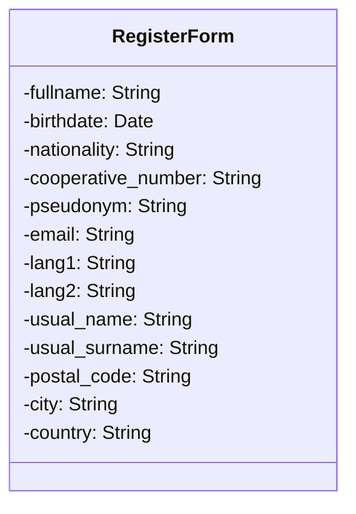

# Candidature

## Résumé
Détaille la procédure d'inscription

## Acteurs

- Le candidat ;
- Le serveur Open LDAP
- Le serveur de messagerie
- L'administrateur
- Les membres actifs

## Prérequis

## Étapes
    Le Candidat se connecte à AlirPunkto
    AlirPunkto retourne la page d'accueil avec le lien d'inscription
    Le candidat demande à créer un compte
    AlirPunkto demande à résoudre un `captcha`
    AlirPunkto affiche le formulaire d'incription
    Le candidat saisit les informations demandées
    Le candidat soumet le formulaire
    AlirPunkto vérifie la syntaxe des saisies
    AlirPunkto interroge LDAP pour vérifier que le pseudo n'est pas déjà utilisé
    AlirPunkto interroge LDAP pour vérifier que le mail n'est pas déjà utilisé
    Si le pseudo ou le mail sont déjà utilisé alors le candida est déjà inscrit et AlirPunkto affiche un message d'erreur
    Si non inscrit :
        AlirPunkto crée un Objet Candidature avec les informations du formulaire
        AlirPunkto attribut un OID à cet objet
        AlirPunkto met l'état de la candidature à `Email validation`
        AlirPunkto enregistre la date        
        AlirPunkto enregistre en ZODB cet objet
        AlirPunkto envoye un mail de demande de confirmation de soumission de la candidature au candidat
        AlirPunkto positionne une tache nettoyage de la candidature si échéance atteinte
        AlirPunkto affiche la page indiquant que le candidat va recevoir un mail et qu'il doit suivre le lien de confirmation

    Le candidat reçois le mail et clique sur le lien de confirmation
    AlirPunkto rentre dans la vue de soumission de la candidature
    AlirPunkto Tire au sort 3 membres parmi les membres du LDAP si possible sinon l'administrateur
    AlirPunkto enregistre les électeurs dans le dictinnaire `voters` de l'objet candidature
    AlirPunkto enregistre la date de soumission de la candidature
    AlirPunkto ajoute un attribut "status" qui vaut "pending" par défaut
    AlirPunkto ajoute un attribut "votes" qui est un dictionnaire vide
    AlirPunkto enregistre les modification de l'objet candidature dans la ZODB
    AlirPunkto envoye un mail de demande de vote (template vote.pt en passant l'identifiant de la candidature) pour accepter ou non la candidature aux électeurs
    Si l'envoi du mail échoue, le site log un message d'erreur et essaye d'envoyer un mail à l'administrateur.

    Les électeurs recoivent leur mail et clique sur le lien de vote
    AlirPunkto tente d'afficher la vue de vote
    Si les électeurs ne sont pas authentifier AlirPunkto affiche la page d'authentification
    L'électeur s'authentifie
    AlirPunkto affiche la page de vote
    L'électeur accepte ou refuse la candidature
    AlirPunkto enregistre le choix de l'électeur
    Si le dernier électeur a voté alors AlirPunkto détermine si la candidature est acceptée ou non.
    Alir Punkto enregistre le résultat dans l'objet et l'enregistre dans la ZODB.
    Si elle est acceptée :
        AlirPunkto ajoute une entrée dans LDAP.
        AlirPunkto envoie un mail de félicitation au nouveau membre.
        AlirPunktoChange l'état de la Candidature à `Approved`
        AlirPunkto enregistre la `Candidature` dans la ZODB
    Si elle est refusée :
        AlirPunkto enregistre l'état de la Candidature à `Approved`
        AlirPunkto enregistre la `Candidature` dans la ZODB
        AlirPunkto envoie un mail de refus au nouveau membre.

    Le site affiche un message de succès et invite le candidat à vérifier sa boite mail pour connaître le résultat de sa candidature

## Scénarios alternatifs

### L'utilisateur ne reçoit pas le mail ou ne confirme jamais
Le scheduleur d'AlirPunkto cherche les sousmissions ayant dépassé la date d'échéance :
    Si la candidature a reçu plus de vote favorable alors traitement favorable (C.f. ci dessu)
    sinon traitement du refus.

## Datas


## Divers

### Exemple de scheduler

```python
import atexit
from apscheduler.schedulers.background import BackgroundScheduler

scheduler = BackgroundScheduler()
scheduler.start()
scheduler.add_job(print_greetings,
    id='greetings', 
    name='Send out birthday greetings', 
    trigger='cron', 
    minute=0, 
    hour=12,
)

atexit.register(lambda: scheduler.shutdown())
```

### Représentation 



### Prototype d'interface utilisateur

Prototype d'interface utilisateur pour le formulaire avec PlantUML et l'extension Salt :

```plantuml
@startsalt
{
  {T
    "Full Name           : " | [                      ]
    "Birth Date          : " | [                      ]
    "Nationality         : " | [                      ]
    "Cooperative Number  : " | [                      ]
    "Pseudonym           : " | [                      ]
    "Email               : " | [                      ]
    "First Interaction Language : " | [                      ]
    "Second Interaction Language: " | [                      ]
    "Usual Name          : " | [                      ]
    "Usual Surname       : " | [                      ]
    "Postal Code         : " | [                      ]
    "City                : " | [                      ]
    "Country             : " | [                      ]
  }
  [Submit]
}
@endsalt
```


