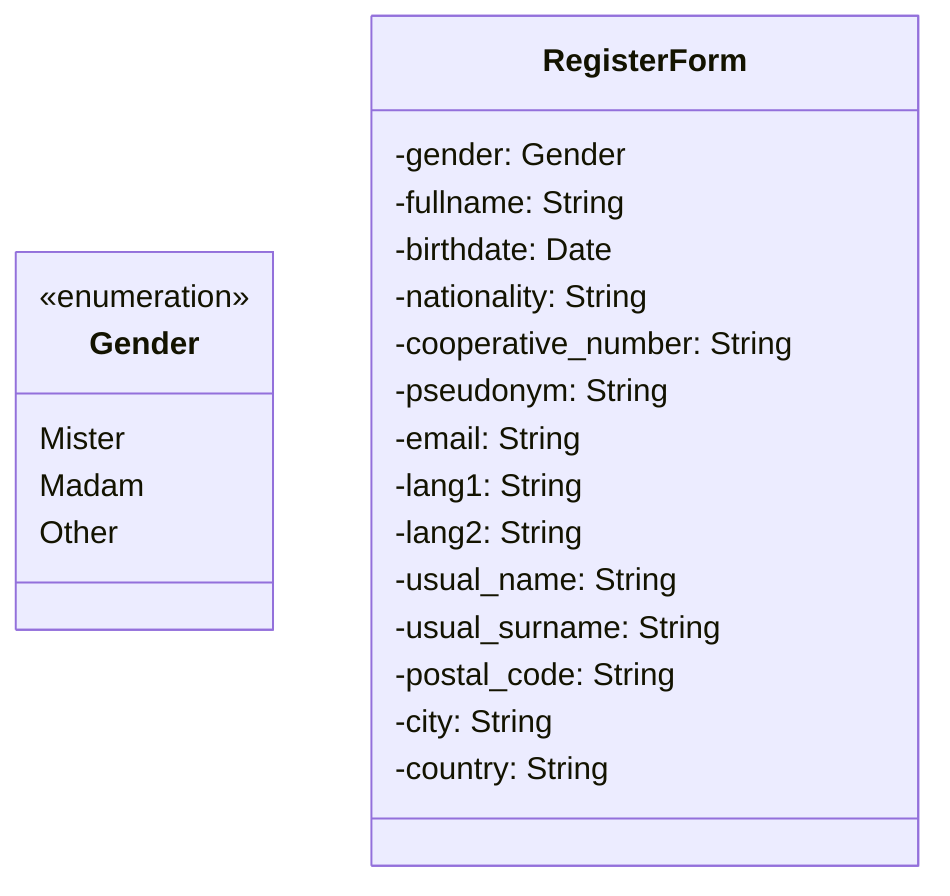
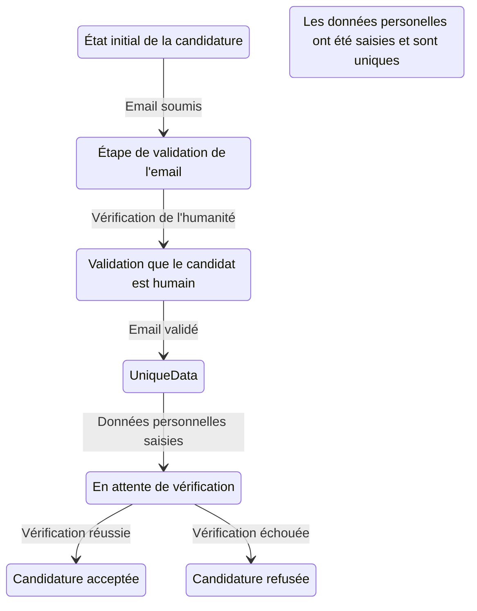
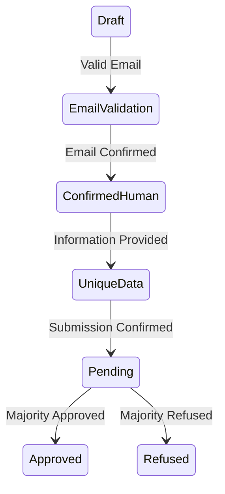

# Résumé

Procédure d'inscription à AlirPunkto.
# Acteurs

- Le candidat ;
- Le serveur Open LDAP
- Le serveur de messagerie
- L'administrateur
- Les membres certifiés ayant un compte actif.

# Prérequis

# Étapes

1. Le Candidat se connecte à AlirPunkto ;
2. AlirPunkto retourne la page d'accueil avec le lien d'inscription ;
3. Le candidat demande à créer un compte ;
4. AlirPunkto demande le mail du candidat ;
5. AlirPunkto interroge LDAP pour vérifier que le mail n'est pas déjà utilisé ;
6. S’il l'est déjà , alors AlirPunkto affiche un message d'erreur indiquant que ce mail est déjà utilisé et invite le candidat à se connecter et abandonne la procédure de candidature.
7. Sinon le mail n'est pas utilisé alors :
8. AlirPunkto crée un objet `candidature` de type `Candidature` à l'état "Draft", avec un `OID` unique et enregistre l'e-mail ;
9. AlirPunkto enregistre en base de données la candidature;
10. AlirPunkto génère aléatoirement une opération très simple à résoudre de la forme "(quatre + trois ) * (sept + cinq) + deux" (Multiplication de la somme de deux chiffres compris entre 2 et 9 écrits en toutes lettres additionnés d'un chiffre compris entre 1 et 9 en toutes lettres) ;
11. AirPunkto enregistre dans l'objet `candidature` la solution attendue.
12. AlirPunkto prépare un e-mail à destination du candidat contenant l'opération à résoudre et le lien pour revenir sur la formulaire le cas échéant.
13. AlirPunkto envoie l'e-mail au candidat ;
14. AlirPunkto change l'état de la `candidature` à "EmailValidation" ;
15. AlirPunkto enregistre en base de données la `candidature` ;
16. AlirPunkto détermine la date d'échéance de la Candidature (temps laissé au Candidat pour ouvrir son e-mail, faire le calcul, et retourner le résultat via le formulaire) ;
17. AlirPunkto positionne une tache de nettoyage de la `candidature` si échéance atteinte sans validation du mail du candidat ;
18. AlirPunkto affiche un message prévenant le candidat qu'il va recevoir un mail contenant une opération mathématique simple à résoudre et dont le résultat doit être saisi dans le champ de vérification de la page affichée avant la date d'échéance ;
19. Le Candidat ouvre le mail reçu avec son lecteur de courrier ;
20. Le Candidat réalise le calcul demandé ;
21. Le Candidat saisit le résultat dans le formulaire et le soumet ;
22. AlirPunkto vérifie le résultat ;
23. Tant que le résultat n'est pas bon alors
	1. AlirPunkto affiche un message d'erreur ;
	2. AlirPunkto demande à nouveau le résultat et cela pour un maximum de 3 tentatives ;
	3. Si 3 erreurs :
		1. AlirPunkto  affiche un message d'abandon et stopper le processus ;
		2. AlirPunkto revient sur la page d'accueil ;
		3. Fin du scénario.
24. Si le résultat est correcte alors :
25. AlirPunkto supprime la tâche de nettoyage prévue et passe la Candidature à l'état "ConfirmedHuman" ;
26. AlirPunkto affiche le formulaire d'inscription en remplissant le champ mail qui ne peut plus être modifié ;
27. Le candidat saisit les informations demandées ;
28. Le candidat soumet le formulaire ;
29. AlirPunkto vérifie la syntaxe des saisies ;
30. AlirPunkto interroge LDAP pour vérifier que le pseudo, le nom et la date de naissance ne sont pas déjà utilisés ;
31. Si le pseudo, le couple nom et date de naissance sont déjà utilisés alors le candidat est déjà inscrit :
	1. AlirPunkto affiche un message d'erreur et attend une saisie valide;
32. Si le candidat n'est pas déjà inscrit :
33. AlirPunkto met l'état de la `candidature` à `UniqueData`  ;
34. AlirPunkto enregistre la date ;
35. AlirPunkto enregistre en base de données cet objet ;
36. AlirPunkto affiche la vue de soumission de la candidature qui prévient le candidat qu'il va devoir soit transmettre par e-mail une copie de sa pièce d'identité, soit la montrer en visio-conférence à 3 vérificateurs ;
37. Le candidat accepte la soumission ;
38. AlirPunkto indique au candidat que sa pièce d'identité sera soit à envoyer aux vérificateurs soit qu'il doit prendre rendez-vous avec eux ;
39. AlirPunkto tire au sort 3 vérificateurs parmi les membres du LDAP si possible, sinon l'administrateur ;
40. AlirPunkto enregistre les vérificateurs dans le dictionnaire `verifiers` de la `candidature` ;
41. AlirPunkto enregistre la date de soumission dans la `candidature` ;
42. AlirPunkto positionne l'état de la `candidature` à "Pending" ;
43. AlirPunkto ajoute un attribut "votes" qui est un dictionnaire vide  à la `candidature`;
44. AlirPunkto enregistre les modifications de l'objet candidature dans la base de données ;
45. AlirPunkto envoie aux vérificateurs un e-mail de demande de vote (template vote.pt en passant l'identifiant de la candidature) pour accepter ou non la candidature ;
46. Si l'envoi du mail échoue, le site enregistre dans les logs un message d'erreur et essaye d'envoyer un e-mail à l'administrateur ;
47. AlirPunkto transmet au navigateur du Candidat une page contenant :
	1. les noms et adresses e-mail des vérificateurs,
	2. un bouton qui ouvre la messagerie électronique du candidat avec les adresses destination, le sujet et un corps de courriel pré-rempli pour transmettre sa pièce d'identité aux vérificateurs, un bouton qui crée un e-mail d'invitation à fixer une date de visioconférence avec les vérificateurs.
	3. Le candidat choisit d'actionner le bouton pour transmettre par e-mail ses informations ;
48. Le navigateur ouvre le lecteur de courrier du candidat avec un e-mail rempli.
49. Le candidat ajoute en pièce jointe une photo de sa pièce d'identité.
50. Le candidat envoie par mail sa pièce d'identité ;
51. AlirPunkto envoie un mail au vérificateur les prévenant qu'ils vont être contactés et leur donne le lien du vote ;
52. Les vérificateurs reçoivent la pièce d'identité et la vérifie;
53. Les vérificateurs vérifient l'intégrité des informations du candidat en se connectant à AlirPunkto en suivant le lien du mail reçu venant d'AlirPunkto ;
54. AlirPunkto demande à authentifier les vérificateurs ;
55. Le vérificateur s'authentifie ;
56. AlirPunkto affiche la vue de vote contenant les informations du candidat ;
57. Le vérificateur accepte ou refuse la candidature ;
58. AlirPunkto enregistre le choix du vérificateur ;
59. Si le dernier vérificateur a voté ou si la date de clôture est atteinte alors AlirPunkto détermine si la candidature est acceptée ou non ;
60. AlirPinkto enregistre le résultat dans la `candidature` et l'enregistre dans la base de donnée ;
61. Si la majorité accepte la candidature :
	1. Le candidat devient membre ;
	2. AlirPunkto détermine le numéro de membre du nouveau membre ;
	3. AlirPunkto ajoute une entrée dans LDAP ;
	4. AlirPunkto envoie un mail de félicitation au nouveau membre ;
	5. AlirPunktoChange l'état de la `candidature` à `Approved` ;
62. Si elle est refusée :
	1. AlirPunkto enregistre l'état de la `candidature` à `Refused` ;
	2. AlirPunkto enregistre la `Candidature` dans la base de donnée ;
63. AlirPunkto envoie un mail de refus ou d'acceptation au nouveau membre selon l'état final de la candidature.
# Scénarios alternatifs

## Le candidat ne reçoit pas le mail ou ne confirme jamais

Le scéduleur d'AlirPunkto cherche les `candidatures` dans l'état "EmailValidation" arrivées à 1 jour de l'échéance et relance le candidat.

## Relance des vérificateurs

Le planificateur (scheduler) d'AlirPunkto cherche les `candidatures` dans l'état "Pending" arrivées  à un jour de l'échéance ; 
AlirPunkto relance par e-mail les vérificateurs.

## Arrivée à échéance du vote

Le planificateur (scheduler) d'AlirPunkto cherche les `candidatures` dans l'état "Pending" arrivée à échéance ; 

Si la candidature a reçu plus de votes favorables alors traitement favorable (C.f. ci dessus)
Sinon traitement du refus.

## Interruption pendant le processus

Une coupure a empêché le candidat de finir le processus de soumission.
Le candidat active le lien d'un des mails reçus lors du  par Alirpunkto et reprend le processus à partir du dernier état enregistré dans la candidature.
# Informations supplémentaires

Voir les tickets de KuneAgi : 
https://gitlab.com/cosmopoliticalcoop/KuneAgi/-/issues/3 (Sauf lieu de naissance)
https://gitlab.com/cosmopoliticalcoop/KuneAgi/-/issues/126

# Datas

## Les données demandées

- gender : Genre, énuméré(Monsieur, Madame, Non déterminé) ;
- fullname : Nom complet (nom et prénom tel que sur la carte d'ID), chaîne de caractères ;
- birthdate : Date de naissance, date ;
- nationality: Nationalité, énuméré ;
- cooperative_number: Numéro d'adhérent, chaîne de caractères;
- pseudonym: Pseudonyme, chaîne de caractères ;
- email: Courriel, chaîne de caractères ;
- lang1: langue préférée, énumérée ;
- lang2: seconde langue préférée, énumérée ;
- usual_name: Nom d'usage, chaîne de caractères ;
- city: Ville, chaîne de caractères ;
- country: Pays, énuméré.

 
## Les états de la Candidature

1. **Draft**: La candidature est à l'état brouillon
2. **Email Validation**: L'état où l'email du candidat est en attente de validation.
3. **ConfirmedHuman**: L'e-mail du candidat et la preuve d'humanité sont faites.
4. **UniqueData**: Le candidat a saisi ses données personnelles.
5. **Pending**: Après la soumission de la candidature et en attente de vérification par les vérificateurs.
6. **Approved**: La candidature a été acceptée.
7. **Refused**: La candidature a été refusée.




# Divers

## Exemple de scheduler

```python
import atexit
from apscheduler.schedulers.background import BackgroundScheduler

scheduler = BackgroundScheduler()
scheduler.start()
scheduler.add_job(print_greetings,
    id='greetings', 
    name='Send out birthday greetings', 
    trigger='cron', 
    minute=0, 
    hour=12,
)

atexit.register(lambda: scheduler.shutdown())
```
