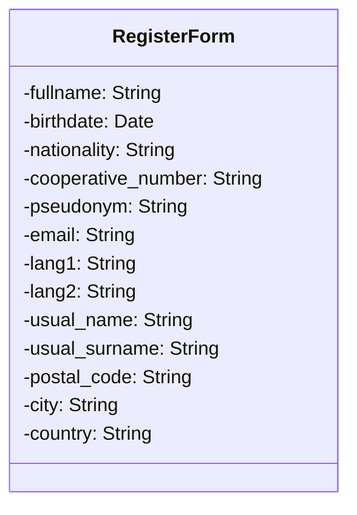

# Candidature

## Résumé
Détaille la procédure d'inscription

## Acteurs

- Le candidat ;
- Le serveur Open LDAP
- Le serveur de messagerie
- L'administrateur
- Les membres actifs

## Prérequis

## Étapes 

Le Candidat se connecte à AlirPunkto ;  
AlirPunkto retourne la page d'accueil avec le lien d'inscription ;  
Le candidat demande à créer un compte ;  
AlirPunkto demande à résoudre un `captcha`;  
AlirPunkto affiche le formulaire d'inscription ;  
Le candidat saisit les informations demandées ;  
Le candidat soumet le formulaire ;  
AlirPunkto vérifie la syntaxe des saisies ;  
AlirPunkto interroge LDAP pour vérifier que le pseudo, le mail, le nom et la date de naissance ne sont pas déjà utilisés ;
Si le pseudo, le couple nom et date de naissance ou le mail sont déjà utilisés alors le candidat est déjà inscrit et AlirPunkto affiche un message d'erreur ;
Si le candidat n'est pas déjà inscrit :  
	AlirPunkto crée un Objet Candidature avec les informations du formulaire ;  
	AlirPunkto attribue un OID à cet objet ;  
	AlirPunkto met l'état de la candidature à `Email validation`;  
	AlirPunkto enregistre la date ;  
	AlirPunkto enregistre en ZODB cet objet ;  
	AlirPunkto envoie un e-mail de demande de confirmation de soumission de la candidature au candidat ;  
	AlirPunkto positionne une tache nettoyage de la candidature si échéance atteinte ;  
	AlirPunkto affiche la page indiquant que le candidat va recevoir un mail et qu'il doit suivre le lien de confirmation de son adresse e-mail ;  

Le candidat reçoit le e-mail et clique sur le lien de confirmation ;  
AlirPunkto rentre dans la vue de soumission de la candidature ;  
AlirPunkto prévient le candidat qu'il doit déposer une copie de sa pièce d'identité sur le site ;

AlirPunkto indique au candidat que sa pièce d'identité sera soit à envoyer aux vérificateurs soit qu'il doit prendre rendez-vous avec eux ;  
AlirPunkto tire au sort 3 vérificateurs parmi les membres du LDAP si possible, sinon l'administrateur ;
AlirPunkto enregistre les vérificateurs dans le dictionnaire `voters` de l'objet candidature ;  
AlirPunkto enregistre la date de soumission de la candidature ;  
AlirPunkto ajoute un attribut "status" qui vaut "pending" par défaut ;  
AlirPunkto ajoute un attribut "votes" qui est un dictionnaire vide ;  
AlirPunkto enregistre les modifications de l'objet candidature dans la ZODB ;  
AlirPunkto envoie un mail de demande de vote (template vote.pt en passant l'identifiant de la candidature) pour accepter ou non la candidature aux vérificateurs ;  
Si l'envoi du mail échoue, le site log un message d'erreur et essaye d'envoyer un mail à l'administrateur ;  
AlirPunkto transmet au navigateur du Candidat une page avec les noms et adresses mails des vérificateurs et un bouton qui ouvre la messagerie électronique du candidat avec un corps de courriel pré-rempli pour transmettre sa pièce d'identité aux vérificateurs, ou un bouton qui crée un message d'invitation à fixer une date de visioconférence avec les vérificateurs;
Le candidate envoie par mail sa pièce d'identité ou prends rendez-vous avec les vérificateurs.
AlirPunkto envoie un mail au vérificateur les prévenant qu'ils vont être contaté et leur donne le lien du vote ;  
Les vérificateurs vérifient l'intégrité du candidat et se connectent à AlirPunkto en suivant le lien du mail reçu venant d'AlirPunkto.
AlirPunkto afficher la vue de vote après avoir autehntifier les vérifificateurs ;
Si les vérificateurs ne sont pas authentifiés, AlirPunkto affiche la page d'authentification ;  
Le vérificateur s'authentifie ;  
AlirPunkto affiche la page de vote avec le lien vers la pièce d'identité chiffrée ;  
Le vérificateur accepte ou refuse la candidature ;  
AlirPunkto enregistre le choix du vérificateur ;  
Si le dernier vérificateur a voté alors AlirPunkto détermine si la candidature est acceptée ou non ;  
Alir Punkto enregistre le résultat dans l'objet et l'enregistre dans la ZODB ;  
Si elle est acceptée :  
	AlirPunkto ajoute une entrée dans LDAP ;  
	AlirPunkto envoie un mail de félicitation au nouveau membre ;  
	AlirPunktoChange l'état de la Candidature à `Approved` ;  
	AlirPunkto enregistre la `Candidature` dans la ZODB ;  
Si elle est refusée :  
	AlirPunkto enregistre l'état de la Candidature à `Approved` ;  
	AlirPunkto enregistre la `Candidature` dans la ZODB ;  
	AlirPunkto envoie un mail de refus au nouveau membre ;  

AlirPunkto affiche un message de succès et invite le candidat à vérifier sa boîte mail pour connaître le résultat de sa candidature.

## Scénarios alternatifs

### Le candidat ne reçoit pas le mail ou ne confirme jamais
Le scéduleur d'AlirPunkto cherche les candidatures dans l'état 

### Arrivée à échéance du vote

Le scheduleur d'AlirPunkto cherche les soumissions ayant dépassé la date d'échéance :
    Si la candidature a reçu plus de vote favorable alors traitement favorable (C.f. ci dessu)
    Sinon traitement du refus.

## Informations supplémentaires

Voir les tickets de KuneAgi : 
https://gitlab.com/cosmopoliticalcoop/KuneAgi/-/issues/3 (Sauf lieu de naissance)
https://gitlab.com/cosmopoliticalcoop/KuneAgi/-/issues/126

## Datas

Les données demandées sont :

- Nom complet (nom et prénom tel que sur la carte d'ID) ;
- Genre (Monsieur, Madame, Non déterminé) ;
- Date de naissance ;
- Nationalité ;
- 


## Divers

### Exemple de scheduler

```python
import atexit
from apscheduler.schedulers.background import BackgroundScheduler

scheduler = BackgroundScheduler()
scheduler.start()
scheduler.add_job(print_greetings,
    id='greetings', 
    name='Send out birthday greetings', 
    trigger='cron', 
    minute=0, 
    hour=12,
)

atexit.register(lambda: scheduler.shutdown())
```

### Représentation 



### Prototype d'interface utilisateur

Prototype d'interface utilisateur pour le formulaire avec PlantUML et l'extension Salt :

```plantuml
@startsalt
{
  {T
    "Full Name           : " | [                      ]
    "Birth Date          : " | [                      ]
    "Nationality         : " | [                      ]
    "Cooperative Number  : " | [                      ]
    "Pseudonym           : " | [                      ]
    "Email               : " | [                      ]
    "First Interaction Language : " | [                      ]
    "Second Interaction Language: " | [                      ]
    "Usual Name          : " | [                      ]
    "Usual Surname       : " | [                      ]
    "Postal Code         : " | [                      ]
    "City                : " | [                      ]
    "Country             : " | [                      ]
  }
  [Submit]
}
@endsalt
```


