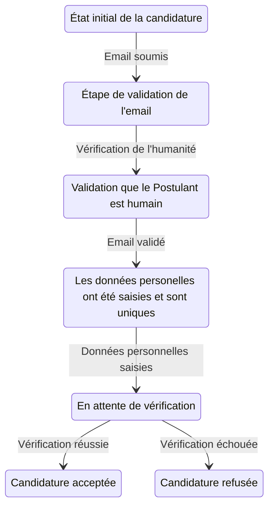
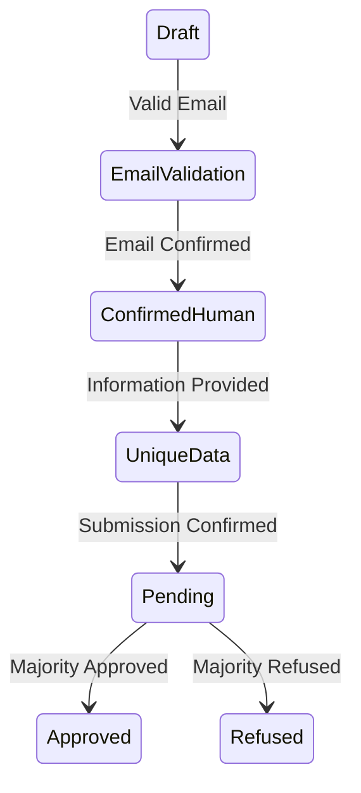

# Résumé

Procédure d'inscription à AlirPunkto.

# Acteurs

- Le Postulant ;
- Alirpunkto
- Le serveur Open LDAP
- Le serveur de messagerie
- L'administrateur
- Les membres certifiés ayant un compte actif.
# Étapes

1. Le Postulant se connecte à AlirPunkto ;
2. AlirPunkto retourne la page d'accueil avec le lien d'inscription ;
3. Le Postulant demande à créer un compte ;
4. AlirPunkto propose au Postulat le choix entre deux options, en présentant deux boutons, chacun avec une infobulle donnant des informations complémentaires sur la signification et les implications de chacun des deux statuts :
	- membre ordinaire de la Communauté ;
	- Coopérateur.
5. Le Postulant choisit l’une des deux options en cliquant sur le bouton correspondant ;
6. AlirPunkto demande l’adresse mail du Postulant ;
7. Le Postulant renseigne ce formulaire ;
8. AlirPunkto interroge LDAP pour vérifier que l’adresse mail n’est pas déjà utilisé par un utilisateur actif ou ayant résilié depuis moins que la période de Quarantaine (Paramètre Quantitatif Affectant les Processus Internes, dont la valeur par défaut, définie au §3,4,1 des statuts, est de 180 jours);
9. **Si** l’adresse mail est déjà utilisée, **alors** AlirPunkto affiche un message d'erreur indiquant que cette adresse mail est déjà utilisée et invite le Postulant à se connecter et abandonne la procédure de candidature,
10. **sinon** l’adresse mail n'est pas utilisée **alors** (cas nominal) :
11. AlirPunkto crée un objet `candidature` de type `Candidature` à l'état "Draft", avec un `OID` unique et enregistre les informations transmises par le Postulant ;
12. AlirPunkto enregistre en base de données la candidature;
13. AlirPunkto génère aléatoirement une opération très simple à résoudre de la forme "(quatre + trois ) * (sept + cinq) + deux" (Multiplication de la somme de deux chiffres compris entre 2 et 9 écrits en toutes lettres additionnés d'un chiffre compris entre 1 et 9 en toutes lettres) ;
14. AirPunkto enregistre dans l'objet `candidature` la solution attendue.
15. AlirPunkto prépare un e-mail à destination du Postulant contenant l'opération à résoudre et le lien pour revenir sur la formulaire le cas échéant.
16. AlirPunkto envoie l'e-mail au Postulant ;
17. AlirPunkto change l'état de la `candidature` à "EmailValidation" ;
18. AlirPunkto enregistre en base de données la `candidature` ;
19. AlirPunkto détermine la date d'échéance de la Candidature (temps laissé au Postulant pour ouvrir son e-mail, faire le calcul, et retourner le résultat via le formulaire) ;
20. AlirPunkto positionne une tache de nettoyage de la `candidature` si échéance atteinte sans validation du mail du Postulant ;
21. AlirPunkto affiche un message prévenant le Postulant qu'il va recevoir un mail contenant une opération mathématique simple à résoudre et dont le résultat doit être saisi avant la date d'échéance dans le champ de vérification de la page à laquelle le lien fourni dans le futur courriel donnera accès ;
22. Le Postulant ouvre le mail reçu avec son lecteur de courrier ;
23. Le Postulant réalise le calcul demandé ;
24. Le Postulant saisit le résultat dans le formulaire sur la page à laquelle le lien fourni avec les courriel donne accès et le soumet ;
25. AlirPunkto vérifie le résultat ;
26. Tant que le résultat n'est pas bon alors
	1. AlirPunkto affiche un message d'erreur ;
	2. AlirPunkto demande à nouveau le résultat et cela pour un maximum de 3 tentatives ;
	3. Si 3 erreurs :
		1. AlirPunkto affiche un message d'abandon et stoppe le processus ;
		2. AlirPunkto revient sur la page d'accueil ;
		3. Fin du scénario.
27. **Si** le résultat est correct **alors** (cas nominal) :
28. AlirPunkto supprime la tâche de nettoyage prévue et passe la Candidature à l'état "ConfirmedHuman" ;
29. AlirPunkto affiche le formulaire d'inscription en remplissant le champ mail qui ne peut plus être modifié ;
30. Le Postulant saisit les informations demandées, à savoir :
	- son pseudonyme (avec une infobulle – déjà rédigée – l’informant que ce pseudonyme ne pourra plus jamais être changé et qu’il ne doit pas permettre de remonter jusqu’à son identité réelle) ;
	- son mot de passe (selon ticket [#84 de Cosmopoliticalcoop](https://gitlab.com/cosmopoliticalcoop/KuneAgi/-/issues/84) — Saisir le mot de passe dès l'inscription - et éviter une étape inutile) ;
	- sa langue préférée d’interaction (parmi les 23 langues officielles de l’Union Européenne + Espéranto, anglais par défaut) ;
	- sa 2e langue préférée d’interaction (idem.) – donnée non obligatoire ;
	- sa 3e langue préférée d’interaction (idem.) – donnée non obligatoire ;
	- son texte de profil utilisateur – donnée non obligatoire ;
	- son image de présentation / avatar – donnée non obligatoire ;
	- et, uniquement dans le cas où le Postulant a choisi l’option « Coopérateur » :
	    - ses prénoms transcrits en caractères latins le cas échéant (pour le grec et le bulgare), tels qu’apparaissant dans ses documents d’état civil ;
	    - ses noms de famille, idem ;
	    - sa date de naissance ;
	    - sa nationalité (parmi celles des États-Membres de l’Union Européenne) ;
31. Le Postulant soumet le formulaire ;
32. AlirPunkto vérifie la syntaxe des saisies ;
33. AlirPunkto interroge LDAP pour vérifier que le pseudonyme n’est pas déjà utilisée par un utilisateur actif ou ayant résilié depuis moins que la période de Quarantaine (Paramètre Quantitatif Affectant les Processus Internes) ;
34. **Tant que** le pseudonyme est déjà utilisé, **faire** AlirPunkto affiche un message d'erreur indiquant que ce pseudonyme est déjà utilisé et invite le Postulant à choisir un autre pseudonyme ;
35. **Si** le Postulant a choisi l’option « Membre ordinaire de la Communauté », **alors** :
	- 1. Le Postulant devient « membre ordinaire de la Communauté » ;
	- 2. AlirPunkto détermine le numéro de membre du nouveau membre ;
	- 3. AlirPunkto ajoute une entrée dans LDAP ;
	- 4. AlirPunkto envoie un mail de félicitation au nouveau membre ;  
	- 5. AlirPunkto Change l'état de la `candidature` à `ApprovedOrdinaryCommunityMember’` ;
36. **sinon** [le Postulant a choisi l’option « Coopérateur] la procédure suivante est réalisée (cas nominal) :
37. AlirPunkto interroge LDAP pour vérifier que la combinaison formée par les noms, les prénoms et la date de naissance n’est pas déjà utilisée par un utilisateur actif ou ayant résilié depuis moins que la période de Quarantaine (Paramètre Quantitatif Affectant les Processus Internes) ;
38. Si la combinaison formée par les noms, les prénoms et la date de naissance sont déjà utilisés alors le Postulant est déjà inscrit :
	1. AlirPunkto affiche un message d'erreur et invite le Postulant à se connecter et abandonne la procédure de candidature;
39. Si le Postulant n'est pas déjà inscrit :
40. AlirPunkto met l'état de la `candidature` à `UniqueData` ;
41. AlirPunkto enregistre la date ;
42. AlirPunkto enregistre en base de données cet objet ;
43. AlirPunkto affiche la vue de soumission de la candidature qui prévient le Postulant qu'il va devoir soit transmettre par e-mail une copie de sa pièce d'identité, soit la montrer en visio-conférence à N vérificateurs (N = nombre de Vérificateurs est un Paramètre Quantitatif Affectant les Processus Internes, dont la valeur par défaut, définie au §3,4,1 des statuts, est de 3) ;
44. Le Postulant accepte la soumission ;
45. AlirPunkto indique au Postulant que sa pièce d'identité sera soit à envoyer aux vérificateurs soit qu'il doit prendre rendez-vous séparément avec chacun d’entre eux ;
46. AlirPunkto tire au sort N vérificateurs parmi les membres actifs du LDAP si possible, sinon l'administrateur ;
47. AlirPunkto enregistre les vérificateurs dans le dictionnaire `verifiers` de la `candidature` ;
48. AlirPunkto enregistre la date de soumission dans la `candidature` ;
49. AlirPunkto positionne l'état de la `candidature` à "Pending" ;
50. AlirPunkto ajoute un attribut "votes" qui est un dictionnaire vide à la `candidature`;
51. AlirPunkto enregistre les modifications de l'objet candidature dans la base de données ;
52. AlirPunkto envoie aux vérificateurs un e-mail de demande de vote (template vote.pt en passant l'identifiant de la candidature) pour accepter ou non la candidature, expliquant la procédure et contenant le lien de vote ;
53. Si l'envoi du mail échoue, le site enregistre dans les logs un message d'erreur et essaye d'envoyer un e-mail à l'administrateur ;
54. AlirPunkto transmet au navigateur du Postulant une page contenant deux boutons pour choisir son mode de vérification d’identité : (1) par vidéoconférence ou (2) par pièce jointe à un courriel ;
55. Le Postulant choisit son mode de vérification d’identité et clique sur le bouton correspondant.
56. Si le Postulant a choisi le mode « par vidéoconférence», alors :
	1. AlirPunko transmet au navigateur du Postulant une page contenant un bouton d’assistance à l’écriture du courriel ;
	2. ce bouton contient un lien « mailto » qui ouvre la messagerie électronique du Postulant vers l’adresse du Postulant, avec les Vérificateurs en copie cachée (chamt « BCc »), avec le sujet et un corps de courriel pré-remplis dans la langue préférée du Postulant pour inviter le Vérificateur à choisir un créneau date + heure de visioconférence parmi celles proposées par le Postulant (que le Postulant détermine, avant une date de fin de transmission des données d’identité égale à une durée de préavis paramétrable avant la date de fin de vote des Vérificateurs), et contenant des liens vers des services libres de vidéoconférence ;
	3. le Postulant clique sur le bouton, ajoute au courriel pré-rempli les dates et heures de rendez-vous qu’il propose et un lien de vidéoconférence et envoie le courriel en une fois à l’ensemble des Vérificateurs ;
57. sinon, [le Postulant a choisi le mode de vérification « par pièce jointe à un courriel »] :
	1. AlirPunko transmet au navigateur du Postulant une page contenant un bouton d’assistance à l’écriture du courriel ;
	2. ce bouton contient un lien « mailto » qui ouvre la messagerie électronique du Postulant vers l’adresse duu Postulant, avec les Vérificateurs en copie cachée (chamt « BCc »), avec le sujet et un corps de courriel pré-remplis dans la langue préférée du Postulant pour accompagner l’envoi de la copie incomplète de pièce d’identité ;
	3. le Postulant clique sur le bouton, joint au courriel pré-rempli une copie incomplète de son document officiel d’identité (masquant par exemple le numéro et le lieu de naissance) et envoie le courriel en une fois à l’ensemble des Vérificateurs ;

58. Chacun des vérificateurs reçoit la copie incomplète de pièce d'identité ou la voit lors de la vidéoconférence et vérifie la conformité des informations d’identité données par le Postulant lors de son inscription (nationalité, noms, prénoms, date de naissance) avec celles de la pièce officielle d’identité;
59. Chacun des vérificateurs vérifie l'intégrité des informations du Postulant en se connectant à AlirPunkto en suivant le lien du mail reçu venant d'AlirPunkto ;
60. AlirPunkto demande à authentifier le vérificateur ;
61. Le vérificateur s'authentifie ;
62. AlirPunkto affiche la vue de vote contenant les informations du Postulant ;
63. Le vérificateur accepte ou refuse la candidature ;
64. AlirPunkto enregistre le choix du vérificateur ;
65. Si le dernier vérificateur a voté ou si la date de clôture est atteinte alors AlirPunkto détermine si la candidature est acceptée ou non (refusée par défaut si aucune Vérification n’est faite à la date de clôture);
66. AlirPinkto enregistre le résultat dans la `candidature` et l'enregistre dans la base de donnée ;
67. Si la majorité accepte la candidature :
	1. Le Postulant devient  »Coopérateur » ;
	2. AlirPunkto détermine le numéro de membre du nouveau membre ;
	3. AlirPunkto ajoute une entrée dans LDAP ;
	4. AlirPunktoChange l'état de la `candidature` à `ApprovedCooperator` ;
68. Si elle est refusée :
	1. AlirPunkto enregistre l'état de la `candidature` à `Refused` ;
	2. AlirPunkto enregistre la `Candidature` dans la base de donnée ;
69. AlirPunkto envoie un mail de refus ou d'acceptation au nouveau membre selon l'état final de la candidature.

# Scénarios alternatifs

## Le _**Postulant**_ ne reçoit pas le mail ou ne confirme jamais

Le planificateur (scheduler) d'AlirPunkto cherche les `candidatures` dans l'état "EmailValidation" arrivées à 1 jour de l'échéance et relance le candidat.

## Relance des vérificateurs

Le planificateur (scheduler) d'AlirPunkto cherche les `candidatures` dans l'état "Pending" arrivées à un jour de l'échéance ;

AlirPunkto relance par e-mail les vérificateurs.

## Arrivée à échéance du vote

Le planificateur (scheduler) d'AlirPunkto cherche les `candidatures` dans l'état "Pending" arrivée à échéance ;


Si la candidature a reçu plus de votes favorables alors traitement favorable (C.f. ci dessus)

Sinon traitement du refus.

## Interruption pendant le processus

Une coupure a empêché le Postulant de finir le processus de soumission.

Le Postulant active le lien d'un des mails reçus lors du par Alirpunkto et reprend le processus à partir du dernier état enregistré dans la candidature.

# Informations supplémentaires

## Les états de la Candidature

1. Draft: La candidature est à l'état brouillon

2. Email Validation: L'état où l'adresse mail du Postulant est en attente de validation.

3. ConfirmedHuman: L'adresse-mail du Postulant est vérifiée et la preuve d'humanité est faite.

4. UniqueData: Le Postulant a saisi ses données personnelles d’identification.

5. Pending: Après la soumission de la candidature et en attente de vérification par les vérificateurs.

6. Approved: La candidature a été acceptée.

7. Refused: La candidature a été refusée.




# Divers

## Exemple de scheduler

```python
import atexit
from apscheduler.schedulers.background import BackgroundScheduler

scheduler = BackgroundScheduler()
scheduler.start()
scheduler.add_job(print_greetings,
    id='greetings', 
    name='Send out birthday greetings', 
    trigger='cron', 
    minute=0, 
    hour=12,
)

atexit.register(lambda: scheduler.shutdown())
```
