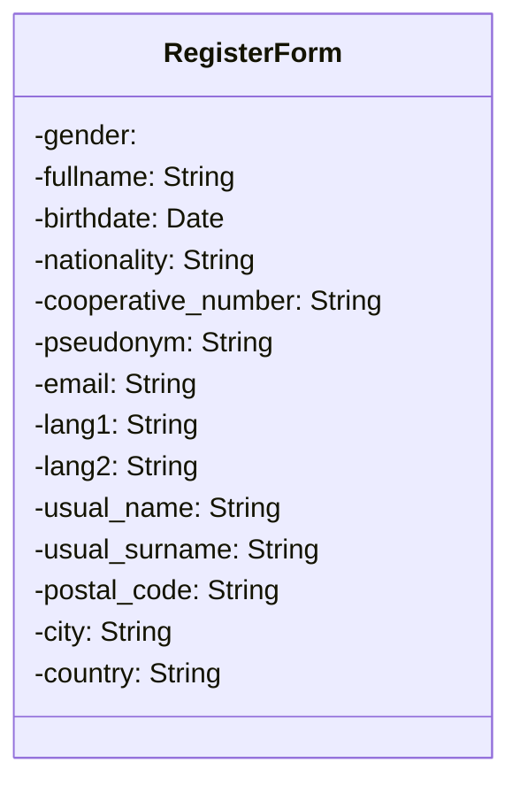
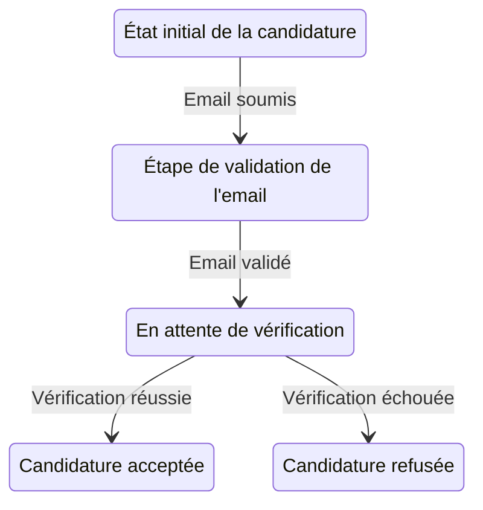

# Candidature

## Résumé

Détaille la procédure d'inscription à AlirPunkto.
## Acteurs

- Le candidat ;
- Le serveur Open LDAP
- Le serveur de messagerie
- L'administrateur
- Les membres certifiés ayant un compte actif.

## Prérequis

## Étapes

Le Candidat se connecte à AlirPunkto ;
AlirPunkto retourne la page d'accueil avec le lien d'inscription ;
Le candidat demande à créer un compte ;
AlirPunkto demande le mail du candidat ;
AlirPunkto interroge LDAP pour vérifier que le mail n'est pas déjà utilisé ;
S’il l'est déjà , alors AlirPunkto affiche un message d'erreur indiquant que ce mail est déjà utilisé et invite le candidat à se connecter et abandonne la procédure de candidature.
Sinon le mail n'est pas utilisé alors :
AlirPunkto génère aléatoirement une opération tres simple à résoudre la forme "(quatre + trois ) * (sept + cinq) + deux" (Multiplication de la somme de deux chiffres compris entre 2 et 9 écrits en toutes lettres additionnés d'un chiffre compris entre 1 et 9 en toutes lettres) ;
AlirPunkto prépare un mail à destination du candidat contenant l'opération à résoudre.
AlirPunkto envoie le mail au candidat ;
AlirPunkto affiche un message prévenant le candidat qu'il va recevoir un mail contenant une opération mathématique simple à résoudre et dont le résultat doit être saisi dans le champ de vérification de la page affichée ;
Le Candidat ouvre le mail reçu avec son lecteur de courrier ;
Le Candidat réalise le calcul demandé ;
Le Candidat saisit le résultat dans le formulaire et le soumet
AlirPinkto vérifie le résultat ;
Si le résultat n'est pas bon alors AlirPunkto affiche un message d'erreur et demande à nouveau le résultat et cela pour un maximum de 3 fois avant d'afficher un message d'abandon et abandonner le processus puis revenir sur la page d'accueil ;
AlirPunkto affiche le formulaire d'inscription en remplissant le champ mail qui ne peut plus être modifié ;
Le candidat saisit les informations demandées ;
Le candidat soumet le formulaire ;
AlirPunkto vérifie la syntaxe des saisies ;
AlirPunkto interroge LDAP pour vérifier que le pseudo, le nom et la date de naissance ne sont pas déjà utilisés ;
Si le pseudo, le couple nom et date de naissance sont déjà utilisés alors le candidat est déjà inscrit et AlirPunkto affiche un message d'erreur et attend une saisie valide;
Si le candidat n'est pas déjà inscrit :
AlirPunkto crée un Objet Candidature avec les informations du formulaire ;
AlirPunkto attribue un OID à cet objet ;
AlirPunkto met l'état de la candidature à `Email validation`;
AlirPunkto enregistre la date ;
AlirPunkto enregistre en ZODB cet objet ;
AlirPunkto envoie un e-mail de demande de confirmation de soumission de la candidature au candidat ;
AlirPunkto positionne une tache nettoyage de la candidature si échéance atteinte ;
AlirPunkto affiche la page indiquant que le candidat va recevoir un mail et qu'il doit suivre le lien de confirmation de son adresse e-mail ;
Le candidat reçoit le e-mail et clique sur le lien de confirmation ;
AlirPunkto rentre dans la vue de soumission de la candidature ;
AlirPunkto prévient le candidat qu'il doit déposer une copie de sa pièce d'identité sur le site ;
AlirPunkto indique au candidat que sa pièce d'identité sera soit à envoyer aux vérificateurs soit qu'il doit prendre rendez-vous avec eux ;
AlirPunkto tire au sort 3 vérificateurs parmi les membres du LDAP si possible, sinon l'administrateur ;
AlirPunkto enregistre les vérificateurs dans le dictionnaire `voters` de l'objet candidature ;
AlirPunkto enregistre la date de soumission de la candidature ;
AlirPunkto ajoute un attribut "status" qui vaut "pending" par défaut ;
AlirPunkto ajoute un attribut "votes" qui est un dictionnaire vide ;
AlirPunkto enregistre les modifications de l'objet candidature dans la ZODB ;
AlirPunkto envoie un mail de demande de vote (template vote.pt en passant l'identifiant de la candidature) pour accepter ou non la candidature aux vérificateurs ;
Si l'envoi du mail échoue, le site log un message d'erreur et essaye d'envoyer un mail à l'administrateur ;
AlirPunkto transmet au navigateur du Candidat une page avec les noms et adresses mail des vérificateurs et un bouton qui ouvre la messagerie électronique du candidat avec un corps de courriel prérempli pour transmettre sa pièce d'identité aux vérificateurs, ou un bouton qui crée un message d'invitation à fixer une date de visioconférence avec les vérificateurs ;
Le candidat envoie par mail sa pièce d'identité ou prend rendez-vous avec les vérificateurs.
AlirPunkto envoie un mail au vérificateur les prévenant qu'ils vont être contactés et leur donne le lien du vote ;
Les vérificateurs vérifient l'intégrité du candidat et se connectent à AlirPunkto en suivant le lien du mail reçu venant d'AlirPunkto ;
AlirPunkto afficher la vue de vote après avoir authentifié les vérificateurs ;
Si les vérificateurs ne sont pas authentifiés, AlirPunkto affiche la page d'authentification ;
Le vérificateur s'authentifie ;
AlirPunkto affiche la page de vote avec le lien vers la pièce d'identité chiffrée ;
Le vérificateur accepte ou refuse la candidature ;
AlirPunkto enregistre le choix du vérificateur ;
Si le dernier vérificateur a voté alors AlirPunkto détermine si la candidature est acceptée ou non ;
AlirPinkto enregistre le résultat dans l'objet et l'enregistre dans la ZODB ;
Si elle est acceptée :
	AlirPunkto ajoute une entrée dans LDAP ;
	AlirPunkto envoie un mail de félicitation au nouveau membre ;
	AlirPunktoChange l'état de la Candidature à `Approved` ;
Si elle est refusée :
	AlirPunkto enregistre l'état de la Candidature à `Refused` ;
AlirPunkto enregistre la `Candidature` dans la ZODB ;
AlirPunkto envoie un mail de refus ou d'acceptation au nouveau membre selon l'état final de la candidature;

## Scénarios alternatifs

### Le candidat ne reçoit pas le mail ou ne confirme jamais

Le scéduleur d'AlirPunkto cherche les candidatures dans l'état

### Arrivée à échéance du vote

Le scheduleur d'AlirPunkto cherche les soumissions ayant dépassé la date d'échéance :
Si la candidature a reçu plus de votes favorables alors traitement favorable (C.f. ci dessus)
Sinon traitement du refus.

## Informations supplémentaires

Voir les tickets de KuneAgi : 
https://gitlab.com/cosmopoliticalcoop/KuneAgi/-/issues/3 (Sauf lieu de naissance)
https://gitlab.com/cosmopoliticalcoop/KuneAgi/-/issues/126

## Datas

### Les données demandées

- gender : Genre, énuméré(Monsieur, Madame, Non déterminé) ;
- fullname : Nom complet (nom et prénom tel que sur la carte d'ID), chaîne de caractères ;
- birthdate : Date de naissance, date ;
- nationality: Nationalité, énuméré ;
- cooperative_number: Numéro d'adhérent, chaîne de caractères;
- pseudonym: Pseudonyme, chaîne de caractères ;
- email: Courriel, chaîne de caractères ;
- lang1: langue préférée, énumérée ;
- lang2: seconde langue préférée, énumérée ;
- usual_name: Nom d'usage, chaîne de caractères ;
- city: Ville, chaîne de caractères ;
- country: Pays, énuméré.

 
### Les états de la Candidature

1. **Draft**: La candidature est à l'état brouillon
2. **Email Validation**: L'état où l'email du candidat est en attente de validation.
3. **Pending**: Après la soumission de la candidature et en attente de vérification par les vérificateurs.
4. **Approved**: La candidature a été acceptée.
5. **Refused**: La candidature a été refusée.


## Divers

### Exemple de scheduler

```python
import atexit
from apscheduler.schedulers.background import BackgroundScheduler

scheduler = BackgroundScheduler()
scheduler.start()
scheduler.add_job(print_greetings,
    id='greetings', 
    name='Send out birthday greetings', 
    trigger='cron', 
    minute=0, 
    hour=12,
)

atexit.register(lambda: scheduler.shutdown())
```

### Prototype d'interface utilisateur

Prototype d'interface utilisateur pour le formulaire avec PlantUML et l'extension Salt :

```plantuml
@startsalt
{
  {T
    "Full Name           : " | [                      ]
    "Birth Date          : " | [                      ]
    "Nationality         : " | [                      ]
    "Cooperative Number  : " | [                      ]
    "Pseudonym           : " | [                      ]
    "Email               : " | [                      ]
    "First Interaction Language : " | [                      ]
    "Second Interaction Language: " | [                      ]
    "Usual Name          : " | [                      ]
    "Usual Surname       : " | [                      ]
    "Postal Code         : " | [                      ]
    "City                : " | [                      ]
    "Country             : " | [                      ]
  }
  [Submit]
}
@endsalt
```


