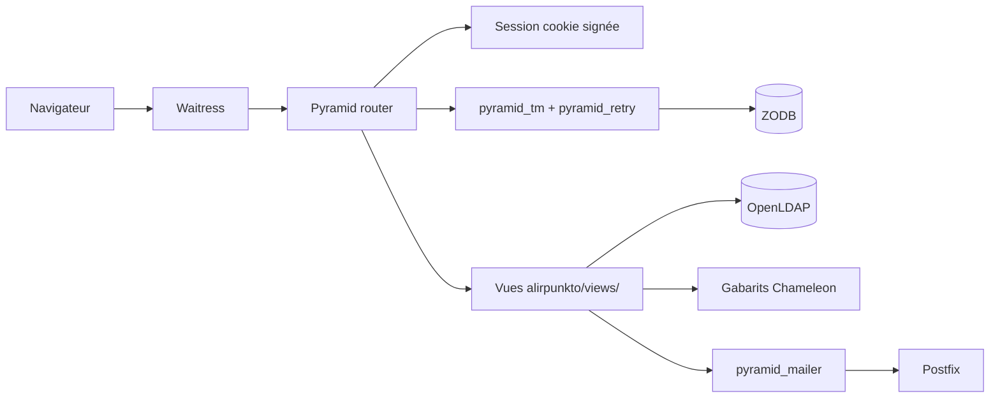

# Architecture d'exécution

> Statut : documentation courante.

## Chaîne de traitement d'une requête

La configuration est centralisée dans `alirpunkto/__init__.py` :

- `pyramid_chameleon` pour le rendu TAL/METAL ;
- `pyramid_tm` et `pyramid_retry` (3 tentatives, `development.ini`) : chaque
  requête est une transaction ; les courriels remis à `pyramid_mailer` ne
  partent qu'au *commit* ;
- `pyramid_zodbconn` fournit la connexion ZODB de la requête ;
- la fabrique de session est `SignedCookieSessionFactory` (cookie signé,
  `httponly`, `secure`, `SameSite=Lax`) ;
- `config.set_default_csrf_options(require_csrf=True)` impose la protection
  CSRF à toutes les vues ;
- un abonné `BeforeRender` (`add_renderer_globals`) injecte les globales de
  gabarit.

## Routes

Les routes sont déclarées dans `alirpunkto/__init__.py` ; `alirpunkto/routes.py`
ne sert que la vue statique (`/static`).

| Route | Chemin | Vue |
|---|---|---|
| `home` | `/` | `views/home.py` |
| `login` / `logout` | `/login`, `/logout` | `views/login.py`, `views/logout.py` |
| `register` | `/register` | `views/register.py` (candidature) |
| `forgot_password` | `/forgot_password` | `views/forgot_password.py` |
| `modify_member` | `/modify_member` | `views/modify_member.py` |
| `get_email` / `check_new_email` | `/get_email`, `/check_new_email` | changement d'adresse |
| `elections` / `vote` | `/elections`, `/vote` | vote des vérificateurs |
| `manage_provider` | `/manage_provider` | gestion des prestataires |
| `sso_login` + redirection Keycloak | `/sso_login`, `/<KEYCLOAK_REDIRECT_PATH>` | `views/sso_login.py` |

## Gabarits

Les pages héritent de `templates/layout.pt` (structure METAL commune) ; chaque
vue a son gabarit (`login.pt`, `register.pt`, `home.pt`, etc.). Les formulaires
riches utilisent Deform (`templates/deform/`).

## Limites connues

- Les routes sont déclarées en dur dans `__init__.py` ; `routes.py` est
  quasi vide, la séparation annoncée n'est pas aboutie.
