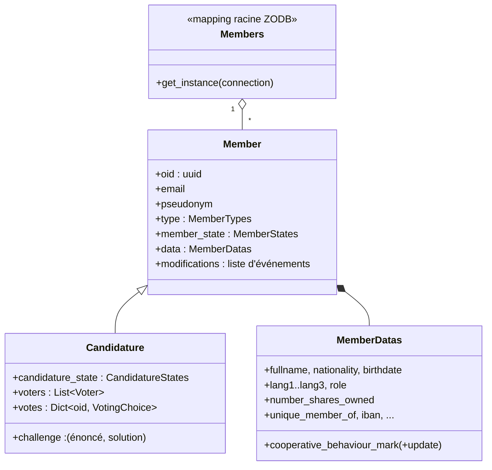

# Modèle de domaine

> Statut : documentation courante.
> Modules : `alirpunkto/models/member.py`, `alirpunkto/models/candidature.py`,
> `alirpunkto/models/users.py`.

## Member

`Member` (persistant) porte l'identité applicative : `oid` (UUID, identique au
`uid` LDAP), `email`, `pseudonym`, `type` (`MemberTypes`), `member_state`
(`MemberStates`) et un bloc `MemberDatas` pour le profil. Chaque modification
passe par les *setters* des propriétés, qui journalisent un
`MemberDataEvent` (horodatage, fonction, ancienne et nouvelle valeur, graine)
dans `modifications` : l'objet garde son propre historique.

Énumérations associées (`models/member.py`) :

- `MemberTypes` : `ADMINISTRATOR`, `ORDINARY`, `COOPERATOR`, `PROVIDER` ;
- `MemberStates` : `CREATED`, `DRAFT`, `REGISTRED`,
  `DATA_MODIFICATION_REQUESTED`, `DATA_MODIFIED`, `EXCLUDED`, `DELETED` ;
- `MemberRoles` (rôles de gouvernance, distincts des types) : `NONE`,
  `ORDINARY`, `COOPERATOR`, `BOARD`, `MEDIATION_ARBITRATION_COUNCIL` — la
  gouvernance effective est portée par les groupes LDAP ;
- `EmailSendStatus` : `IN_PREPARATION`, `SENT`, `ERROR`, utilisé par
  l'historique `email_send_status_history` de chaque membre.

## Candidature

`Candidature` hérite de `Member` et ajoute l'instruction du dossier :

- `challenge` : le défi arithmétique anti-robot et sa solution ;
- `candidature_state` : la machine à états
  `DRAFT → EMAIL_VALIDATION → CONFIRMED_HUMAN → UNIQUE_DATA → PENDING →
  APPROVED | REFUSED` ;
- `voters` et `votes` : les vérificateurs tirés au sort et leur choix
  (`VotingChoice` : `YES`, `NO`, `ABSTAIN`).

**Dépouillement** : quand tous les vérificateurs ont voté, le refus exige
une **majorité stricte de NON** — l'égalité approuve, y compris le 0-0
d'un scrutin tout-abstention (règle adoptée de la PR #232 ; l'abstention
rend l'égalité atteignable même à trois votants).

Le détail du flux est décrit dans
[../specifications_fonctionnelles/candidature.md](../specifications_fonctionnelles/candidature.md).

## Members

`Members` est le mapping racine de la ZODB (`root['members']`, clé = `oid`).
`Members.get_instance(connection)` relie toujours l'instance à la connexion
ZODB de la requête courante (voir
[03_persistance_zodb](03_persistance_zodb.md)).

## User (session)

`models/users.py` définit `User`, un objet **léger et non persistant** (nom,
courriel, oid, actif, type) sérialisé en JSON dans la session après
connexion. Il ne faut pas le confondre avec `Member` : c'est un simple reflet
pour l'interface.

## Démission et quarantaine (2026-07-30)

Le scénario historique « Démissionner » est implémenté (`views/unsubscribe.py`).
Deux états s'ajoutent à `MemberStates` : **`PENDING_UNSUBSCRIPTION`** (la
demande est posée, le courriel de confirmation est parti, l'état précédent
est mémorisé dans `previous_member_state`) et **`UNSUBSCRIBED`** (le lien a
été suivi ; `departure_date` et `departure_reason` sont posés). Une demande
non confirmée **expire paresseusement** après
`UNSUBSCRIBE_LINK_VALIDITY_DAYS` (7 j) — il n'y a pas d'ordonnanceur : la
péremption est vérifiée au profil et au clic du lien, et l'état précédent
est restauré.

À la confirmation, l'entrée LDAP est **désactivée mais conservée**
(`isActive=False`) : le pseudonyme et l'identité restent réservés pendant
la **Quarantaine** — `QUARANTINE_PERIOD_DAYS`, paramètre quantitatif du
§3.4 des statuts, **180 jours** par défaut (#54) — et
`data.date_erasure_all_data` mémorise l'échéance d'effacement. La purge
différée (voir [09_taches_periodiques](09_taches_periodiques.md)) efface
ensuite tout **sauf le pseudonyme, la date et le motif du départ** et passe
le membre à `DELETED`.

## Candidature de montée en grade (#7)

Un membre Ordinaire peut devenir Coopérateur
(`views/upgrade_to_cooperator.py`) : un formulaire réduit aux quatre champs
d'identité (clonés du `RegisterForm`) ouvre une `Candidature` de type
`COOPERATOR` portant **`existing_member_oid`**, pseudonyme et courriel
copiés du membre — jamais redemandés — et l'état **`UNIQUE_DATA`**
directement : le flux existant (vérificateurs, vote) prend le relais. À
l'approbation, `register_user_to_ldap` bifurque vers une **mise à jour en
place** de l'entrée LDAP (type, attributs d'identité) sans toucher `uid`,
`cn`, `mail` ni `userPassword`. Une candidature de montée en grade en cours
est **reprise**, jamais dupliquée.

## Visibilité des profils (2026-08-01)

Trois régimes gouvernent désormais la vue `modify_member`. **Un membre ne
voit que son propre profil** (#201) : la liste des membres n'est ni
chargée ni exposée pour lui, tout `oid` forgé (champ POST, session
résiduelle) est rabattu sur le sien en un point unique, et un GET nu
atterrit directement sur sa page. **L'administrateur consulte sans
modifier** (#149) : une fiche en lecture seule des huit champs du ticket
— pseudonyme, texte de profil, avatar, numéro, rôle traduit, Cooperative
Behaviour Mark et sa date, départ — construite avant tout effet de bord ;
un POST `modify` forgé aboutit à la fiche, jamais à une écriture, et rien
de sensible (courriel, IBAN, identité civile) n'atteint le contexte.
**Son propre profil suit la matrice de l'issue #55** : chacun voit et
modifie sa présentation, son avatar, son courriel et ses langues ; le
Coopérateur ou assimilé modifie en plus son IBAN et voit — sans les
modifier — son identité, sa nationalité, sa CBM, ses parts, sa cotisation
et son rôle ; pseudonyme et numéro sont en lecture seule pour tous ; les
groupes d'appartenance s'affichent, traduits, au-dessus du formulaire ;
la date d'effacement (#54) n'est visible de personne. La matrice `Owner`
étant indexée par état seul, un post-traitement par type
(`_restrict_owner_permissions_by_type`) rabat les dix champs coopérateurs
à `NONE` pour les autres, et l'entrée `PENDING_UNSUBSCRIPTION` garantit
qu'un démissionnaire en attente ouvre encore son profil — le bouton
d'annulation y vit. La vue porte enfin le cadre de la spécification
(#123) : titre « Ton profil », introduction, boutons Soumettre et
Annuler traduits, l'annulation étant un Post/Redirect/Get traité avant
tout accès LDAP.
