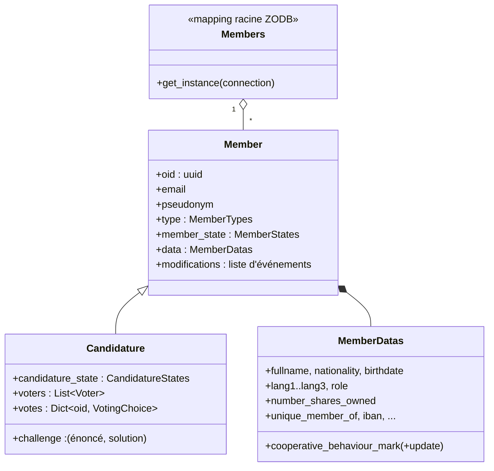

# Modèle de domaine

> Statut : documentation courante.
> Modules : `alirpunkto/models/member.py`, `alirpunkto/models/candidature.py`,
> `alirpunkto/models/users.py`.

## Member

`Member` (persistant) porte l'identité applicative : `oid` (UUID, identique au
`uid` LDAP), `email`, `pseudonym`, `type` (`MemberTypes`), `member_state`
(`MemberStates`) et un bloc `MemberDatas` pour le profil. Chaque modification
passe par les *setters* des propriétés, qui journalisent un
`MemberDataEvent` (horodatage, fonction, ancienne et nouvelle valeur, graine)
dans `modifications` : l'objet garde son propre historique.

Énumérations associées (`models/member.py`) :

- `MemberTypes` : `ADMINISTRATOR`, `ORDINARY`, `COOPERATOR`, `PROVIDER` ;
- `MemberStates` : `CREATED`, `DRAFT`, `REGISTRED`,
  `DATA_MODIFICATION_REQUESTED`, `DATA_MODIFIED`, `EXCLUDED`, `DELETED` ;
- `MemberRoles` (rôles de gouvernance, distincts des types) : `NONE`,
  `ORDINARY`, `COOPERATOR`, `BOARD`, `MEDIATION_ARBITRATION_COUNCIL` — la
  gouvernance effective est portée par les groupes LDAP ;
- `EmailSendStatus` : `IN_PREPARATION`, `SENT`, `ERROR`, utilisé par
  l'historique `email_send_status_history` de chaque membre.

## Candidature

`Candidature` hérite de `Member` et ajoute l'instruction du dossier :

- `challenge` : le défi arithmétique anti-robot et sa solution ;
- `candidature_state` : la machine à états
  `DRAFT → EMAIL_VALIDATION → CONFIRMED_HUMAN → UNIQUE_DATA → PENDING →
  APPROVED | REFUSED` ;
- `voters` et `votes` : les vérificateurs tirés au sort et leur choix
  (`VotingChoice` : `YES`, `NO`, `ABSTAIN`).

Le détail du flux est décrit dans
[../specifications_fonctionnelles/candidature.md](../specifications_fonctionnelles/candidature.md).

## Members

`Members` est le mapping racine de la ZODB (`root['members']`, clé = `oid`).
`Members.get_instance(connection)` relie toujours l'instance à la connexion
ZODB de la requête courante (voir
[03_persistance_zodb](03_persistance_zodb.md)).

## User (session)

`models/users.py` définit `User`, un objet **léger et non persistant** (nom,
courriel, oid, actif, type) sérialisé en JSON dans la session après
connexion. Il ne faut pas le confondre avec `Member` : c'est un simple reflet
pour l'interface.
