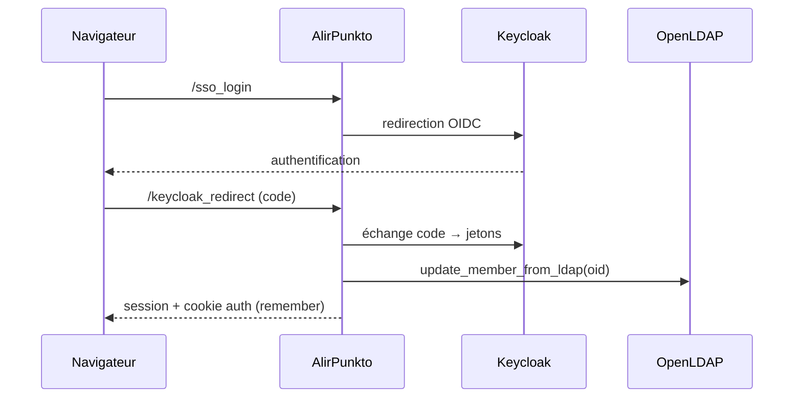

# Authentification

> Statut : documentation courante.
> Modules : `alirpunkto/views/login.py`, `alirpunkto/views/sso_login.py`,
> `alirpunkto/views/home.py`, `alirpunkto/utils.py` (`store_sso_tokens`,
> `logout`), `alirpunkto/views/logout.py`.

## Deux chemins d'entrée

1. **Formulaire local** (`/login`) : le pseudonyme est résolu en `oid`
   (`get_oid_from_pseudonym`), puis `check_password` tente un *bind* LDAP —
   slapd vérifie nativement les mots de passe `{SSHA}`. En cas de succès la
   vue synchronise le membre (`update_member_from_ldap`) et demande aussi un
   jeton Keycloak (`get_keycloak_token`) pour aligner la session SSO.
2. **SSO Keycloak** (`/sso_login` et la redirection
   `/keycloak_redirect`) : flux OIDC ; le jeton est vérifié (signature,
   audience, expiration via `jwt`), l'`oid` en est extrait, le membre est
   synchronisé depuis LDAP puis la session est ouverte.

## Contenu de session

La session est un **cookie signé** (`SignedCookieSessionFactory`, `httponly`,
`secure`, `SameSite=Lax`) limité à 4093 octets. Elle ne contient que le
strict nécessaire : `logged_in`, `user` (objet `User` léger en JSON),
`created_at`, et — via `utils.store_sso_tokens` — le **jeton de
rafraîchissement** Keycloak et son échéance. L'*access token* n'est
volontairement **pas** stocké : rien ne le relit et ses revendications de
groupes faisaient déborder le cookie (incident du 2026-07-08, verrouillé par
`tests/test_session_cookie_budget.py`). L'identification Pyramid passe par
`remember(request, pseudonym)` (cookie *auth tkt* distinct).

## Rafraîchissement et déconnexion

`home_view` prolonge la session SSO tant que l'échéance du jeton de
rafraîchissement n'est pas atteinte (`refresh_keycloak_token`, puis
`store_sso_tokens`) et déconnecte proprement sinon. `utils.logout` purge la
session (utilisateur, jetons) ; `/logout` la clôt côté interface.

## Limites connues

- Le jeton de rafraîchissement vit dans le cookie de session, désormais
  **scellé** (compressé puis chiffré — voir la section des
  durcissements) : le porteur du cookie ne peut plus le lire. La cible
  de long terme reste une session côté serveur (voir
  [decisions_architecture](decisions_architecture.md)).

## Comptes désactivés (2026-07-30)

`sso_login` refuse la connexion d'un membre dont `data.is_active` est faux
(compte démissionnaire ou désactivé) : la garde est placée après la
resynchronisation depuis LDAP et avant la construction du `User` de
session. L'entrée LDAP, conservée pendant la Quarantaine, ne rouvre donc
aucun accès.

## Durcissements de l'audit externe (2026-08-01)

**La redirection d'après-connexion est bornée au site.** La vue de
connexion honorait aveuglément `session['redirect_url']` ;
`safe_local_redirect` n'accepte plus qu'une cible du site — une URL
absolue dont l'autorité est exactement l'hôte de la requête (le cas
légitime des vues qui mémorisent `current_route_url()`), ou un chemin
local `/…` (jamais `//…`) ; schémas exotiques, antislashs et pièges
`user@hôte` retombent sur l'accueil, et la clé de session est purgée
dans tous les cas.

**Les tentatives de connexion sont limitées avant tout accès LDAP** :
deux fenêtres glissantes (10 par adresse sur 5 minutes ; 5 par
identifiant sur 15 minutes, toutes adresses confondues), remises à zéro
au succès, réponse uniforme traduite, journal sans mot de passe. L'état
vit en mémoire du processus — le choix est documenté dans
`login_throttle.py` et correspond au déploiement (un processus
Waitress) ; pour que la fenêtre par adresse voie les vraies IP derrière
Apache, Waitress fait désormais confiance au proxy
(`trusted_proxy` dans `production.ini`).

**La connexion ne lit que le POST.** Le formulaire n'est traité que si
la méthode est `POST`, et les identifiants ne sont lus que de
`request.POST` : une URL forgée `/login?form.submitted=1&username=…`
ne déclenche plus rien — un test vérifie que ni la résolution du
pseudonyme ni `is_admin` ne sont appelés sur un GET (les identifiants
sortent ainsi des journaux d'accès et de l'historique du navigateur).
Les appels Keycloak portent par ailleurs des délais (connexion 3 s,
lecture 10 s), échouent proprement en `None`, et ne journalisent
jamais un corps de réponse brut.

**Le jeton de rafraîchissement est scellé et les réponses Keycloak
validées** (sixième passage, 2026-08-01). Le cookie de session est
signé, pas chiffré : le jeton y voyage désormais **compressé puis
chiffré** (`seal_sso_refresh_token` — zlib niveau 9 puis Fernet sur
`SECRET_KEY` ; la compression d'abord, car le chiffré est
incompressible et le pire cas aurait recroisé la limite de cookie de
4093 octets de l'incident du 2026-07-08 ; le jeton étant seul dans le
flux compressé, aucun oracle ne s'ouvre). Tout ce qui ne se déchiffre
pas — valeur altérée, session antérieure en clair — se lit comme une
session SSO expirée : déconnexion propre, reconnexion, migration
douce. Et chaque réponse 200 du point de jetons passe par
`_validated_token_payload` : JSON parsé sous garde, `access_token` et
`refresh_token` exigés non vides, durées entières strictes bornées à
90 jours, échec journalisé sans le corps.

**Décision d'architecture** : Keycloak ne deviendra pas l'unique point
d'entrée de l'authentification. Le serveur de test n'est pas relié à
Keycloak et n'héberge qu'AlirPunkto ; l'authentification LDAP directe
est une voie assumée, l'intégration Keycloak restant l'obtention d'un
jeton SSO après l'authentification locale.

### Garde des états de départ (issue #265)

Depuis le train 0109, la vue de connexion consulte `member_state` juste après l'authentification LDAP : un compte en état `UNSUBSCRIBED`, `EXCLUDED` ou `DELETED` est refusé avec le message traduit `login_account_disabled`, même si l'annuaire authentifie encore ses identifiants. Les états vivants passent inchangés ; les deux sens sont verrouillés par `tests/test_departure_tickets.py`.
