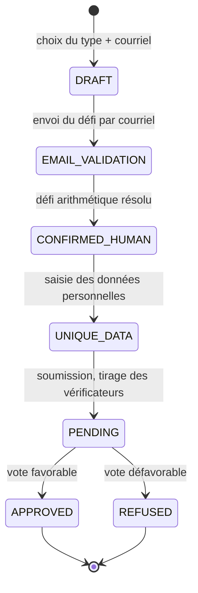

# Candidature

> Statut : spécification fonctionnelle courante (remplace le scénario
> historique `../specifications_historiques/Scénarios/Candidature.md`).
> Modules : `alirpunkto/views/register.py`, `alirpunkto/models/candidature.py`,
> `alirpunkto/views/vote.py`, `alirpunkto/views/elections.py`.

## Acteurs

Le **candidat** ; les **vérificateurs** (membres tirés au sort) ; le site.

## Machine à états

## Déroulé

1. **DRAFT** — le candidat choisit son type (membre ordinaire ou
   coopérateur) et saisit son adresse électronique ; l'unicité de l'adresse
   parmi les candidatures non refusées est contrôlée.
2. **EMAIL_VALIDATION** — le site génère un **défi arithmétique**
   (`generate_math_challenges`) et l'envoie par courriel
   (`send_validation_email`) : la réception prouve l'adresse, la résolution
   prouve l'humanité.
3. **CONFIRMED_HUMAN** — défi résolu ; le candidat définit son pseudonyme et
   son mot de passe (règles de robustesse et d'unicité :
   `is_valid_password`, `is_valid_unique_pseudonym`).
4. **UNIQUE_DATA** — saisie des données personnelles ; les champs exigés
   dépendent du type (le coopérateur fournit l'état civil complet, données
   sensibles réservées aux vérificateurs).
5. **PENDING** — la candidature est soumise ; `random_voters` tire au sort
   les vérificateurs (nombre fixé par le paramètre `number_of_voters`),
   chacun est invité par courriel à instruire le dossier.
6. **Vote** (`/elections`, `/vote`) — chaque vérificateur vote oui, non ou
   abstention (`VotingChoice`), avant la date limite de vérification. Quand
   tous ont voté, le refus exige une majorité **stricte** de non :
   l'égalité approuve (PR #232). Selon le décompte, la vue `vote` bascule la
   candidature en **APPROVED** ou **REFUSED**.
7. **APPROVED** — le compte LDAP est créé (`register_user_to_ldap`, mot de
   passe haché `{SSHA}`), le mot de passe en clair est purgé de la ZODB, le
   candidat devient membre et en est notifié
   (`send_candidature_state_change_email`).

À chaque changement d'état, le candidat (et, en phase de vote, les
vérificateurs) reçoivent un courriel localisé.

## Limites connues

- Aucune péremption automatique : une candidature en attente le reste
  jusqu'à action humaine (voir
  [../architecture/09_taches_periodiques.md](../architecture/09_taches_periodiques.md)).
